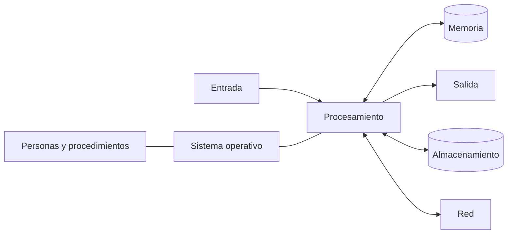
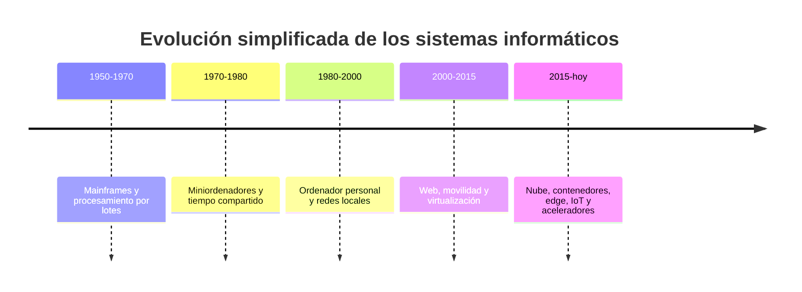
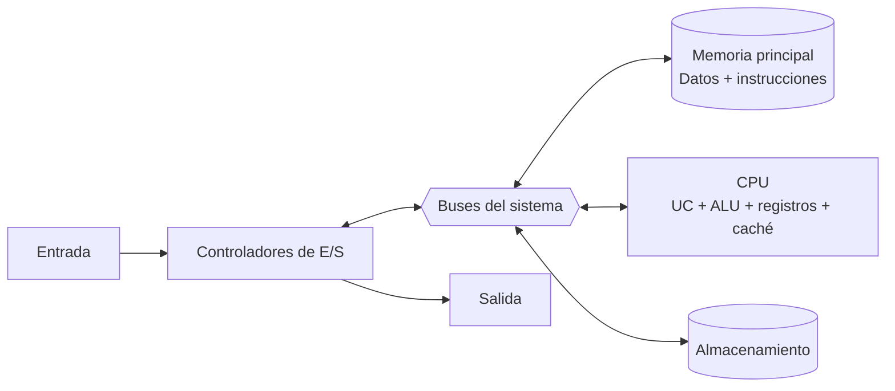
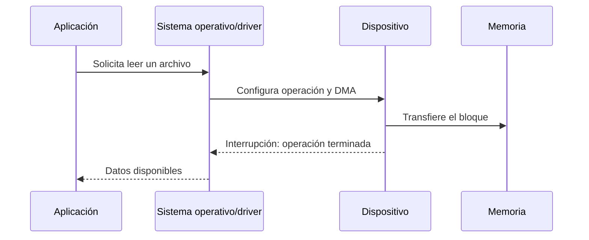
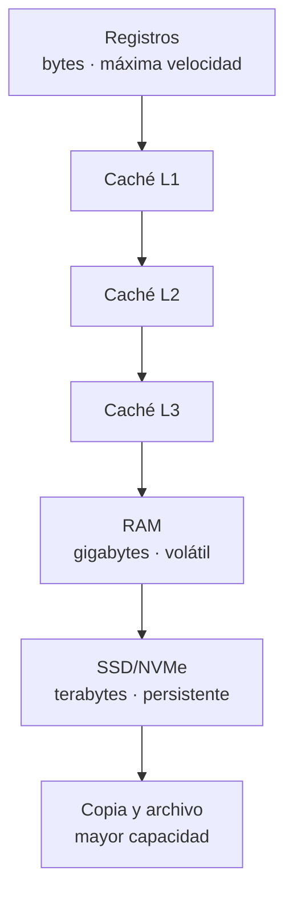
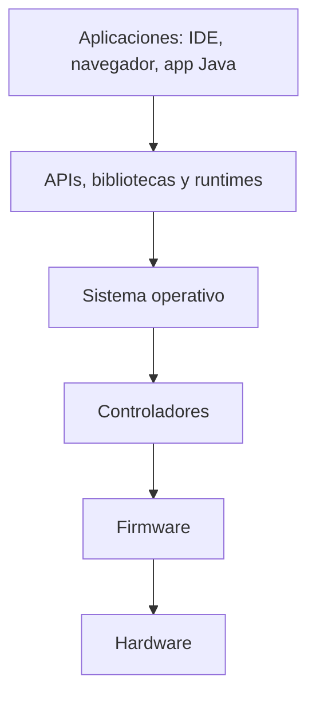
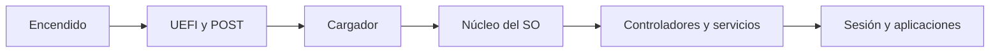
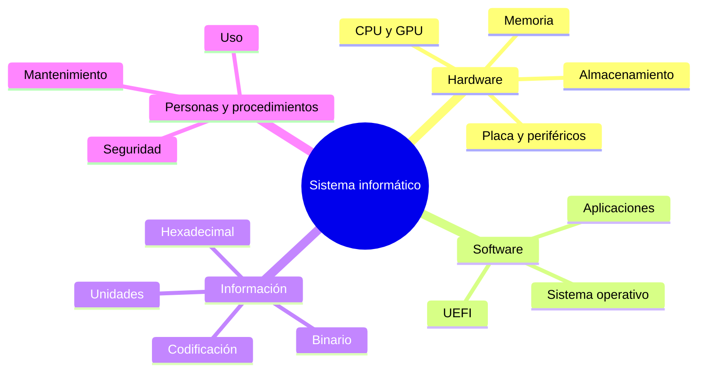

# UD1 · Componentes del sistema informático

T1

**Punto de partida de la unidad**

Antes de estudiar CPU, compatibilidad o SAI necesitamos una visión completa del
sistema: qué elementos lo forman, cómo se relacionan y cómo representan datos.

## 1. Del dato al sistema informático

Un **sistema informático** recibe datos, los procesa de acuerdo con un programa,
los almacena y comunica resultados. No es solo el ordenador.

**:material-memory: Hardware**  
CPU, memoria, placa, almacenamiento, periféricos y red.

**:material-code-braces: Software**  
Firmware, sistema operativo, controladores y aplicaciones.

**:material-database: Datos**  
Texto, números, imágenes, código, metadatos y copias.

**:material-account-group: Personas**  
Usuarios, desarrollo, administración, soporte y dirección.

**:material-clipboard-check: Procedimientos**  
Instalación, seguridad, permisos, mantenimiento y recuperación.

!!! example "Ejemplo DAM"
    Cuando ejecutamos una aplicación Java, el código, la máquina virtual, el
    sistema operativo, la CPU, la RAM y los datos cooperan. Un fallo de permisos,
    memoria o almacenamiento puede impedir el trabajo aunque el programa sea
    correcto.

## 2. No todos los sistemas informáticos son un PC

La forma del equipo cambia, pero el modelo funcional se mantiene: **procesar,
almacenar y comunicar información**. Clasificar un sistema solo por su tamaño ya
no es suficiente; también importan su finalidad, número de usuarios, consumo,
tolerancia a fallos y forma de conectarse.

| Tipo de sistema | Rasgo principal | Ejemplo actual | Relación con DAM |
|---|---|---|---|
| Personal | Uso interactivo de una persona | Portátil de desarrollo | IDE, emuladores, bases de datos locales |
| Móvil | Bajo consumo, batería y sensores | Teléfono o tableta | Pruebas de aplicaciones móviles |
| Servidor | Atiende peticiones de otros equipos | Servidor web o de base de datos | Despliegue de API y servicios |
| Sistema empotrado | Diseñado para una función concreta | Router, vehículo, terminal TPV | Integración con dispositivos y redes |
| Nube | Recursos virtualizados y elásticos | Máquina virtual o contenedor gestionado | Publicación y escalado de aplicaciones |
| HPC | Cálculo masivamente paralelo | MareNostrum 5 | Simulación, IA y tratamiento de datos |

!!! warning "Una clasificación histórica que debemos interpretar"
    *Mainframe*, *minicomputador*, *workstation* y *PC* siguen siendo términos
    útiles para estudiar la evolución, pero hoy sus fronteras se solapan. Un
    teléfono actual puede superar a antiguas estaciones de trabajo, mientras
    que un mainframe moderno se distingue por disponibilidad, entrada/salida y
    consolidación de cargas, no simplemente por «ser grande».

### 2.1 De sistemas centralizados a sistemas distribuidos

En los primeros centros de proceso, muchos usuarios compartían un gran sistema
central. El ordenador personal trasladó capacidad de cálculo al escritorio. La
red, la web y la virtualización volvieron a repartir una aplicación entre varios
equipos: cliente, servidor, base de datos, almacenamiento y servicios externos.

!!! example "La aplicación también es un sistema"
    Una app de DAM puede ejecutarse en un móvil, consultar una API alojada en un
    contenedor y guardar datos en una base de datos gestionada. Aunque el usuario
    vea una sola pantalla, intervienen varios sistemas, redes y capas de software.

## 3. El modelo funcional: arquitectura de Von Neumann

La arquitectura de **programa almacenado** propone que datos e instrucciones se
guarden en memoria. La CPU lee una instrucción, la interpreta, obtiene sus datos,
la ejecuta y guarda el resultado. Este modelo explica la mayoría de los sistemas
de propósito general, aunque los procesadores modernos ejecuten internamente
muchas operaciones en paralelo.

### 3.1 Las unidades funcionales

| Unidad | Responsabilidad | Ejemplo |
|---|---|---|
| Unidad de control | Decodifica instrucciones y coordina señales | Ordena leer un operando de memoria |
| ALU/FPU | Opera con enteros, lógica y coma flotante | Suma, comparación, desplazamiento |
| Registros | Guardan valores inmediatos dentro de la CPU | Contador de programa y operandos |
| Memoria principal | Mantiene temporalmente código y datos en ejecución | Bytecode, objetos y pila de una JVM |
| Entrada/salida | Comunica el sistema con dispositivos y red | Teclado, pantalla, SSD o Ethernet |

El llamado **cuello de botella de Von Neumann** aparece porque instrucciones y
datos deben viajar entre CPU y memoria. Los equipos actuales lo reducen con
cachés, predicción, ejecución fuera de orden, varios canales de memoria y
precarga, pero no lo eliminan.

### 3.2 Von Neumann y Harvard modificada

En una arquitectura Harvard pura, datos e instrucciones usan memorias y caminos
separados. Muchas CPU actuales presentan al programa un espacio de memoria
unificado, pero disponen de cachés L1 separadas para instrucciones y datos. Por
eso se habla de **Harvard modificada**: conserva la comodidad del modelo de Von
Neumann y permite accesos simultáneos cerca del núcleo.

### Vídeo · Von Neumann por dentro

Repaso visual en español de CPU, memoria, unidad de control, ALU, registros,
buses y entrada/salida. Úsalo después del esquema anterior e intenta detenerlo
para anticipar por dónde circulará cada dato.

<iframe src="https://www.youtube-nocookie.com/embed/Ai-1o4xn-zY"
title="Modelo Von Neumann por dentro" loading="lazy" allowfullscreen></iframe>

[Abrir el vídeo en YouTube](https://www.youtube.com/watch?v=Ai-1o4xn-zY)

## 4. Cómo se comunican los componentes

Un bus no es «un cable» concreto, sino un conjunto de líneas y un protocolo de
comunicación. En el modelo didáctico distinguimos:

- **bus de direcciones:** indica qué posición o dispositivo se selecciona;
- **bus de datos:** transporta la información;
- **bus de control:** coordina lectura, escritura, interrupciones y temporización.

En un PC real no existe un único bus universal. Hay enlaces especializados:
canales DDR entre CPU y RAM, PCI Express para expansión y NVMe, USB para
periféricos, SATA para almacenamiento y enlaces internos entre CPU y chipset.

!!! example "Direcciones y capacidad"
    Con `n` bits pueden codificarse `2ⁿ` direcciones distintas. Esto no significa
    automáticamente que un equipo pueda instalar esa cantidad de RAM: también
    limitan la CPU, la placa, el firmware y el sistema operativo.

### 4.1 Interrupciones, DMA y controladores

La CPU no puede comprobar continuamente cada dispositivo. Un periférico puede
generar una **interrupción** para solicitar atención. Para transferencias grandes,
el **DMA** permite mover bloques entre un dispositivo y la RAM sin que la CPU
copie byte a byte. El **controlador** (*driver*) traduce las órdenes genéricas del
sistema operativo al protocolo concreto del hardware.

## 5. Hardware por función

### 5.1 Procesamiento

- **CPU:** interpreta y ejecuta instrucciones.
- **GPU:** acelera gráficos y cálculos muy paralelos.
- **NPU/acelerador de IA:** ejecuta determinadas cargas matriciales con alta
  eficiencia; no sustituye a CPU o GPU en cualquier tarea.
- **Controladores:** coordinan memoria, almacenamiento y periféricos.

En equipos actuales pueden convivir CPU, GPU integrada o dedicada y NPU. La
presencia de un acelerador no garantiza que una aplicación lo utilice: hacen
falta controladores, bibliotecas y soporte explícito del software.

#### Qué hay dentro de una CPU

- **Núcleos e hilos:** permiten mantener varias secuencias de ejecución; más
  núcleos no acelera automáticamente un programa que no se pueda paralelizar.
- **Unidad de control y decodificadores:** convierten instrucciones de la ISA en
  operaciones internas.
- **ALU, FPU y unidades vectoriales:** ejecutan operaciones enteras, decimales y
  sobre varios datos a la vez.
- **Registros:** son el almacenamiento más próximo a las unidades de ejecución.
- **Cachés L1, L2 y L3:** reducen el tiempo medio de acceso a datos e instrucciones.
- **Pipeline, predicción y ejecución especulativa:** mantienen ocupadas las
  unidades de ejecución cuando existen dependencias y saltos.

La **ISA** (x86-64, Arm o RISC-V) es el contrato visible para el software; la
microarquitectura es la forma concreta en la que un procesador cumple ese
contrato. Dos CPU compatibles con la misma ISA pueden rendir y consumir de forma
muy diferente.

!!! info "GHz no equivale a rendimiento"
    El tiempo de ejecución depende de la frecuencia, las instrucciones realizadas
    por ciclo, el paralelismo, la memoria, la refrigeración y el propio programa.
    Comparar procesadores solo por GHz conduce a conclusiones incorrectas.

### 5.2 Memoria y almacenamiento

| Nivel | Conserva datos sin corriente | Uso principal | Rapidez relativa |
|---|---|---|---|
| Registros y caché | No | Trabajo inmediato de la CPU | Muy alta |
| RAM | No | Programas y datos activos | Alta |
| SSD | Sí | Sistema, aplicaciones y proyectos | Media |
| HDD/copia externa | Sí | Capacidad, archivo y respaldo | Menor |

Un **fallo de caché** obliga a buscar el dato en un nivel más lento. Aumentar la
frecuencia no elimina los cuellos de botella de memoria o almacenamiento.

La jerarquía busca equilibrar tres propiedades que compiten: velocidad,
capacidad y coste. Los datos se copian entre niveles; por eso «tener 16 GB de RAM»
no significa que la CPU acceda directamente a todos ellos con la misma latencia.

**RAM** y **almacenamiento** no son intercambiables: la RAM es el espacio de
trabajo volátil; el SSD conserva archivos. Cuando falta RAM, el sistema puede
usar almacenamiento como memoria virtual, pero con una penalización importante.

### 5.3 Entrada, salida y comunicación

- Entrada: teclado, ratón, sensores, cámara.
- Salida: pantalla, audio, impresión.
- Entrada/salida: almacenamiento, pantalla táctil, interfaces USB.
- Comunicación: Ethernet, Wi-Fi, Bluetooth y adaptadores de red.

Un mismo dispositivo puede pertenecer a varias categorías. Un SSD es
almacenamiento persistente, pero desde el punto de vista de la CPU también es un
dispositivo de entrada/salida. Una pantalla táctil produce salida visual y recibe
entrada del usuario.

## 6. La placa base organiza el sistema

La placa base distribuye alimentación y señales. Su formato determina parte de
la expansión y su firmware UEFI inicia la plataforma antes de cargar el sistema
operativo.

### Placa actual

| N.º | Zona | Qué debemos reconocer |
|---:|---|---|
| 1 | Alimentación CPU | Conector EPS/ATX12V para el regulador |
| 2 | Zócalo | Unión mecánica y eléctrica con la CPU |
| 3 | DIMM | Bancos de memoria RAM |
| 4 | Alimentación principal | Conector ATX de 24 pines |
| 5 | PCIe principal | GPU o tarjeta de gran ancho de banda |
| 6 | PCIe cortas | Red, sonido, captura y otras ampliaciones |
| 7 y 10 | M.2 | SSD y, según placa, otros módulos |
| 8 | Chipset | Amplía las posibilidades de entrada/salida |
| 9 | SATA | SSD y HDD SATA |
| 11 | Pila y cabeceras | Configuración, frontal, USB y ventilación |
| 12 | Panel trasero | Puertos externos |

### Placa clásica

En placas antiguas eran visibles **puente norte y puente sur**, ranuras AGP/PCI,
conectores IDE y puertos heredados. En una plataforma actual, el controlador de
memoria y varias líneas rápidas se integran en la CPU; el chipset concentra
entrada/salida adicional.

| Antes | Ahora | Consecuencia |
|---|---|---|
| IDE/PATA | SATA y NVMe | Menos cableado y mucha más velocidad |
| AGP y PCI | PCI Express | Enlace serie escalable por líneas |
| BIOS tradicional | UEFI | Mejor arranque, seguridad y configuración |
| Puente norte separado | Funciones integradas en CPU | Menor latencia |

En una placa actual es frecuente encontrar UEFI, DDR5, varias ranuras M.2 NVMe,
PCI Express y conectividad USB de distintas velocidades. No debe deducirse la
versión por el aspecto del conector: siempre se consulta el manual del modelo y
la distribución de líneas, porque instalar un M.2 puede compartir recursos o
deshabilitar otro puerto.

### Vídeo · Componentes de una placa base

Explicación animada de zócalo, chipset, VRM, RAM, PCIe y conectores. Aunque el
vídeo muestra una generación concreta, los bloques funcionales siguen siendo
válidos; para compatibilidad siempre prevalece el manual de la placa elegida.

<iframe src="https://www.youtube-nocookie.com/embed/b2pd3Y6aBag"
title="Motherboards Explained - PowerCert" loading="lazy"
allowfullscreen></iframe>

[Abrir el vídeo en YouTube](https://www.youtube.com/watch?v=b2pd3Y6aBag)

## :material-clipboard-edit-outline: Tarea 1.1 · Anatomía de una placa base

50 minIndividualEntrega en Aules

Reconocerás los elementos numerados de una placa moderna, los compararás con
una clásica y justificarás qué cambios tecnológicos explican las diferencias.

[Abrir la actividad de placa base](actividades/A1-placa-base.md){ .md-button .md-button--primary }

## 7. Software y arranque

El **firmware UEFI** comprueba e inicializa hardware. Después localiza un
cargador, que coloca en memoria el núcleo del sistema operativo. El SO gestiona
procesos, memoria, archivos, dispositivos, usuarios y comunicaciones; las
aplicaciones aprovechan esos servicios.

### 7.1 Capas de software

- **Firmware:** código persistente muy próximo al dispositivo.
- **Sistema operativo:** abstrae hardware y reparte recursos con protección.
- **Runtime o máquina virtual:** ofrece un entorno de ejecución, como JVM o .NET.
- **Bibliotecas y APIs:** evitan que cada aplicación reinvente servicios comunes.
- **Aplicación:** resuelve una necesidad del usuario apoyándose en las capas
  inferiores.

## 8. Cómo representa información el ordenador

Un bit toma el valor 0 o 1. Con `n` bits existen `2ⁿ` combinaciones; el formato
decide si representan un número, carácter, color, dirección o instrucción.

### 8.1 Sistemas de numeración

| Base | Dígitos | Uso informático |
|---:|---|---|
| 2 | 0 y 1 | Circuitos, permisos y máscaras |
| 10 | 0 a 9 | Interacción cotidiana |
| 16 | 0 a 9 y A a F | Direcciones, bytes y colores |

En un sistema posicional, cada cifra pesa según su posición:

`101101₂ = 1·2⁵ + 0·2⁴ + 1·2³ + 1·2² + 0·2¹ + 1·2⁰ = 45₁₀`

Como cuatro bits equivalen a una cifra hexadecimal:

`0010 1101₂ = 2D₁₆`

### 8.2 Conversión decimal a binario

Dividimos sucesivamente por 2 y leemos los restos de abajo arriba:

| División | Cociente | Resto |
|---|---:|---:|
| 45 ÷ 2 | 22 | 1 |
| 22 ÷ 2 | 11 | 0 |
| 11 ÷ 2 | 5 | 1 |
| 5 ÷ 2 | 2 | 1 |
| 2 ÷ 2 | 1 | 0 |
| 1 ÷ 2 | 0 | 1 |

Resultado: `45₁₀ = 101101₂`.

### 8.3 Unidades y errores frecuentes

- `1 byte = 8 bits`.
- `1 kB = 1 000 bytes`; `1 KiB = 1 024 bytes`.
- `500 Mb/s ÷ 8 = 62,5 MB/s` como máximo teórico antes de sobrecargas.
- Unicode identifica caracteres; UTF-8 los codifica con longitud variable.
- La coma flotante aproxima muchos decimales, por lo que `0.1 + 0.2` puede no
  compararse exactamente con `0.3`.

### Vídeo · Cómo se representan números y caracteres

Crash Course relaciona bits, enteros, caracteres y Unicode. Es un buen refuerzo
después de practicar las conversiones; dispone de subtítulos.

<iframe src="https://www.youtube-nocookie.com/embed/1GSjbWt0c9M"
title="Representing Numbers and Letters with Binary - Crash Course"
loading="lazy" allowfullscreen></iframe>

[Abrir el vídeo en YouTube](https://www.youtube.com/watch?v=1GSjbWt0c9M)

## :material-calculator-variant-outline: Tarea 1.2 · Representación numérica

55 minIndividualEntrega en Aules

Resolverás conversiones, interpretarás unidades reales de red y almacenamiento
y detectarás errores habituales en un pequeño caso de programación.

[Abrir la actividad de representación numérica](actividades/A2-representacion-numerica.md){ .md-button .md-button--primary }

## 9. Supercomputación como sistema completo

Un supercomputador no es solo «un ordenador muy grande»: combina nodos,
aceleradores, memoria, red de baja latencia, almacenamiento paralelo, software
de planificación, refrigeración y energía. MareNostrum 5 permite observar cómo
la misma arquitectura funcional se escala para resolver problemas científicos.

!!! tip "Actividad de ampliación"
    [Tarea 1.3 · Radiografía de un supercomputador](actividades/A3-supercomputador.md)
    conecta todos los componentes estudiados y diferencia rendimiento máximo de
rendimiento medido.

### Vídeo actual · Dentro de MareNostrum 5

Recorrido publicado en 2025 por la infraestructura del Barcelona Supercomputing
Center, con aceleración, visualización y ejemplos de investigación científica.

<iframe src="https://www.youtube-nocookie.com/embed/rk-CKed4c7U"
title="MareNostrum 5 - Barcelona Supercomputing Center" loading="lazy"
allowfullscreen></iframe>

[Abrir el vídeo en YouTube](https://www.youtube.com/watch?v=rk-CKed4c7U)

## Mapa final del tema

## Comprueba que estás preparado

1. Explica por qué una aplicación no funciona únicamente gracias a la CPU.
2. Ordena registros, caché, RAM y SSD por proximidad y persistencia.
3. Identifica cinco zonas de una placa sin memorizar su posición exacta.
4. Convierte `11010110₂` a hexadecimal y decimal.
5. Relaciona UEFI, cargador y sistema operativo.

## Fuentes para ampliar y comprobar datos

- [IBM · Qué es un mainframe](https://www.ibm.com/mx-es/think/topics/mainframe):
  disponibilidad, transacciones, entrada/salida y diferencias frente a HPC.
- [Intel · Manual de optimización de arquitecturas x86-64](https://www.intel.com/content/www/us/en/developer/articles/technical/intel-sdm.html):
  referencia técnica para cachés, predicción, ejecución y jerarquía de memoria.
- [UEFI Forum · Especificaciones](https://uefi.org/specifications): definición y
  evolución del firmware UEFI y Secure Boot.

!!! note "Criterio profesional"
    Los ejemplos de modelos y generaciones envejecen. Para tomar una decisión de
    compra o compatibilidad se consulta siempre la ficha de la CPU, el manual de
    la placa y la lista de memoria validada por el fabricante.
