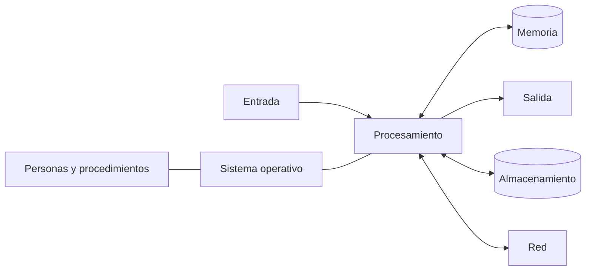
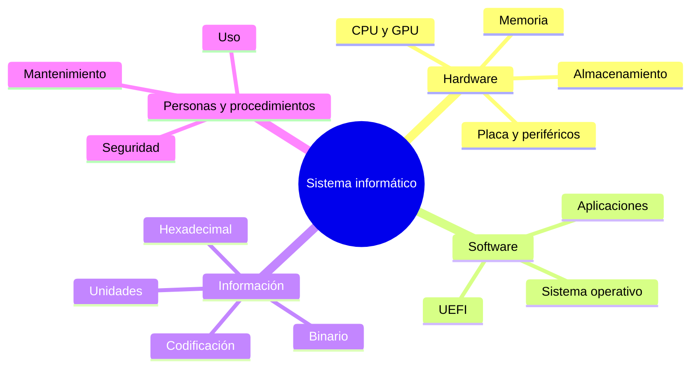

# Tema 1 · Componentes del sistema informático

T1

**Punto de partida de la unidad**

Antes de estudiar CPU, compatibilidad o SAI necesitamos una visión completa del
sistema: qué elementos lo forman, cómo se relacionan y cómo representan datos.

## 1. Del dato al sistema informático

Un **sistema informático** recibe datos, los procesa de acuerdo con un programa,
los almacena y comunica resultados. No es solo el ordenador.

**:material-memory: Hardware**  
CPU, memoria, placa, almacenamiento, periféricos y red.

**:material-code-braces: Software**  
Firmware, sistema operativo, controladores y aplicaciones.

**:material-database: Datos**  
Texto, números, imágenes, código, metadatos y copias.

**:material-account-group: Personas**  
Usuarios, desarrollo, administración, soporte y dirección.

**:material-clipboard-check: Procedimientos**  
Instalación, seguridad, permisos, mantenimiento y recuperación.

!!! example "Ejemplo DAM"
    Cuando ejecutamos una aplicación Java, el código, la máquina virtual, el
    sistema operativo, la CPU, la RAM y los datos cooperan. Un fallo de permisos,
    memoria o almacenamiento puede impedir el trabajo aunque el programa sea
    correcto.

## 2. Hardware por función

### 2.1 Procesamiento

- **CPU:** interpreta y ejecuta instrucciones.
- **GPU:** acelera gráficos y cálculos muy paralelos.
- **Controladores:** coordinan memoria, almacenamiento y periféricos.

### 2.2 Memoria y almacenamiento

| Nivel | Conserva datos sin corriente | Uso principal | Rapidez relativa |
|---|---|---|---|
| Registros y caché | No | Trabajo inmediato de la CPU | Muy alta |
| RAM | No | Programas y datos activos | Alta |
| SSD | Sí | Sistema, aplicaciones y proyectos | Media |
| HDD/copia externa | Sí | Capacidad, archivo y respaldo | Menor |

Un **fallo de caché** obliga a buscar el dato en un nivel más lento. Aumentar la
frecuencia no elimina los cuellos de botella de memoria o almacenamiento.

### 2.3 Entrada, salida y comunicación

- Entrada: teclado, ratón, sensores, cámara.
- Salida: pantalla, audio, impresión.
- Entrada/salida: almacenamiento, pantalla táctil, interfaces USB.
- Comunicación: Ethernet, Wi-Fi, Bluetooth y adaptadores de red.

## 3. La placa base organiza el sistema

La placa base distribuye alimentación y señales. Su formato determina parte de
la expansión y su firmware UEFI inicia la plataforma antes de cargar el sistema
operativo.

### Placa actual

| N.º | Zona | Qué debemos reconocer |
|---:|---|---|
| 1 | Alimentación CPU | Conector EPS/ATX12V para el regulador |
| 2 | Zócalo | Unión mecánica y eléctrica con la CPU |
| 3 | DIMM | Bancos de memoria RAM |
| 4 | Alimentación principal | Conector ATX de 24 pines |
| 5 | PCIe principal | GPU o tarjeta de gran ancho de banda |
| 6 | PCIe cortas | Red, sonido, captura y otras ampliaciones |
| 7 y 10 | M.2 | SSD y, según placa, otros módulos |
| 8 | Chipset | Amplía las posibilidades de entrada/salida |
| 9 | SATA | SSD y HDD SATA |
| 11 | Pila y cabeceras | Configuración, frontal, USB y ventilación |
| 12 | Panel trasero | Puertos externos |

### Placa clásica

En placas antiguas eran visibles **puente norte y puente sur**, ranuras AGP/PCI,
conectores IDE y puertos heredados. En una plataforma actual, el controlador de
memoria y varias líneas rápidas se integran en la CPU; el chipset concentra
entrada/salida adicional.

| Antes | Ahora | Consecuencia |
|---|---|---|
| IDE/PATA | SATA y NVMe | Menos cableado y mucha más velocidad |
| AGP y PCI | PCI Express | Enlace serie escalable por líneas |
| BIOS tradicional | UEFI | Mejor arranque, seguridad y configuración |
| Puente norte separado | Funciones integradas en CPU | Menor latencia |

## :material-clipboard-edit-outline: Actividad del bloque · Anatomía de una placa

50 minParejasEntrega en Aules

Reconocerás los elementos numerados de una placa moderna, los compararás con
una clásica y justificarás qué cambios tecnológicos explican las diferencias.

[Abrir la actividad de placa base](actividades/A1-placa-base.md){ .md-button .md-button--primary }

## 4. Software y arranque

El **firmware UEFI** comprueba e inicializa hardware. Después localiza un
cargador, que coloca en memoria el núcleo del sistema operativo. El SO gestiona
procesos, memoria, archivos, dispositivos, usuarios y comunicaciones; las
aplicaciones aprovechan esos servicios.

## 5. Cómo representa información el ordenador

Un bit toma el valor 0 o 1. Con `n` bits existen `2ⁿ` combinaciones; el formato
decide si representan un número, carácter, color, dirección o instrucción.

### 5.1 Sistemas de numeración

| Base | Dígitos | Uso informático |
|---:|---|---|
| 2 | 0 y 1 | Circuitos, permisos y máscaras |
| 10 | 0 a 9 | Interacción cotidiana |
| 16 | 0 a 9 y A a F | Direcciones, bytes y colores |

En un sistema posicional, cada cifra pesa según su posición:

`101101₂ = 1·2⁵ + 0·2⁴ + 1·2³ + 1·2² + 0·2¹ + 1·2⁰ = 45₁₀`

Como cuatro bits equivalen a una cifra hexadecimal:

`0010 1101₂ = 2D₁₆`

### 5.2 Conversión decimal a binario

Dividimos sucesivamente por 2 y leemos los restos de abajo arriba:

| División | Cociente | Resto |
|---|---:|---:|
| 45 ÷ 2 | 22 | 1 |
| 22 ÷ 2 | 11 | 0 |
| 11 ÷ 2 | 5 | 1 |
| 5 ÷ 2 | 2 | 1 |
| 2 ÷ 2 | 1 | 0 |
| 1 ÷ 2 | 0 | 1 |

Resultado: `45₁₀ = 101101₂`.

### 5.3 Unidades y errores frecuentes

- `1 byte = 8 bits`.
- `1 kB = 1 000 bytes`; `1 KiB = 1 024 bytes`.
- `500 Mb/s ÷ 8 = 62,5 MB/s` como máximo teórico antes de sobrecargas.
- Unicode identifica caracteres; UTF-8 los codifica con longitud variable.
- La coma flotante aproxima muchos decimales, por lo que `0.1 + 0.2` puede no
  compararse exactamente con `0.3`.

## :material-calculator-variant-outline: Actividad del bloque · Laboratorio RN

55 minIndividualEntrega en Aules

Resolverás conversiones, interpretarás unidades reales de red y almacenamiento
y detectarás errores habituales en un pequeño caso de programación.

[Abrir la actividad de representación numérica](actividades/A2-representacion-numerica.md){ .md-button .md-button--primary }

## 6. Supercomputación como sistema completo

Un supercomputador no es solo «un ordenador muy grande»: combina nodos,
aceleradores, memoria, red de baja latencia, almacenamiento paralelo, software
de planificación, refrigeración y energía. MareNostrum 5 permite observar cómo
la misma arquitectura funcional se escala para resolver problemas científicos.

!!! tip "Actividad de ampliación"
    [Radiografía de un supercomputador](actividades/A3-supercomputador.md)
    conecta todos los componentes estudiados y diferencia rendimiento máximo de
    rendimiento medido.

## Mapa final del tema

## Comprueba que estás preparado

1. Explica por qué una aplicación no funciona únicamente gracias a la CPU.
2. Ordena registros, caché, RAM y SSD por proximidad y persistencia.
3. Identifica cinco zonas de una placa sin memorizar su posición exacta.
4. Convierte `11010110₂` a hexadecimal y decimal.
5. Relaciona UEFI, cargador y sistema operativo.
