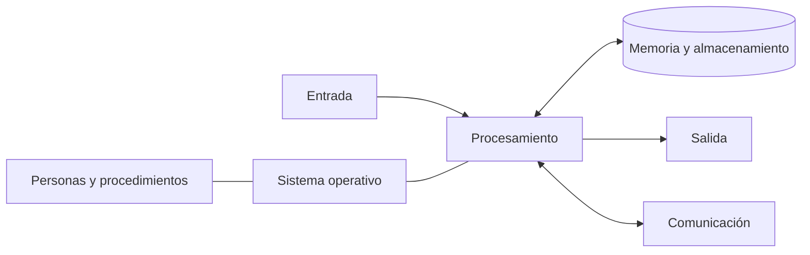
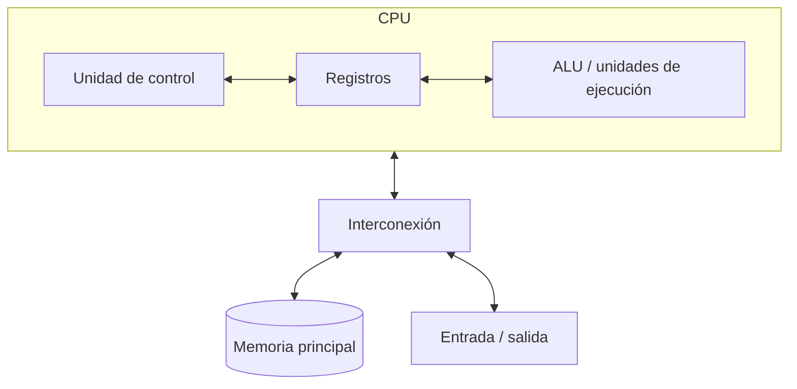
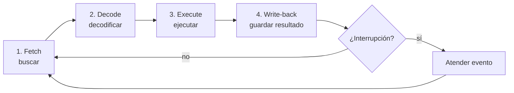

# UD1.1 · El sistema informático y las instrucciones de la CPU

## Qué aprenderemos

Al terminar podrás explicar qué convierte a un conjunto de componentes en un
sistema informático, seguir una instrucción desde que se lee de memoria hasta
que produce un resultado y relacionar bits, registros, memoria y programas.

## 1. Un sistema, no una colección de piezas

Un **sistema informático** recibe datos, los procesa siguiendo instrucciones,
los almacena y comunica resultados.

| Elemento | Función | Ejemplos |
|---|---|---|
| Hardware | Soporte físico | CPU, RAM, SSD, placa base, red |
| Software | Instrucciones y datos | UEFI, sistema operativo, aplicaciones |
| Personas | Definen objetivos y toman decisiones | Usuario, técnica, administradora |
| Procedimientos y datos | Reglas y materia prima | Copias, permisos, ficheros, protocolos |

El rendimiento global depende de su coordinación. Un SSD rápido no compensa
una memoria insuficiente; una buena máquina no es fiable sin copias ni
procedimientos de recuperación.

## 2. Arquitectura de programa almacenado

En el modelo de **Von Neumann**, instrucciones y datos se guardan en memoria.
La CPU recupera instrucciones codificadas, las interpreta y las ejecuta, aunque
los procesadores modernos solapen y reordenen internamente muchas operaciones.

La arquitectura **Harvard** separa memorias o caminos para instrucciones y
datos. Muchas CPU actuales ofrecen al programa una memoria unificada, pero usan
cachés L1 separadas: es una organización Harvard modificada.

## 3. El lenguaje de la CPU

Una instrucción contiene un **código de operación** u *opcode* (`ADD`, `LOAD`,
`JMP`...) y operandos que indican registros, valores o direcciones. Las familias
habituales son transferencia, aritmética, lógica, comparación, salto y control.
Dos arquitecturas pueden codificar la misma idea de forma diferente.

## 4. Buscar, decodificar y ejecutar

| Registro | Papel didáctico |
|---|---|
| PC | Dirección de la siguiente instrucción |
| MAR | Dirección de memoria que se va a leer o escribir |
| MDR | Dato o instrucción transferido desde/hacia memoria |
| IR | Instrucción que se está decodificando |
| Registros generales | Operandos y resultados temporales |
| FLAGS | Condiciones como cero, acarreo o signo |

### Ejemplo trazado

Si `PC = 100` y allí está `ADD R1, R2`:

1. **Búsqueda:** `MAR ← PC`; memoria entrega la instrucción a `MDR` y se copia
   a `IR`. El `PC` avanza según la longitud de la instrucción.
2. **Decodificación:** la unidad de control reconoce `ADD` y localiza operandos.
3. **Ejecución:** la unidad aritmética suma `R1` y `R2`.
4. **Escritura:** el resultado vuelve al destino y se actualizan indicadores.

!!! warning "Dos ideas que no debemos confundir"
    Una instrucción no equivale normalmente a un ciclo de reloj. Puede necesitar
    varias etapas y una CPU segmentada mantiene varias instrucciones en curso.
    Además, `MAR` y `MDR` intervienen en accesos a memoria; mover datos entre dos
    registros no exige leer la RAM.

## 5. Jerarquía de memoria

| Nivel | Capacidad típica | Rapidez relativa | Uso |
|---|---:|---|---|
| Registros | Bytes o pocos KiB | Máxima | Operandos inmediatos |
| Caché L1/L2/L3 | KiB a decenas de MiB | Muy alta | Datos reutilizados |
| RAM | GiB | Alta | Programas activos |
| SSD/HDD | Cientos de GB o TB | Menor | Persistencia |

Un **fallo de caché** obliga a esperar a un nivel más lento. Por eso frecuencia
y número de núcleos no bastan para predecir rendimiento.

## 6. Representación de la información

Con `n` bits se obtienen `2ⁿ` combinaciones. El significado depende del formato:
número, carácter, color, instrucción o sonido.

| Base | Dígitos | Uso habitual |
|---:|---|---|
| 2 | 0–1 | Circuitos y máscaras |
| 10 | 0–9 | Cálculo cotidiano |
| 16 | 0–9, A–F | Direcciones, colores, bytes compactos |

Ejemplo: `101101₂ = 45₁₀ = 2D₁₆`. Para pasar a hexadecimal se agrupan los bits
de cuatro en cuatro: `0010 1101 → 2D`.

- `1 kB = 1 000 bytes`; `1 KiB = 1 024 bytes`.
- `1 byte = 8 bits`; `Mb/s` y `MB/s` no son la misma unidad.
- Unicode identifica caracteres y UTF-8 los codifica con longitud variable.
- La coma flotante aproxima muchos decimales: `0.1 + 0.2` puede no ser idéntico
  a `0.3` en una comparación binaria directa.

## 7. Del encendido al programa

La fuente estabiliza tensiones; la CPU comienza en una dirección conocida y el
firmware UEFI inicializa hardware. Después localiza el cargador, que carga el
núcleo del sistema operativo. El SO prepara controladores, memoria, servicios y
la sesión de usuario.

## Comprueba que lo entiendes

1. Traza `LOAD R1, [200]` e indica cuándo intervienen `MAR` y `MDR`.
2. ¿Por qué dos CPU a 4 GHz pueden rendir de forma diferente?
3. Convierte `11010110₂` a hexadecimal y decimal.
4. Explica por qué 500 Mb/s no equivalen a 500 MB/s.

## Fuentes y ampliación

- [MareNostrum 5: arquitectura y nodos (BSC)](https://www.bsc.es/supportkc/docs/MareNostrum5/overview)
- [Lista y metodología TOP500](https://www.top500.org/)
- [Unicode: conceptos básicos](https://www.unicode.org/standard/standard.html)
