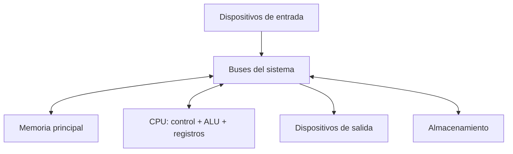
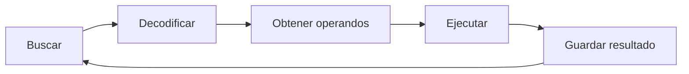
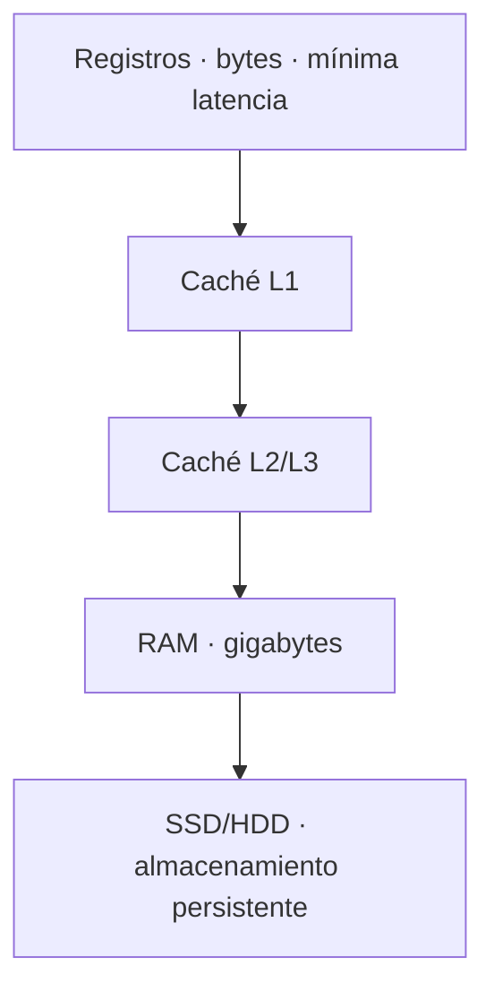
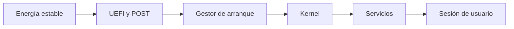

# 1. El sistema informático y la arquitectura del ordenador

## Qué queremos comprender

Un ordenador no es una colección de piezas aisladas. Es un sistema en el que hardware, software, datos, personas y procedimientos cooperan. La idea central de este capítulo es aprender a pasar de la fotografía de una placa base a un modelo que explique **cómo circula y se transforma la información**.

## 1.1 De los datos al sistema informático

La informática estudia el tratamiento automático de la información. Un dato es una representación; se convierte en información cuando se interpreta en un contexto. El número `23`, por ejemplo, puede representar una temperatura, una edad o una cantidad de equipos.

Un sistema informático integra:

- componentes físicos;
- programas y configuraciones;
- datos almacenados o transmitidos;
- personas que lo utilizan o administran;
- procedimientos de operación, seguridad y recuperación.

### Para explicarlo en clase

Utiliza la analogía de un restaurante. El hardware es el local y sus utensilios; el software, las recetas y reglas; los datos, los pedidos e ingredientes; las personas, clientes y personal; los procedimientos, la forma de recibir, cocinar, servir y comprobar. Tener una cocina excelente no garantiza un buen servicio si falla el resto del sistema.

## 1.2 Modelo de Von Neumann

El modelo de programa almacenado establece que instrucciones y datos se guardan en memoria. La CPU obtiene una instrucción, la interpreta, la ejecuta y continúa con la siguiente.

Los buses transportan tres clases de señales:

- **datos**, el contenido que se mueve;
- **direcciones**, la posición o dispositivo implicado;
- **control**, la operación y sincronización.

La anchura del bus indica cuántos bits pueden transferirse simultáneamente. Sin embargo, el rendimiento depende también de frecuencia, latencia, controlador, protocolo y patrón de acceso.

## 1.3 El ciclo de instrucción

Imaginemos la operación `resultado = A + B`:

1. El contador de programa contiene la dirección de la siguiente instrucción.
2. La unidad de control solicita esa posición a memoria.
3. La instrucción llega al registro de instrucción.
4. El decodificador determina que debe sumar dos operandos.
5. Los datos se obtienen de registros, caché o memoria.
6. La ALU realiza la suma.
7. El resultado se guarda y se actualizan indicadores de estado.
8. El contador apunta a la siguiente instrucción.

### Ejemplo resuelto

Supongamos que un registro contiene `00000101₂` y otro `00000011₂`. La ALU suma ambos valores y obtiene `00001000₂`, es decir, `8₁₀`. Además del resultado, puede actualizar banderas como cero, acarreo, signo o desbordamiento. Estas banderas permiten que instrucciones posteriores tomen decisiones.

## 1.4 Registros, caché y RAM

La CPU necesita datos a gran velocidad. Por eso el almacenamiento se organiza en niveles:

Los niveles rápidos son pequeños y caros. La caché aprovecha dos principios:

- **localidad temporal:** si un dato se ha usado, probablemente vuelva a usarse pronto;
- **localidad espacial:** si se usa una posición, probablemente se usen posiciones próximas.

### Ejemplo para el aula

Compara la jerarquía con material de clase. Lo que está en la mano equivale a registros; lo que está sobre la mesa, a caché; lo guardado en la mochila, a RAM; lo almacenado en un armario de otra sala, al disco. Todos contienen recursos, pero el tiempo de acceso cambia radicalmente.

## 1.5 CPU: más allá de los GHz

La frecuencia indica ciclos por segundo, pero no instrucciones completadas. Dos procesadores a la misma frecuencia pueden rendir de forma distinta por:

- arquitectura e instrucciones por ciclo;
- número de núcleos e hilos;
- tamaño y diseño de caché;
- límites térmicos y energéticos;
- tipo de carga y capacidad de paralelismo;
- velocidad de memoria y entrada/salida.

La ley de Amdahl explica que acelerar una parte no mejora indefinidamente el conjunto. Si una aplicación pasa la mitad del tiempo esperando al almacenamiento, duplicar la velocidad de CPU no duplica el rendimiento global.

## 1.6 Arranque del sistema

Al encender:

1. La fuente estabiliza tensiones y envía una señal de alimentación correcta.
2. La CPU comienza en una dirección predefinida del firmware.
3. UEFI ejecuta comprobaciones e inicializa componentes.
4. Consulta el orden de arranque.
5. Carga un gestor desde la partición EFI.
6. El gestor carga el kernel.
7. El kernel detecta hardware, monta el sistema raíz e inicia servicios.
8. Aparece la autenticación o interfaz de usuario.

Esta secuencia permite localizar fallos: si no hay imagen ni códigos POST, el problema está antes del sistema operativo; si aparece UEFI pero no encuentra medio, se investiga almacenamiento y arranque; si el kernel inicia y falla un servicio, se consultan registros.

## Comprobación de comprensión

1. ¿Por qué un SSD no sustituye a la RAM aunque ambos almacenen datos?
2. ¿Qué parte decide la siguiente instrucción que debe ejecutarse?
3. ¿Por qué los GHz no bastan para comparar dos CPU?
4. Ordena un fallo de servicio, uno del gestor de arranque y uno de alimentación según el momento en que aparecen.
