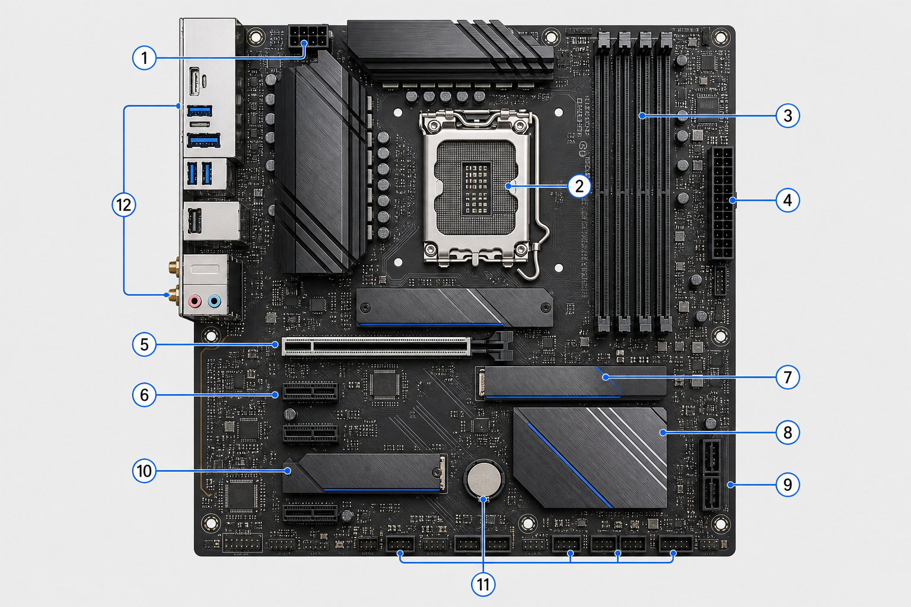
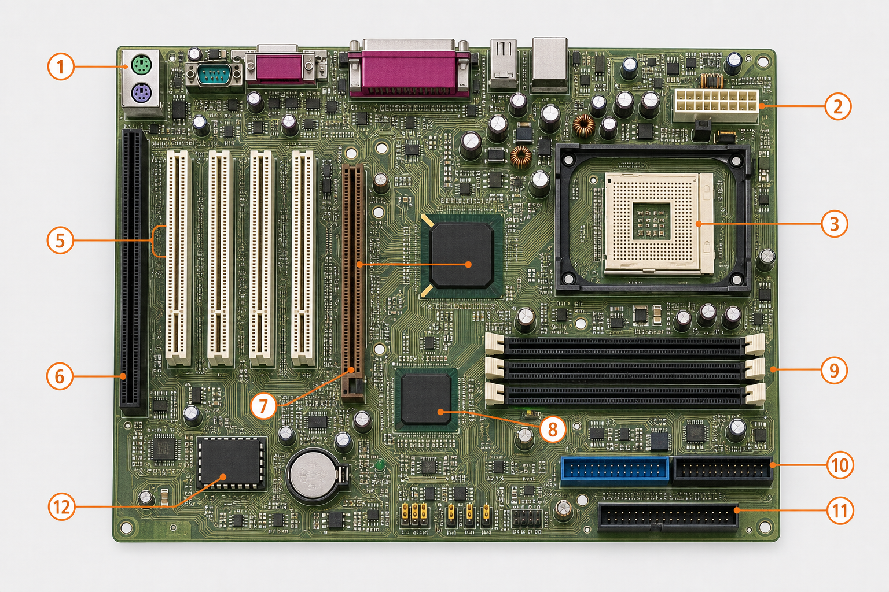
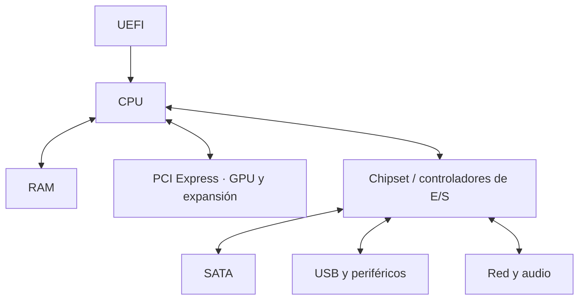
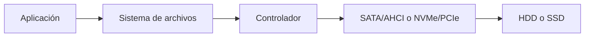
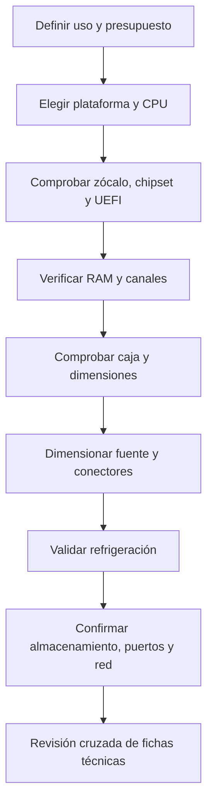

# 2. Componentes, prestaciones y compatibilidad

## 2.1 La placa base como sistema de interconexión

La placa base distribuye alimentación y comunica CPU, RAM, almacenamiento, tarjetas y periféricos. Su formato determina dimensiones, puntos de anclaje y capacidad de expansión.

### Anatomía visual de una placa moderna

**Leyenda orientativa:**

1. alimentación auxiliar de la CPU (EPS); 2. zócalo de la CPU; 3. ranuras DIMM para RAM; 4. alimentación ATX de 24 pines;
5. ranura PCIe x16; 6. ranuras PCIe de menor tamaño; 7 y 10. posiciones M.2 con disipador; 8. chipset con disipador;
9. conectores SATA; 11. batería CMOS y cabeceras inferiores; 12. panel de conexiones trasero.

En una placa actual llaman la atención los disipadores del VRM y de las unidades M.2, la desaparición de los grandes buses paralelos y la concentración de enlaces rápidos alrededor de CPU y chipset. La apariencia exacta cambia según formato y gama: la ilustración representa una ATX genérica, no un modelo comercial.

### Anatomía visual de una placa clásica (aprox. 1998–2002)

Los elementos más característicos son los puertos PS/2, serie y paralelo; el conector ATX de 20 pines; el zócalo de CPU; los bancos SDRAM; el chipset dividido en **puente norte** y **puente sur**; la ranura AGP para gráficos; las ranuras PCI e ISA; y los conectores IDE/PATA y de disquetera. Los puentes o *jumpers* tenían mayor protagonismo para configurar manualmente determinados parámetros.

!!! warning "Ilustraciones para aprender a reconocer componentes"
    Son reconstrucciones didácticas propias y plausibles, no fotografías ni esquemas de servicio. Para montar o reparar una placa concreta siempre debe consultarse el manual exacto del fabricante.

### Qué ha cambiado

| Placa clásica | Placa moderna |
|---|---|
| SDRAM y buses paralelos | DDR4/DDR5 y enlaces serie de alta velocidad |
| ISA, PCI y AGP | PCI Express |
| IDE/PATA y disquetera | SATA y M.2 NVMe |
| Puente norte y puente sur separados | Muchas funciones migran a la CPU; queda un chipset/PCH |
| BIOS y configuración frecuente mediante *jumpers* | UEFI, actualización integrada y configuración por firmware |
| Serie, paralelo y PS/2 habituales | USB, Ethernet rápido, vídeo digital, audio y, según modelo, Wi-Fi |
| Poca refrigeración sobre la propia placa | Disipadores de VRM, chipset y M.2 |

La evolución no cambia su misión fundamental: proporcionar alimentación, temporización e interconexión compatible a todos los subsistemas.

El diagrama es conceptual: en plataformas modernas muchas funciones antes situadas en el chipset están integradas en la CPU.

### Para observar placas reales

- [Anatomía y elección de una placa base moderna — Intel](https://www.intel.com/content/www/us/en/gaming/resources/how-to-choose-a-motherboard.html): recorrido por formato, zócalo, chipset, PCIe, RAM y conectividad.
- [Galería de una placa ATX moderna — ASUS ROG Strix B850-A](https://rog.asus.com/us/motherboards/rog-strix/rog-strix-b850-a-gaming-wifi7-neo/gallery/): fotografías superiores y en perspectiva con M.2, VRM, DDR5 y panel trasero.
- [Placa Intel D425KT con elementos numerados (PDF)](https://www.intel.com/content/dam/doc/product-brief/desktop-board-d425kt-innovation-brief.pdf): ejemplo de transición con PCI, SATA, DDR3 y conectividad heredada.

### Vídeos recomendados

- [Elementos de una placa base — utilidadTV](https://www.youtube.com/watch?v=yGknqrIlhXc) (en español, explicación visual introductoria).
- [Todas las placas base explicadas en 7 minutos — Un Poco de Tech](https://www.youtube.com/watch?v=BzreiTu4vNY) (formatos, chipsets, VRM, DDR y criterios de elección).

!!! question "Mientras ves el vídeo"
    Localiza zócalo, VRM, DIMM, PCIe, chipset, M.2/SATA, alimentación y panel trasero. Después compara sus posiciones con las dos ilustraciones anteriores y anota qué conexiones han desaparecido o cambiado.

### Qué mirar en una ficha técnica

- formato y dimensiones;
- zócalo y generaciones de CPU admitidas;
- chipset y versión de firmware necesaria;
- tipo, número de canales y capacidad máxima de RAM;
- distribución de líneas PCIe;
- conectores M.2 y sus modos SATA/PCIe;
- puertos, red, audio y cabeceras internas;
- conectores de alimentación y límites térmicos.

## 2.2 Procesador y refrigeración

Los núcleos ejecutan flujos de instrucciones. SMT o tecnologías equivalentes permiten mantener más de un hilo lógico por núcleo, mejorando la utilización, pero un hilo lógico no equivale a un núcleo completo.

El consumo real varía con la carga. La potencia térmica orienta el diseño de refrigeración, aunque no siempre coincide con el máximo eléctrico. Si se alcanza un límite térmico, el procesador reduce frecuencia para protegerse: es el *thermal throttling*.

### Ejemplo de decisión

Un equipo para compilación, máquinas virtuales y contenedores se beneficia de más núcleos y RAM. Un puesto destinado a tareas ofimáticas puede priorizar eficiencia, silencio y coste. Una estación 3D debe equilibrar CPU y GPU y asegurar potencia y refrigeración.

## 2.3 Memoria RAM

La compatibilidad exige que coincidan generación, formato y soporte de plataforma. DDR4 y DDR5 no son intercambiables física ni eléctricamente.

La capacidad evita paginación; la velocidad y latencia afectan el tiempo de acceso; los canales aumentan ancho de banda. Instalar módulos en ranuras incorrectas puede dejar el sistema en un único canal.

### Cálculo sencillo

Una memoria anunciada como DDR5-5600 realiza 5.600 millones de transferencias por segundo por pin. Con un bus de 64 bits, el ancho de banda teórico de un canal es:

`5.600 MT/s × 8 bytes = 44.800 MB/s`

Dos canales pueden duplicar teóricamente esta cifra, aunque la carga real, el controlador y las latencias reducen el rendimiento efectivo.

## 2.4 Almacenamiento

Un HDD utiliza platos y cabezales mecánicos. Su latencia depende del movimiento. Un SSD usa memoria flash y un controlador; no tiene piezas móviles.

SATA limita el enlace a cifras próximas a 600 MB/s. NVMe trabaja sobre PCIe y permite muchas colas de órdenes paralelas. La mejora es especialmente visible en cargas aleatorias y concurrentes, pero no todas las aplicaciones aprovechan el máximo secuencial.

### Capacidad y unidades

Un fabricante expresa 1 TB como `10¹²` bytes. Si una herramienta muestra TiB, divide por `2⁴⁰`. Por ello, 1 TB decimal equivale aproximadamente a 0,91 TiB. No faltan datos: se han usado unidades distintas.

## 2.5 Fuente de alimentación

La fuente debe aportar potencia estable y conectores adecuados. No basta sumar consumos nominales: se considera el pico de GPU, la línea de 12 V, eficiencia, temperatura, envejecimiento y margen.

La certificación 80 PLUS mide eficiencia en condiciones definidas. Una eficiencia del 90 % significa que para entregar 450 W el equipo toma aproximadamente 500 W de la red; los 50 W restantes se convierten principalmente en calor.

Protecciones deseables incluyen sobretensión, subtensión, sobrecorriente, sobrepotencia, cortocircuito y temperatura.

## 2.6 GPU y periféricos

Una GPU integra muchas unidades orientadas al paralelismo. Para seleccionarla se revisan carga, VRAM, API, controladores, dimensiones, alimentación y salidas de vídeo.

Los periféricos requieren interfaz física, protocolo y controlador. USB describe varias capas y versiones; la forma del conector no garantiza la velocidad ni funciones disponibles. Un USB-C puede ofrecer solo USB 2.0 o incluir datos rápidos, vídeo y carga, según el equipo.

## 2.7 Método de compatibilidad

### Caso resuelto

Se desea instalar una CPU de 170 W, una GPU con recomendación de fuente de 650 W, dos módulos DDR5 y un SSD NVMe.

1. Se verifica que placa y CPU comparten zócalo y que UEFI admite el modelo.
2. Se confirma DDR5, capacidad y ranuras recomendadas para doble canal.
3. Se revisa que usar el M.2 no desactive un puerto o reduzca líneas de otra ranura.
4. Se comprueban longitud y grosor de GPU, altura del disipador y flujo de aire.
5. Se elige una fuente de calidad con margen y conectores nativos para GPU y CPU.
6. Se confirma que la regleta y el SAI soportan el consumo total.

## Errores frecuentes

- Confundir el conector M.2 con el protocolo NVMe.
- Comprar RAM de una generación incompatible.
- Suponer que cualquier CPU del mismo zócalo funciona sin revisar UEFI.
- Dimensionar la fuente únicamente por su potencia impresa.
- Montar módulos de RAM contiguos cuando la placa recomienda ranuras alternas.
- Olvidar dimensiones físicas y conectores.

## Comprobación de comprensión

Explica qué consultarías antes de añadir RAM, un SSD M.2 y una GPU a un equipo existente. La respuesta debe mencionar documentación, compatibilidad eléctrica, lógica, física y térmica.
