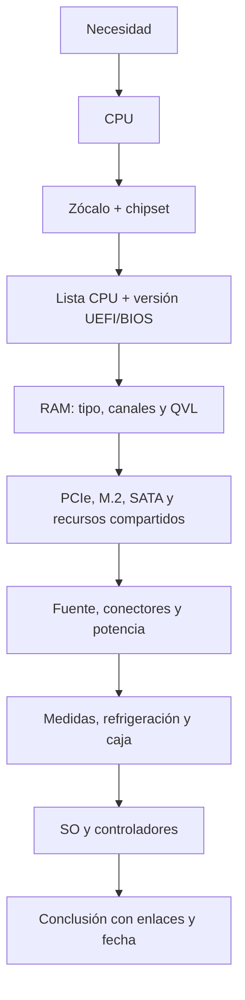

# UD1.2 · Componentes y compatibilidad del hardware

## Qué aprenderemos

Identificaremos componentes, leeremos fichas técnicas y justificaremos una
configuración. La respuesta válida no será «parece que encaja», sino una
conclusión apoyada en documentación oficial.

## 1. Mapa ordenado de componentes

### 1.1 Procesamiento

- **CPU:** arquitectura, núcleos, frecuencia, caché, límites de potencia,
  gráficos integrados y juego de instrucciones.
- **GPU:** gráficos y cargas paralelas; integrada o dedicada con memoria propia.
- **Refrigeración:** compatible con anclaje, consumo térmico y caja.

### 1.2 Memoria y almacenamiento

- **RAM:** generación DDR, capacidad, módulos, velocidad, perfiles, ECC y QVL.
- **SSD NVMe/SATA y HDD:** persistencia. M.2 es un formato; no garantiza que la
  interfaz sea NVMe ni que todas las ranuras ofrezcan las mismas líneas PCIe.

### 1.3 Interconexión y expansión

- **Placa base:** une subsistemas y distribuye alimentación y señales.
- **PCI Express:** conecta GPU, red y almacenamiento. Una ranura física grande
  puede funcionar con menos líneas eléctricas.
- **Chipset y CPU:** aportan puertos y expansión; algunos recursos se comparten.

### 1.4 Alimentación, chasis y periféricos

- **Fuente:** transforma la corriente y aplica protecciones.
- **Caja:** limita formato, GPU, disipador, radiadores y flujo de aire.
- **Periféricos y red:** entrada, salida, comunicación y accesibilidad.

## 2. La placa base, antes y ahora

### Placa moderna

Orden de lectura: zócalo y retención; VRM y alimentación CPU; DIMM; M.2; PCIe;
chipset y SATA; cabeceras USB, ventilación y panel frontal; conexiones traseras;
firmware UEFI y pila.

### Placa clásica (aprox. 1998–2002)

En diseños antiguos eran visibles puente norte y sur, AGP/PCI e IDE. Hoy el
controlador de memoria y parte de las líneas rápidas suelen estar en la CPU; el
chipset concentra E/S adicional. Las posiciones varían en cada modelo.

## 3. Método profesional de compatibilidad

### CPU, zócalo y firmware

Coincidir físicamente no basta. Consulta la página del modelo exacto y su **CPU
Support List**. Anota la versión mínima de UEFI/BIOS y si puede actualizarse sin
una CPU ya compatible.

### RAM

Comprueba generación DDR, capacidad total y por módulo, canales, velocidades,
QVL y soporte ECC/Registered. XMP o EXPO es un perfil de rendimiento, no una
garantía universal; llenar todos los bancos puede reducir la velocidad estable.

### Almacenamiento y expansión

Lee el diagrama de bloques y las notas: un M.2 puede desactivar SATA o compartir
ancho de banda con PCIe. Verifica interfaz, longitud, generación y líneas.

### Alimentación y dimensiones

Comprueba potencia continua, conectores CPU/GPU, calidad y protecciones. Contrasta
formato de placa, longitud y grosor de GPU, disipador y radiadores.

### SO y controladores

Valida arranque UEFI, TPM cuando proceda y soporte del sistema. Conserva URL,
modelo, revisión y fecha: las páginas de soporte cambian.

## 4. Caso guiado

Una placa tiene el zócalo correcto, pero no arranca con una CPU nueva. La lista
oficial incluye la CPU desde UEFI `2.10`, mientras la placa tiene `1.40`. Encaja,
pero todavía no funciona. Se planifica la actualización siguiendo el manual y,
si no existe actualización sin CPU, se consigue temporalmente una CPU admitida.

**Conclusión:** deben coincidir compatibilidad física, eléctrica, lógica y de
firmware.

## 5. Prestaciones con contexto

Compara rendimiento por núcleo y multinúcleo, memoria, rendimiento sostenido,
E/S, consumo, ruido, reparación y coste total. La elección cambia si el uso es
desarrollo, virtualización, edición, IA, servidor o juego.

## Comprueba que lo entiendes

1. ¿Por qué el zócalo no es prueba suficiente?
2. Diferencia formato M.2 e interfaz NVMe.
3. ¿Qué evidencias guardarías para defender una configuración?
4. Propón un orden de diagnóstico para un equipo sin imagen.

## Fuentes y herramientas

- [Intel: localizar chipsets compatibles](https://www.intel.com/content/www/us/en/support/articles/000092715/processors.html)
- [Intel: zócalos y soporte BIOS](https://www.intel.com/content/www/us/en/support/articles/000005670/processors.html)
- [CPU-Z (CPUID)](https://www.cpuid.com/softwares/cpu-z.html)
- Manual, lista de CPU, QVL y controladores del fabricante del modelo concreto.
