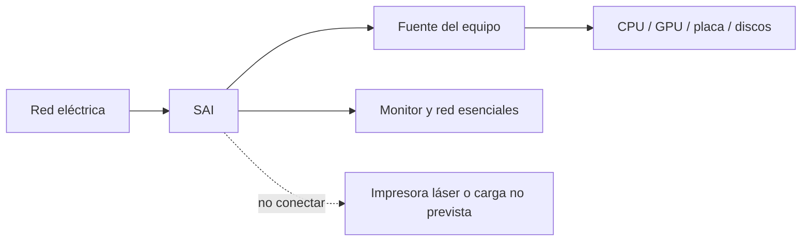
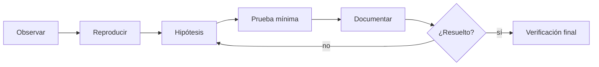

# UD1.3 · Alimentación, SAI y trabajo seguro

## Qué aprenderemos

Analizaremos la alimentación, los problemas de la red eléctrica y la elección
de un sistema de alimentación ininterrumpida (SAI), junto con procedimientos
seguros de instalación, prueba y mantenimiento.

## 1. De la red a los componentes

La fuente convierte corriente alterna en tensiones continuas, estabiliza la
salida y aplica protecciones. La potencia anunciada no basta: importan calidad,
eficiencia, conectores, ventilación y protecciones. Un SAI se instala antes de
las cargas críticas para mantenerlas durante un corte y, según su tecnología,
acondicionar la tensión.

## 2. Problemas eléctricos habituales

| Fenómeno | Qué ocurre | Consecuencia posible |
|---|---|---|
| Corte | Desaparece la tensión | Pérdida de trabajo, apagado brusco |
| Microcorte | Interrupción muy breve | Reinicio o error intermitente |
| Subtensión | Tensión inferior | Inestabilidad, uso frecuente de batería |
| Sobretensión | Tensión superior | Estrés o daño |
| Transitorio | Pico muy rápido | Daño electrónico o corrupción |
| Ruido/distorsión | Señal degradada | Fallos en cargas sensibles |

El SAI no sustituye una instalación correcta, la toma de tierra ni las copias.

## 3. Topologías de SAI

### Offline o standby

Normalmente usa la red y conmuta a batería e inversor ante un problema. Es
económico, con breve transferencia y acondicionamiento limitado.

### Line-interactive

Añade regulación automática de tensión (AVR), que corrige ciertas variaciones
sin gastar batería. Es habitual en puestos, red y pequeños servidores.

### Online de doble conversión

La energía pasa continuamente por rectificador e inversor. Aísla mejor y no
necesita transferencia para la carga, con más coste, calor y consumo propio.

| Criterio | Offline | Line-interactive | Online |
|---|---|---|---|
| Coste | Bajo | Medio | Alto |
| Regulación | Básica | AVR | Continua |
| Transferencia | Breve | Breve | Nula para la carga |
| Uso típico | Puesto | Aula/red/servidor pequeño | Servicio crítico |

## 4. W, VA, margen y autonomía

No deben superarse ni los **vatios (W)** de potencia activa ni los
**voltamperios (VA)** de potencia aparente. El factor de potencia relaciona
ambos valores en una condición concreta.

### Procedimiento

1. Decide qué equipos necesitan batería.
2. Mide consumo real o usa datos fiables.
3. Suma los vatios simultáneos.
4. Añade margen; como orientación inicial, 20–25 %, y verifica el modelo.
5. Comprueba a la vez límites W y VA.
6. Consulta la curva de autonomía a esa carga: no se deduce solo de los VA.

### Ejemplo

Equipo `260 W` + monitor `35 W` + red `20 W` = `315 W`. Con margen del 25 %:
`315 × 1,25 = 393,75 W`. Elegimos un modelo que admita más de `394 W` sin
superar VA y consultamos su autonomía a unos `315 W`.

!!! caution "Una aproximación no es una ley"
    No uses `VA = W / 0,6` como verdad universal. Los SAI publican capacidad
    real en W y VA; ambos valores se comprueban en la ficha concreta.

## 5. Forma de onda y cargas

Las fuentes con corrección activa del factor de potencia pueden ser exigentes
con la forma de onda. Para cargas sensibles se comprueba la recomendación del
fabricante y se valora salida sinusoidal. Motores, calefactores e impresoras
láser pueden tener picos incompatibles con un SAI informático.

## 6. Instalación y prueba segura

1. Revisa manual, potencia, ventilación y estado.
2. Colócalo estable, seco y con espacio para disipar calor.
3. Conecta solo las cargas planificadas.
4. Configura USB/red y apagado ordenado cuando proceda.
5. Registra modelo, serie, carga y fecha de puesta en servicio.
6. Prueba siguiendo el manual, nunca improvisando sobre un servicio crítico.
7. Revisa alarmas y batería. Su vida depende de temperatura, ciclos y modelo.

!!! danger "Seguridad"
    Un SAI puede mantener tensión desenchufado. No se abre ni se manipulan sus
    baterías sin formación. Las baterías se entregan a un gestor autorizado.

## 7. Diagnóstico basado en evidencias

Antes de tocar hardware: apagar, desconectar, evitar descargas electrostáticas,
documentar cables y no forzar conectores. Formula una hipótesis y cambia una
variable cada vez.

## Comprueba que lo entiendes

1. Diferencia corte, subtensión y transitorio.
2. ¿Qué ventaja aporta AVR sin usar la batería?
3. Calcula el límite mínimo en W para 420 W con margen del 25 %.
4. ¿Por qué los VA no permiten conocer la autonomía?

## Fuentes y ampliación

- [APC: W, VA, factor de potencia y selección](https://www.apc.com/us/en/support/product-support/ups-buying-guide-for-selecting-a-battery-backup-system.jsp)
- Manual y curva de autonomía del modelo evaluado.
