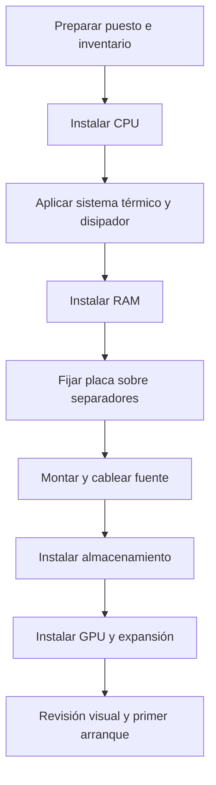
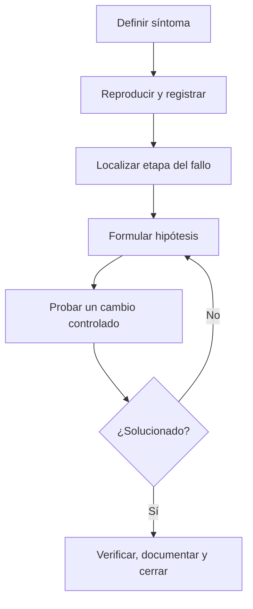

# 4. PRL, montaje y diagnóstico

## 4.1 Riesgos principales

Trabajar con equipos informáticos implica riesgos eléctricos, térmicos, mecánicos, electrostáticos y ergonómicos. La baja tensión interna no elimina el peligro: una fuente conectada contiene zonas de alta tensión y condensadores que pueden conservar carga.

### Regla de oro

No se abre ni repara internamente una fuente de alimentación, monitor u otro equipo de alta tensión sin formación y medios específicos.

## 4.2 Preparación del puesto

1. Guardar datos y apagar correctamente.
2. Desconectar alimentación y periféricos.
3. Pulsar el botón de encendido unos segundos para descargar circuitos de baja tensión.
4. Trabajar sobre superficie limpia, estable y no conductora.
5. Retirar objetos metálicos y ordenar tornillos.
6. Controlar ESD con pulsera conectada a masa o contacto frecuente con el chasis.
7. Manipular placas por los bordes.

La pulsera ESD no se conecta a una fuente de tensión. Su función es igualar potenciales para evitar una descarga a través de componentes sensibles.

## 4.3 Secuencia de montaje

Los separadores deben coincidir con los orificios de la placa. Un separador sobrante puede provocar un cortocircuito. La pasta térmica llena imperfecciones microscópicas; una cantidad excesiva no mejora la transferencia.

## 4.4 Diagnóstico basado en evidencias

Un método profesional evita sustituir piezas al azar.

### Etapas de arranque y pistas

| Síntoma | Etapa probable | Primeras comprobaciones |
| --- | --- | --- |
| Sin luces ni ventiladores | Alimentación | toma, cable, interruptor, ATX/EPS |
| Enciende sin imagen | POST/hardware | RAM, GPU, códigos, monitor |
| UEFI visible sin disco | Almacenamiento/arranque | detección, cables, orden, partición EFI |
| Kernel inicia y se detiene | Sistema operativo | mensajes, modo recuperación, sistema de archivos |
| Sesión abre pero una función falla | Servicio/aplicación | registros, permisos, configuración |

## 4.5 Caso resuelto: equipo recién montado sin imagen

**Síntoma:** ventiladores giran, pero el monitor indica ausencia de señal.

1. Se confirma entrada correcta del monitor y cable conocido.
2. Se revisan conectores ATX de 24 pines y EPS de CPU.
3. La placa muestra indicador de DRAM.
4. Se desconecta alimentación y se reinstala un único módulo en la ranura recomendada.
5. El equipo completa POST.
6. Se actualiza UEFI, se añade el segundo módulo y se ejecuta una prueba de memoria.
7. Se documenta que un módulo no estaba completamente insertado.

No se concluyó “placa rota” ni se cambió la CPU sin evidencia. El indicador permitió reducir el espacio de búsqueda.

## 4.6 Caso resuelto: apagados bajo carga

Posibles causas: temperatura, fuente insuficiente, protección eléctrica, RAM inestable o controlador. Se monitorizan temperaturas y tensiones reportadas, se revisa montaje del disipador, se ejecutan pruebas separadas de CPU, GPU y memoria y se consultan registros.

Si la temperatura alcanza el límite rápidamente, se inspeccionan contacto, ventilador y flujo. Si el fallo aparece solo al cargar GPU, se revisan alimentación y potencia. Cambiar varias piezas simultáneamente impediría saber la causa.

## 4.7 Mantenimiento preventivo

- Limpieza controlada con el equipo desconectado.
- Sujeción de ventiladores al usar aire para evitar que giren excesivamente.
- Revisión de filtros, temperaturas, ruidos y cables.
- Actualización de firmware solo cuando aporta correcciones necesarias y siguiendo el procedimiento del fabricante.
- Inventario de componentes, números de serie, cambios y garantías.
- Comprobación periódica de copias y protección eléctrica.

## 4.8 SAI

Un sistema de alimentación ininterrumpida permite mantener temporalmente equipos y filtrar determinadas perturbaciones.

- *Standby*: adecuado para puestos sencillos.
- *Line-interactive*: corrige variaciones sin usar siempre batería.
- *Online de doble conversión*: ofrece mayor aislamiento y continuidad para cargas críticas.

La autonomía depende de potencia real, factor de potencia, baterías y envejecimiento. No debe dimensionarse solo con los vatios de la fuente del PC.

## 4.9 Ergonomía y sostenibilidad

La parte superior de la pantalla debe quedar aproximadamente a la altura visual, con distancia cómoda y sin reflejos. Se alterna postura, se realizan pausas visuales y se mantienen teclado y ratón sin tensión articular.

Reparar, ampliar y reutilizar puede reducir residuos. Los componentes, baterías y soportes se entregan a gestores autorizados; nunca se eliminan junto a residuos ordinarios. Antes de reutilizar almacenamiento se aplica borrado seguro apropiado a la tecnología.

## Lista de comprobación final

- ¿El equipo está desconectado y el puesto es seguro?
- ¿Se han fotografiado conexiones antes de desmontar?
- ¿Cada hipótesis tiene una prueba concreta?
- ¿Se cambia una sola variable cada vez?
- ¿La solución se verifica bajo condiciones similares al fallo?
- ¿Se registran causa, intervención, resultado y recomendaciones?
