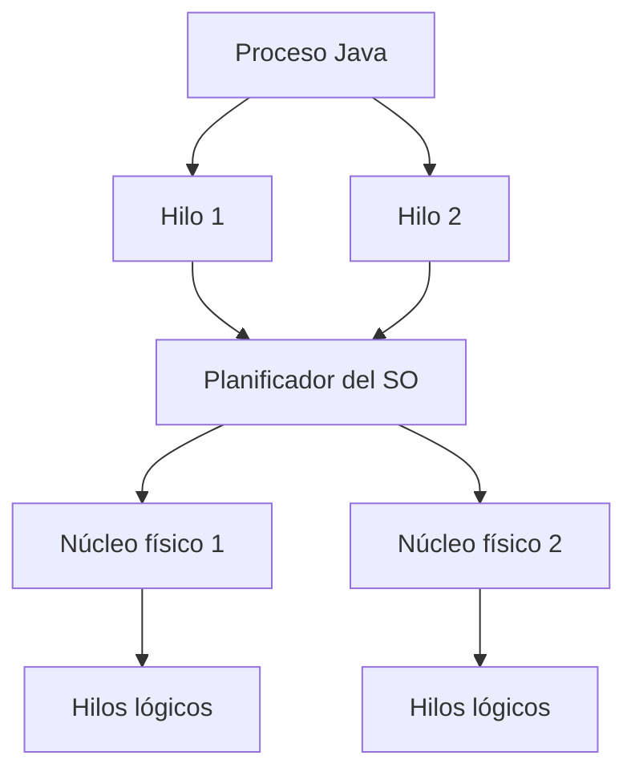
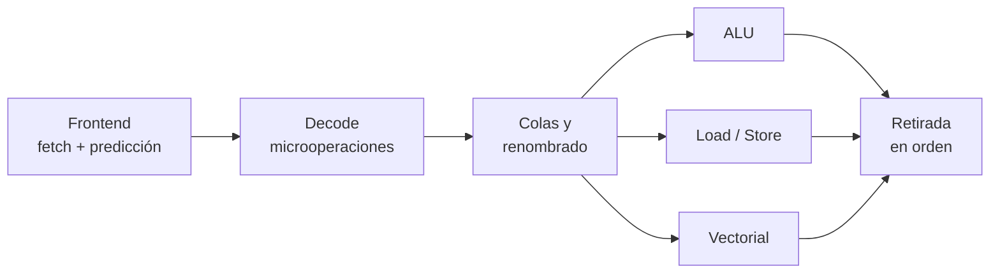

# Ampliación · Organización y rendimiento de la CPU

Este material es opcional. Léelo después de comprender el ciclo de búsqueda,
decodificación y ejecución del [tema 1.1](11-instrucciones-cpu.md).
La tarea 1.1.1 se centra en ese recorrido y en el simulador con acumulador.

## La CPU física: del silicio al socket

Lo que llamamos «procesador» reúne varias capas:

| Capa | Qué es | Por qué importa |
|---|---|---|
| *Die* | Fragmento de silicio con transistores | Integra núcleos, caché y controladores |
| *Chiplet* | Die especializado dentro de un mismo producto | Permite combinar cálculo, E/S y gráficos |
| Encapsulado | Soporte que protege y conecta los dies | Determina contactos y dimensiones |
| IHS | Cubierta metálica que reparte calor | Contacta con pasta térmica y disipador |
| Socket | Conector y retención de la placa | Debe coincidir mecánica y eléctricamente |

Una CPU moderna puede integrar CPU, GPU, NPU, controlador de memoria y líneas
PCIe. Eso no significa que todas las CPU incorporen los mismos bloques ni que
una salida de vídeo de la placa funcione sin gráficos integrados.

## Núcleos, hilos y procesadores híbridos

Un **núcleo** mantiene su propio estado de ejecución. SMT —Hyper-Threading es
una implementación comercial— permite que un núcleo exponga más de un hilo
lógico y aproveche recursos que quedarían libres. Dos hilos lógicos no equivalen
a dos núcleos completos.

En diseños híbridos pueden convivir núcleos de prestaciones y características
distintas. El planificador del sistema operativo decide dónde ejecutar cada hilo.
Para una carga DAM importa el comportamiento completo: compilación, máquinas
virtuales, base de datos, contenedores, consumo y respuesta interactiva.



### Cómo reconocer estos datos en Linux

Ejecuta `lscpu` en un terminal y relaciona la salida con los conceptos anteriores.
Este ejemplo es ficticio y describe una topología uniforme:

| Campo | Ejemplo | Cómo interpretarlo |
|---|---|---|
| Arquitectura | x86_64 | ISA que utiliza el entorno |
| Nombre del modelo | Modelo indicado por el sistema | Identificación del procesador |
| Sockets | 1 | Un paquete de CPU reconocido |
| Núcleos por socket | 4 | Cuatro núcleos físicos en ese paquete |
| Hilos por núcleo | 2 | Dos contextos lógicos por núcleo |
| CPU lógicas | 8 | El SO puede planificar sobre ocho CPU lógicas |
| Cachés | Valores de L1, L2 y L3 | Comprueba si los tamaños son agregados |
| Virtualización | VT-x o AMD-V, si aparece | Extensión de virtualización expuesta |

En este caso, `1 × 4 × 2 = 8` CPU lógicas. Cada pareja de hilos comparte
recursos de un núcleo: ocho CPU lógicas no equivalen a ocho núcleos físicos.
El socket físico es el conector de la placa; el campo de `lscpu` informa de
los paquetes que el sistema reconoce.

En una máquina virtual o WSL, la salida puede describir lo que el entorno
expone al invitado. Indica siempre dónde ejecutaste el comando. Si un campo no
aparece, escribe «no mostrado»; no inventes su valor. La fórmula anterior no
debe aplicarse sin comprobarla en topologías híbridas o con CPU desactivadas.

## Potencia, temperatura y frecuencia dinámica

La frecuencia anunciada no permanece fija. El procesador ajusta tensión y
frecuencia según carga, temperatura, límites eléctricos y política energética.
Puede alcanzar un turbo alto durante poco tiempo y reducirlo después para no
superar sus límites. El **throttling** es una reducción protectora; no se arregla
comparando únicamente el TDP impreso en dos cajas.

!!! warning "TDP no es consumo máximo universal"
    TDP es un parámetro de diseño térmico definido por cada fabricante. Para
    dimensionar placa, refrigeración o fuente se consultan también los límites
    de potencia y la ficha técnica del modelo concreto.

## Cómo comparar rendimiento con criterio

El tiempo de un programa puede aproximarse conceptualmente como:

`tiempo = instrucciones × ciclos por instrucción × tiempo de ciclo`

El compilador cambia el número de instrucciones; la microarquitectura y la
memoria cambian los ciclos necesarios; la frecuencia cambia el tiempo de ciclo.
Por eso no existe una única cifra que describa todas las cargas.

- Usa pruebas que representen la tarea real y especifica versión y configuración.
- Separa rendimiento de un hilo y de varios hilos.
- Observa consumo, temperatura y rendimiento sostenido, no solo el pico.
- Comprueba RAM, almacenamiento y refrigeración para no medir otro cuello de botella.
- Distingue latencia —tiempo de una tarea— de throughput —trabajo por unidad de tiempo—.

**Ejemplo numérico:** 3 GHz significa 3 000 millones de ciclos por segundo.
Si un núcleo completa de media 0,5 instrucciones por ciclo (IPC), termina unos
1 500 millones de instrucciones por segundo. Si completa 2 por ciclo, termina
unos 6 000 millones. Son situaciones hipotéticas a la misma frecuencia:

```text
Instrucciones por segundo ≈ frecuencia en Hz × IPC medio
```

Las esperas de memoria y las dependencias pueden reducir el IPC; disponer de
varias unidades de ejecución permite completar varias instrucciones por ciclo
cuando el programa lo permite. Por eso los GHz, por sí solos, no bastan.

## Qué añade una CPU moderna

El modelo anterior sigue siendo válido para comprender el resultado, pero una
CPU actual incorpora técnicas adicionales:

- **superescalaridad:** inicia varias operaciones por ciclo;
- **renombrado de registros:** elimina dependencias falsas;
- **ejecución fuera de orden:** adelanta operaciones cuyos datos están listos;
- **predicción de saltos:** intenta mantener alimentado el pipeline;
- **ejecución especulativa:** trabaja sobre el camino previsto;
- **retirada en orden:** confirma resultados respetando el comportamiento de la ISA;
- **SIMD/vectorización:** una instrucción opera sobre varios datos.



!!! warning "Fuera de orden no significa resultado desordenado"
    El procesador puede ejecutar antes una operación independiente, pero solo
    hace visibles los resultados de una forma compatible con el programa. Si
    falla una predicción o aparece una excepción, descarta trabajo especulativo.

## La jerarquía de memoria también decide el tiempo

La CPU puede ejecutar operaciones internas mucho más rápido que acceder a RAM.
Las cachés guardan temporalmente bloques usados recientemente.


Un **hit** encuentra el dato en el nivel consultado; un **miss** obliga a buscar
en otro más lento. La localidad temporal favorece datos reutilizados y la
localidad espacial favorece posiciones cercanas. Por eso recorrer un array de
forma ordenada suele aprovechar mejor la caché que acceder a posiciones al azar.

La memoria virtual añade traducción de direcciones. La **MMU** convierte
direcciones virtuales en físicas y el **TLB** conserva traducciones recientes.
Un fallo de página es muy distinto de un fallo de caché: puede requerir la
intervención del sistema operativo y resultar muchísimo más costoso.

## Interrupciones, excepciones y llamadas al sistema

| Mecanismo | Origen | Ejemplo |
|---|---|---|
| Interrupción | Evento externo o asíncrono | red, teclado, temporizador |
| Excepción | La instrucción en ejecución | división por cero, fallo de página |
| Llamada al sistema | Petición deliberada del programa | abrir archivo, crear proceso |

De forma simplificada, la CPU termina o detiene de manera controlada el flujo,
guarda el contexto necesario, cambia a una rutina del sistema operativo y luego
reanuda el programa cuando procede. Esto permite que una aplicación DAM use
archivos, red o pantalla sin controlar directamente cada dispositivo.

### De una operación Java a la CPU

Considera dos acciones de una aplicación:

```java
int saldo = entrada + ajuste;
String texto = java.nio.file.Files.readString(ruta);
```

En la primera, el programa calcula una suma. `javac` genera bytecode y la JVM
puede interpretarlo o compilarlo mediante JIT. El código máquina resultante
utiliza los registros y las unidades de la CPU. No hay una equivalencia fija
entre una línea Java y una instrucción: el compilador puede transformar e
incluso eliminar operaciones cuyo resultado ya conoce o no se utiliza.

En la segunda, las bibliotecas y la JVM recurren a servicios del sistema
operativo para abrir y leer el archivo. Las llamadas al sistema necesarias
transfieren el control a código del núcleo y después lo devuelven al programa.
El sistema puede satisfacer lecturas desde caché, por lo que leer un archivo
no implica siempre una lectura física del dispositivo.

**Sumar datos en registros no requiere por sí mismo una llamada al sistema.**
Pedir acceso a un recurso administrado por el sistema operativo, como un
archivo, sí requiere sus servicios. En ambos casos, la CPU termina ejecutando
instrucciones máquina; lo que cambia es el código y el nivel de privilegio.

