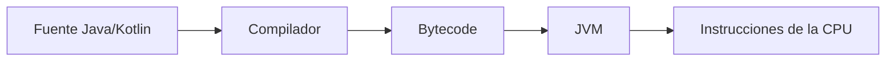
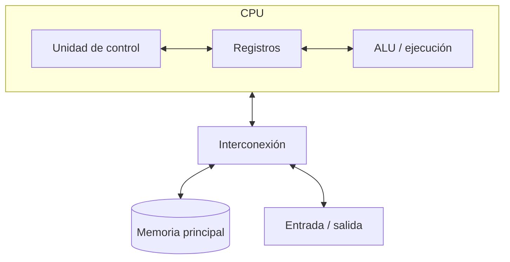
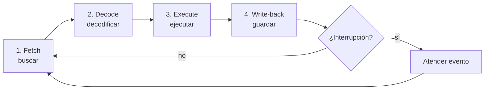

# 1.1 · Las instrucciones de la CPU

1.1

**De un programa a operaciones elementales**

Seguiremos una instrucción por los registros y buses de una CPU sencilla, y
después conectaremos el modelo con procesadores modernos.

## 1. Programa, instrucción y código máquina

El código fuente se traduce o interpreta hasta llegar a instrucciones que la
arquitectura puede ejecutar. Cada instrucción contiene un **opcode** y uno o
varios operandos. Las familias habituales son transferencia, aritmética, lógica,
comparación, salto y control.

## 2. Modelo de programa almacenado

En el modelo de Von Neumann, datos e instrucciones comparten memoria. La CPU
integra unidad de control, unidades de ejecución y registros; los buses o
interconexiones transportan direcciones, datos y control.

Muchas CPU presentan una memoria unificada al programa, pero separan caché L1
de instrucciones y datos: una organización Harvard modificada.

## 3. Registros del modelo didáctico

| Registro | Función |
|---|---|
| PC | Dirección de la próxima instrucción |
| MAR | Dirección de memoria que se consulta |
| MDR | Dato o instrucción transferido desde/hacia memoria |
| IR | Instrucción que se decodifica |
| Registros generales | Operandos y resultados temporales |
| FLAGS | Cero, signo, acarreo y otras condiciones |

## 4. Ciclo de instrucción

Si `PC=100` y allí está `LOAD R1, [500]`:

1. `MAR ← PC`; memoria entrega la instrucción a `MDR`; `IR ← MDR`.
2. El `PC` avanza según la longitud de la instrucción.
3. La unidad de control decodifica `LOAD` y la dirección `500`.
4. `MAR ← 500`; el dato leído llega a `MDR`; finalmente `R1 ← MDR`.

Para `ADD R1, R2`, los operandos ya están en registros y no hace falta leer la
RAM. La ALU calcula el resultado y actualiza las banderas.

!!! warning "Instrucción no significa ciclo de reloj"
    Una instrucción puede necesitar varias etapas y muchos ciclos. Una CPU
    segmentada mantiene varias instrucciones en curso; una CPU superescalar
    puede iniciar varias operaciones, y la ejecución fuera de orden reorganiza
    trabajo sin cambiar el resultado observable del programa.

## 5. Interrupciones

Una interrupción permite atender teclado, red, temporizadores o almacenamiento
sin consultar continuamente cada dispositivo. La CPU conserva el contexto,
ejecuta una rutina de servicio y regresa al programa. Las excepciones, en cambio,
se originan al ejecutar una instrucción, por ejemplo una división por cero.

## Comprueba que lo entiendes

1. ¿Por qué `MAR` y `MDR` aparecen dos veces en un `LOAD`?
2. ¿Qué diferencia existe entre `PC` e `IR`?
3. ¿Qué puede provocar una bandera de cero?
4. Explica por qué el modelo sigue siendo útil aunque simplifique una CPU real.

## :material-chip: Actividad 1.1 · Viaje de una instrucción

55 minIndividualEntrega en Aules

Trazarás un programa corto, justificarás cada cambio de registro y distinguirás
accesos a memoria, instrucciones y ciclos de reloj.

[Abrir la actividad 1.1](actividades/A11-ciclo-instruccion.md){ .md-button .md-button--primary }

