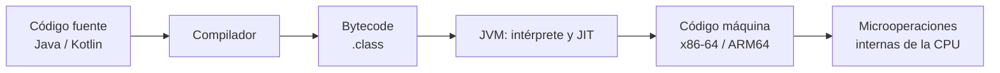
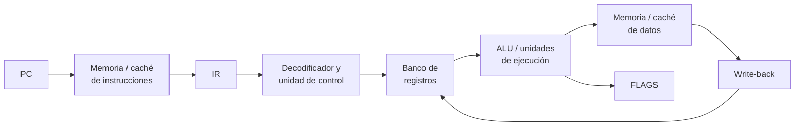
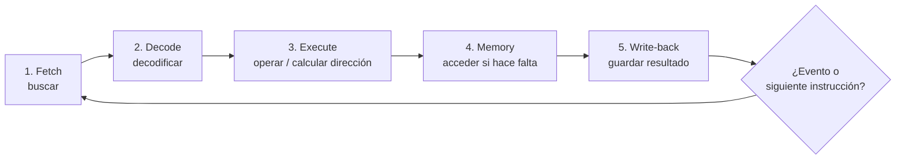
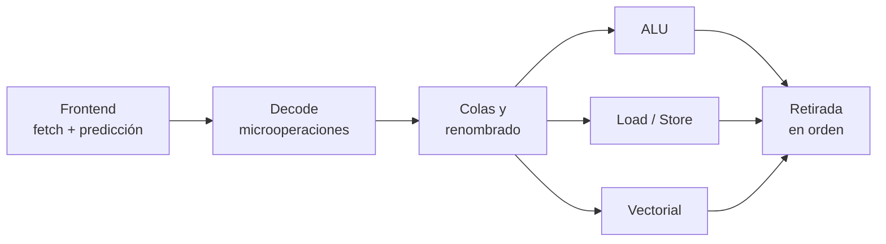

# 1.1 · Las instrucciones de la CPU

<div class="lesson-banner" markdown>
<div class="lesson-number">1.1</div>
<div markdown>
**Del programa escrito al movimiento de bits**

Seguiremos una instrucción desde el código de una aplicación hasta los registros
y unidades de ejecución. Después veremos cómo una CPU moderna consigue mantener
muchas instrucciones en vuelo sin alterar el resultado del programa.
</div>
</div>

## Qué aprenderás

Al terminar podrás:

- diferenciar programa, instrucción, ISA y microarquitectura;
- explicar la función de PC, IR, registros generales, MAR, MDR y FLAGS;
- reconstruir las fases de búsqueda, decodificación y ejecución;
- distinguir instrucción, microoperación, etapa y ciclo de reloj;
- interpretar una segmentación sencilla y sus riesgos;
- relacionar caché, interrupciones y llamadas al sistema con una aplicación DAM.

## 1. Del código fuente al procesador

La CPU no ejecuta directamente una línea Java como `total += precio`. Antes debe
convertirse en representaciones que cada capa pueda entender.



En Java, `javac` produce bytecode para la JVM. Durante la ejecución, la JVM
puede interpretar ese bytecode o compilar con JIT las zonas más utilizadas a
código máquina nativo. Por eso el mismo `.class` puede ejecutarse en equipos con
CPU diferentes, siempre que exista una JVM adecuada.

!!! note "Tres niveles que no deben confundirse"
    **Lenguaje fuente** expresa el algoritmo; **bytecode** expresa operaciones
    de una máquina virtual; **código máquina** contiene instrucciones binarias
    de una arquitectura real.

## 2. ISA y microarquitectura

La **arquitectura del conjunto de instrucciones** o ISA es el contrato visible
para compiladores y sistemas operativos. Define instrucciones, registros,
formatos, tipos de datos, modos de direccionamiento y comportamiento de las
excepciones. x86-64, ARM64 y RISC-V son ISA diferentes.

La **microarquitectura** es la forma concreta de implementar una ISA: tamaño de
cachés, número de etapas, predictores, unidades de ejecución o capacidad para
reordenar operaciones. Dos procesadores pueden ejecutar el mismo programa
x86-64 y tener diseños internos y rendimientos muy distintos.

| Concepto | Pregunta que responde | Ejemplo |
|---|---|---|
| ISA | ¿Qué instrucciones entiende? | x86-64, ARM64, RISC-V |
| Microarquitectura | ¿Cómo las ejecuta internamente? | pipeline, cachés, unidades |
| Código máquina | ¿Qué bits ejecutará esta CPU? | bytes de una instrucción |
| Ensamblador | ¿Cómo escribimos esos bits de forma legible? | `ADD R1, R2, R3` |

## 3. Anatomía de una instrucción

Una instrucción suele combinar:

- **opcode:** operación que debe realizarse;
- **registros origen:** dónde están los operandos;
- **registro destino:** dónde se guardará el resultado;
- **inmediato:** constante incluida en la instrucción;
- **modo de direccionamiento:** cómo obtener una dirección de memoria.

Consideremos una notación didáctica:

```asm
LOAD  R1, [500]     ; R1 recibe el contenido de memoria[500]
ADD   R3, R1, R2    ; R3 recibe R1 + R2
STORE [504], R3     ; memoria[504] recibe R3
JZ    fin           ; salta si la bandera Z vale 1
```

`ADD R3, R1, R2` no suma los nombres. El decodificador selecciona dos registros,
ordena una suma a la ALU y habilita la escritura del resultado en `R3`.

!!! example "Un mismo objetivo, instrucciones distintas"
    Una ISA puede ofrecer una instrucción compleja para una operación; otra
    puede necesitar varias instrucciones simples. Importa el resultado definido
    por la ISA, no que el ensamblador sea idéntico.

## 4. Bloques que participan



### 4.1 Registros del modelo didáctico

| Registro | Función | Pregunta útil |
|---|---|---|
| PC | Dirección de la próxima instrucción | ¿Qué se busca ahora? |
| IR | Instrucción que se está decodificando | ¿Qué orden ha llegado? |
| MAR | Dirección usada en un acceso a memoria | ¿En qué posición? |
| MDR | Dato transferido desde o hacia memoria | ¿Qué valor viaja? |
| Registros generales | Operandos, direcciones y resultados | ¿Con qué trabajamos? |
| SP | Posición superior de la pila | ¿Dónde está el marco actual? |
| FLAGS | Cero, signo, acarreo, desbordamiento... | ¿Qué ocurrió? |

MAR y MDR ayudan a visualizar los accesos, aunque en una CPU moderna no siempre
existan como dos registros físicos únicos con esos nombres.

### 4.2 ALU, unidad de control y reloj

La **ALU** realiza operaciones aritméticas, lógicas, desplazamientos y
comparaciones. Otras unidades se especializan en coma flotante, vectores,
cargas/almacenamientos o saltos. La **unidad de control** interpreta la
instrucción y genera señales para mover datos y activar recursos.

El reloj coordina cambios de estado. Una frecuencia de 4 GHz representa cuatro
mil millones de ciclos por segundo, pero no implica cuatro mil millones de
instrucciones terminadas: cada instrucción atraviesa etapas distintas y pueden
completarse varias o ninguna en un ciclo concreto.

## 5. Ciclo de una instrucción, paso a paso

El esquema escolar se resume como **fetch - decode - execute**. Para explicar
mejor el camino de datos utilizaremos cinco fases lógicas:



No todas las instrucciones usan las cinco fases del mismo modo. Una suma entre
registros no necesita leer datos de RAM; un `STORE` escribe memoria y no suele
escribir un registro destino; un salto puede sustituir el siguiente valor del
PC.

### 5.1 Ejemplo completo: `LOAD R1, [500]`

Supongamos `PC = 100`, que la instrucción ocupa 4 bytes y que
`memoria[500] = 27`.

| Fase | Microoperaciones didácticas | Estado relevante |
|---|---|---|
| Fetch | `MAR ← PC`; `MDR ← M[MAR]`; `IR ← MDR` | IR contiene `LOAD` |
| Actualizar PC | `PC ← PC + 4` | PC pasa a 104 |
| Decode | Se reconoce `LOAD`, destino R1 y dirección 500 | Control prepara lectura |
| Execute | Se calcula la dirección efectiva | Dirección = 500 |
| Memory | `MAR ← 500`; `MDR ← M[500]` | MDR recibe 27 |
| Write-back | `R1 ← MDR` | R1 pasa a 27 |

MAR y MDR aparecen dos veces porque primero se lee **la instrucción** situada en
100 y después se lee **el dato** situado en 500.

### 5.2 Después: `ADD R3, R1, R2`

Si `R1 = 27` y `R2 = 15`, el banco de registros entrega ambos operandos, la ALU
calcula 42 y write-back guarda `R3 = 42`. Si el resultado fuese cero, la bandera
`Z` podría activarse; si una suma sin signo generase un bit adicional aparecería
acarreo; el desbordamiento con signo se interpreta de otra manera.

### 5.3 Finalmente: `STORE [504], R3`

La CPU calcula 504 como dirección efectiva y envía el valor 42 hacia la memoria.
Aquí no se escribe R3: R3 es la fuente. Esta diferencia entre `LOAD` y `STORE`
es esencial para trazar programas correctamente.

## 6. Saltos: cuando PC no avanza en línea recta

Un programa necesita decisiones y bucles. Una comparación actualiza condiciones
y un salto condicional decide entre continuar secuencialmente o cargar otra
dirección en PC.

```asm
loop:
    LOAD R1, [R4]       ; leer elemento
    ADD  R2, R2, R1     ; acumular
    ADD  R4, R4, 4      ; siguiente posición
    SUB  R5, R5, 1      ; queda un elemento menos
    JNZ  loop           ; repetir mientras R5 no sea cero
```

El bucle de alto nivel y su traducción conceptual se relacionan así:

```java
int total = 0;
for (int valor : datos) {
    total += valor;
}
```

El compilador decide instrucciones concretas, asigna registros y optimiza. La
traducción anterior sirve para razonar, pero no pretende reproducir literalmente
el código que generará una JVM real.

## 7. Segmentación: una cadena de montaje

Sin segmentación, una instrucción podría atravesar todas las fases antes de que
comenzase la siguiente. Con **pipeline**, cada etapa trabaja simultáneamente con
una instrucción diferente.

| Ciclo | Fetch | Decode | Execute | Memory | Write-back |
|---:|---|---|---|---|---|
| 1 | I1 |  |  |  |  |
| 2 | I2 | I1 |  |  |  |
| 3 | I3 | I2 | I1 |  |  |
| 4 | I4 | I3 | I2 | I1 |  |
| 5 | I5 | I4 | I3 | I2 | I1 |
| 6 | I6 | I5 | I4 | I3 | I2 |

La latencia de una instrucción no desaparece, pero aumenta el **throughput**:
una vez llena la tubería, idealmente puede finalizar una instrucción por ciclo.

### 7.1 Riesgos del pipeline

| Riesgo | Qué ocurre | Respuesta habitual |
|---|---|---|
| Estructural | Dos instrucciones necesitan el mismo recurso | Duplicar o esperar |
| De datos | Una instrucción necesita un resultado aún no disponible | Forwarding o burbuja |
| De control | Todavía no se conoce el resultado de un salto | Predecir y, si falla, vaciar |

Ejemplo de dependencia verdadera:

```asm
ADD R1, R2, R3
SUB R4, R1, R5     ; necesita el R1 producido por ADD
```

El **forwarding** puede enviar el resultado directamente a la siguiente unidad
sin esperar a que se escriba y vuelva a leerse del banco de registros. Si no
llega a tiempo, la CPU introduce una espera o *stall*.

## 8. Qué añade una CPU moderna

El modelo anterior sigue siendo válido para comprender el resultado, pero una
CPU actual incorpora técnicas adicionales:

- **superescalaridad:** inicia varias operaciones por ciclo;
- **renombrado de registros:** elimina dependencias falsas;
- **ejecución fuera de orden:** adelanta operaciones cuyos datos están listos;
- **predicción de saltos:** intenta mantener alimentado el pipeline;
- **ejecución especulativa:** trabaja sobre el camino previsto;
- **retirada en orden:** confirma resultados respetando el comportamiento de la ISA;
- **SIMD/vectorización:** una instrucción opera sobre varios datos.



!!! warning "Fuera de orden no significa resultado desordenado"
    El procesador puede ejecutar antes una operación independiente, pero solo
    hace visibles los resultados de una forma compatible con el programa. Si
    falla una predicción o aparece una excepción, descarta trabajo especulativo.

## 9. La jerarquía de memoria también decide el tiempo

La CPU puede ejecutar operaciones internas mucho más rápido que acceder a RAM.
Las cachés guardan temporalmente bloques usados recientemente.


Un **hit** encuentra el dato en el nivel consultado; un **miss** obliga a buscar
en otro más lento. La localidad temporal favorece datos reutilizados y la
localidad espacial favorece posiciones cercanas. Por eso recorrer un array de
forma ordenada suele aprovechar mejor la caché que acceder a posiciones al azar.

La memoria virtual añade traducción de direcciones. La **MMU** convierte
direcciones virtuales en físicas y el **TLB** conserva traducciones recientes.
Un fallo de página es muy distinto de un fallo de caché: puede requerir la
intervención del sistema operativo y resultar muchísimo más costoso.

## 10. Interrupciones, excepciones y llamadas al sistema

| Mecanismo | Origen | Ejemplo |
|---|---|---|
| Interrupción | Evento externo o asíncrono | red, teclado, temporizador |
| Excepción | La instrucción en ejecución | división por cero, fallo de página |
| Llamada al sistema | Petición deliberada del programa | abrir archivo, crear proceso |

De forma simplificada, la CPU termina o detiene de manera controlada el flujo,
guarda el contexto necesario, cambia a una rutina del sistema operativo y luego
reanuda el programa cuando procede. Esto permite que una aplicación DAM use
archivos, red o pantalla sin controlar directamente cada dispositivo.

## 11. Caso guiado para explicar en clase

Supongamos:

```asm
LOAD R1, [500]
ADD  R1, R1, 1
STORE [500], R1
```

Estado inicial: `PC = 100`, `R1 = 0`, `M[500] = 9`; cada instrucción ocupa
4 bytes.

| Tras la instrucción | PC | R1 | M[500] | Explicación |
|---|---:|---:|---:|---|
| Inicial | 100 | 0 | 9 | Todavía no se ejecutó nada |
| `LOAD` | 104 | 9 | 9 | Se leyó memoria |
| `ADD` | 108 | 10 | 9 | Se operó en registros |
| `STORE` | 112 | 10 | 10 | Se escribió memoria |

Preguntas para conducir la explicación:

1. ¿En qué instrucción se modifica realmente la memoria 500?
2. ¿Por qué `ADD` no necesita acceder a RAM para sus operandos?
3. ¿Qué valor tendría PC si la segunda instrucción fuese un salto a 200?
4. ¿Qué dependencia aparecería entre `LOAD` y `ADD` en un pipeline?
5. ¿Qué ocurriría si la página que contiene la dirección 500 no estuviera en RAM?

## 12. Errores frecuentes

- **“Una instrucción tarda un ciclo”.** Depende de la instrucción y del diseño.
- **“4 GHz son 4 000 millones de instrucciones/s”.** Frecuencia y rendimiento
  no son equivalentes.
- **“El PC contiene la instrucción”.** Contiene normalmente su dirección.
- **“LOAD copia una dirección”.** Puede cargar un dato desde la dirección; hay
  que leer el modo de direccionamiento.
- **“Caché y RAM son lo mismo”.** Ambas son memoria, pero difieren en función,
  tamaño, tecnología, latencia y gestión.
- **“x86-64 identifica un procesador concreto”.** Identifica una ISA compatible
  con muchas microarquitecturas.

## Vídeo para reforzar la explicación

<div class="video-card" markdown>

### La unidad central de proceso, paso a paso

Crash Course Computer Science construye una CPU didáctica y sigue sus señales y
ciclos. Está en inglés, con subtítulos, y funciona especialmente bien después de
explicar los apartados 4 y 5.

<div class="video-frame">
<iframe src="https://www.youtube-nocookie.com/embed/FZGugFqdr60"
title="The Central Processing Unit - Crash Course Computer Science 7"
loading="lazy" allowfullscreen></iframe>
</div>

[Abrir el vídeo en YouTube](https://www.youtube.com/watch?v=FZGugFqdr60)

</div>

## Comprueba que lo entiendes

1. Diferencia ISA y microarquitectura mediante un ejemplo.
2. Explica por qué MAR y MDR aparecen dos veces en un `LOAD`.
3. Distingue instrucción, etapa del pipeline y ciclo de reloj.
4. Identifica la dependencia entre `LOAD R1, [500]` y `ADD R2, R1, R3`.
5. Explica qué ocurre cuando falla una predicción de salto.
6. Relaciona una llamada Java para leer un archivo con una llamada al sistema.

<div class="activity-card" markdown>

## :material-chip: Tarea 1.1.1 · Viaje de una instrucción

<div class="activity-meta" markdown>
<span>55 min</span><span>Individual</span><span>Entrega en Aules</span>
</div>

Trazarás un programa corto, justificarás cada cambio de registro y distinguirás
accesos a memoria, instrucciones, etapas del pipeline y ciclos de reloj.

[Abrir la Tarea 1.1.1](actividades/A11-ciclo-instruccion.md){ .md-button .md-button--primary }

</div>

## Fuentes para ampliar

- [Intel: manuales de arquitectura y programación](https://www.intel.com/content/www/us/en/developer/articles/technical/intel-sdm.html)
- [Arm: guía introductoria a la arquitectura](https://developer.arm.com/documentation/102404/latest/)
- [RISC-V: especificaciones públicas de la ISA](https://riscv.org/technical/specifications/)
- [Crash Course: Central Processing Unit](https://thecrashcourse.com/courses/the-central-processing-unit-cpu-crash-course-computer-science-7/)
