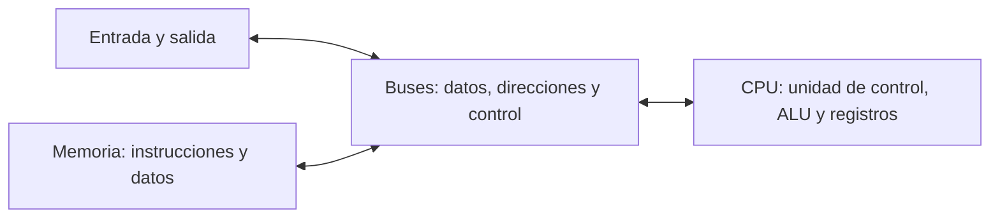
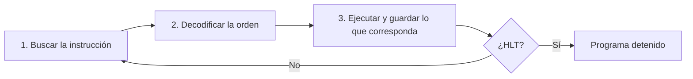

# 1.1 · Las instrucciones de la CPU

<div class="lesson-banner" markdown>
<div class="lesson-number">1.1</div>
<div markdown>
**Cómo pasa una orden de la memoria a la CPU**

Primero reconoceremos las piezas, después seguiremos una suma y finalmente
veremos un salto. Usaremos el mismo modelo con acumulador en la teoría y en
el simulador de la actividad.
</div>
</div>

## 1. El punto de partida: una máquina de Von Neumann

Un programa es una lista de instrucciones. La CPU las busca en memoria y las
ejecuta para trabajar con datos. En el modelo de **Von Neumann**, instrucciones
y datos se almacenan en una misma memoria. Que el simulador los dibuje en zonas
diferentes no significa que sean dos arquitecturas de memoria.

Imagina que queremos calcular `12 + 5` y guardar 17. La memoria conserva los
números y las órdenes; la CPU lee las órdenes, suma y devuelve el resultado.

| Parte | Función | En nuestro ejemplo |
|---|---|---|
| Memoria RAM | Guarda instrucciones y datos | Conserva el programa, 12, 5 y el resultado |
| Unidad de control | Interpreta instrucciones y coordina el trabajo | Ordena leer, sumar o guardar |
| ALU | Realiza operaciones aritméticas y lógicas | Calcula 12 + 5 |
| Registros | Guardan información temporal dentro de la CPU | Conservan la orden y el resultado actual |
| Entrada y salida | Intercambian información con el exterior | Teclado, pantalla y otros dispositivos |
| Buses | Transportan direcciones, datos y señales de control | Comunican CPU, memoria y dispositivos |

La **CPU** incluye unidad de control, ALU y registros. La RAM no es un registro
de la CPU. Un ordenador real añade cachés y otros componentes; empezamos con
este modelo para entender el recorrido.


```mermaid
flowchart LR
  IO["Entrada y salida"] <--> B["Buses: datos, direcciones y control"]
  M["Memoria: instrucciones y datos"] <--> B
  B <--> CPU["CPU: unidad de control, ALU y registros"]
```

## 2. Los registros que necesitamos

| Nombre | Qué guarda | Pregunta que resuelve |
|---|---|---|
| PC, contador de programa | Dirección de la próxima instrucción que se buscará | ¿Dónde está la siguiente orden? |
| IR, registro de instrucción | Instrucción que se ha leído | ¿Qué orden interpretamos? |
| ACC, acumulador | Dato de trabajo y resultado de las operaciones | ¿Con qué valor trabajamos? |
| MAR, registro de dirección de memoria | Dirección de una lectura o escritura | ¿A qué casilla accedemos? |
| MDR, registro de datos o intercambio de memoria | Contenido que entra o sale de memoria | ¿Qué valor se transfiere? |

**Una dirección no es su contenido.** Una casilla de memoria puede llamarse X
y contener 12: X identifica dónde está el dato; 12 es el dato. PC guarda una
dirección de instrucción, IR guarda la orden y ACC guarda un valor de trabajo.

En los vídeos aparecen nombres en español: registro contador de programa (PC),
registro de instrucción (IR), registro de dirección de memoria (MAR) y registro
de intercambio de memoria (MDR). Son las funciones de la tabla anterior.

El simulador muestra PC, IR y ACC, pero no presenta MAR y MDR como dos casillas
independientes. Los utilizaremos en los esquemas para explicar los accesos;
no tienes que buscar campos con esos nombres en su pantalla.

## 3. Qué significa cada instrucción

Usaremos una máquina didáctica con **un acumulador**. X, Y y Z son variables de
memoria; ACC es el registro donde se realizan los cálculos. La flecha `←`
significa «recibe el valor de».

| Instrucción | Significado | Si X = 12 y ACC = 5… |
|---|---|---|
| `LOD X` | ACC ← contenido de X | ACC pasa a 12 |
| `LOD #3` | ACC ← número 3 | ACC pasa a 3 |
| `ADD X` | ACC ← ACC + contenido de X | ACC pasa a 17 |
| `SUB X` | ACC ← ACC − contenido de X | ACC pasa a −7 |
| `MUL X` | ACC ← ACC × contenido de X | ACC pasa a 60 |
| `STO Z` | Z ← ACC | Z pasa a 5; ACC sigue en 5 |
| `JMP 6` | Continuar por la dirección 6 | Cambia el recorrido siempre |
| `JMZ 5` | Ir a 5 si ACC vale 0 | Con ACC = 5, no salta |
| `HLT` | Detener el programa | Termina la ejecución |

Cada fila de la última columna es un ejemplo independiente. El símbolo **#**
indica un número incluido en la instrucción: `ADD #3` suma 3; `ADD X` suma el
contenido de X.

**JMZ comprueba ACC directamente. Z es una variable de memoria, no una bandera
de cero.** Otras arquitecturas tienen registros R1/R2 y saltos que consultan
banderas; esa no es la notación de esta práctica.

## 4. El ciclo: buscar, decodificar y ejecutar

La CPU repite este recorrido hasta encontrar una orden de parada:


```mermaid
flowchart LR
  F["1. Buscar la instrucción"] --> D["2. Decodificar la orden"]
  D --> E["3. Ejecutar y guardar lo que corresponda"]
  E --> N{"¿HLT?"}
  N -->|No| F
  N -->|Sí| P["Programa detenido"]
```

### 4.1 Buscar: traer la instrucción de memoria

Supongamos que PC vale 0 y en la dirección 0 está `LOD X`:

1. Se copia la dirección del PC a MAR: `MAR ← PC`.
2. Se lee esa posición de memoria y su contenido llega a MDR.
3. Se copia la instrucción a IR: `IR ← MDR`.
4. Se prepara el PC para la siguiente dirección, que en este modelo es 1.

Hasta aquí hemos obtenido **la orden**, no el valor de X. Todas las
instrucciones, incluidas una suma o un salto, necesitan ser buscadas.

### 4.2 Decodificar: entender qué hay que hacer

La unidad de control examina IR. En `LOD X`, reconoce `LOD` como la operación
y X como el origen del dato. Activa las señales necesarias para realizarla.

Algunos materiales incluyen la decodificación al final de la búsqueda o al
principio de la ejecución. Aquí la nombramos por separado para entenderla;
no estamos añadiendo otra instrucción al programa.

### 4.3 Ejecutar: realizar la operación

Depende de la orden: `LOD` lee un dato, `ADD` suma, `STO` escribe memoria y
`JMZ` decide la dirección siguiente. No todas modifican los mismos elementos.

**Aquí cada línea ocupa una posición y PC avanza de uno en uno.** No sumaremos
4 al PC. En otras máquinas, el incremento depende del tamaño de las
instrucciones y de cómo se direcciona la memoria.

## 5. Una suma completa, paso a paso

Queremos guardar `X + Y` en Z. Empezamos con **X = 12, Y = 5, Z = 0,
ACC = 0 y PC = 0**.

| Dirección | Instrucción |
|---:|---|
| 0 | `LOD X` |
| 1 | `ADD Y` |
| 2 | `STO Z` |
| 3 | `HLT` |

### Primera instrucción: LOD X

La CPU busca `LOD X` en 0, la lleva a IR y prepara PC = 1. Después de
decodificarla, lee el dato de X, que vale 12, y lo copia a ACC.

```text
ACC = 12; X = 12; Y = 5; Z = 0; PC = 1.
```

Hay **dos lecturas diferentes**: una para obtener la instrucción y otra para
obtener el dato. Leer X no borra su contenido.

### Segunda instrucción: ADD Y

La CPU busca `ADD Y` en 1 y prepara PC = 2. Se lee Y, que contiene 5.
La ALU suma el ACC anterior y ese dato: `12 + 5 = 17`. El resultado sustituye
el contenido de ACC.

```text
ACC = 17; X = 12; Y = 5; Z = 0; PC = 2.
```

**Z todavía vale 0.** Calcular en ACC no guarda automáticamente el resultado
en Z. `ADD Y` sí lee un dato de memoria porque Y es una variable; no es una
suma entre dos registros de otra arquitectura.

### Tercera instrucción: STO Z

La CPU busca `STO Z` en 2 y prepara PC = 3. Después copia el valor de ACC,
17, a Z. En nuestro esquema, MAR selecciona la dirección de Z y MDR
transporta 17 hacia memoria.

```text
ACC = 17; X = 12; Y = 5; Z = 17; PC = 3.
```

**STO copia; no vacía ACC.** Aquí es donde cambia realmente Z.

### Cuarta instrucción: HLT

Se busca la instrucción de la dirección 3 y el programa se detiene. El resultado
ya está guardado. En esta versión del simulador, `HLT` devuelve el PC a 0 para
preparar otra ejecución; eso no significa que el programa siga en bucle.

| Instrucción terminada | ACC | X | Y | Z | PC observado al terminar |
|---|---:|---:|---:|---:|---|
| Estado inicial | 0 | 12 | 5 | 0 | 0 |
| `LOD X` | 12 | 12 | 5 | 0 | 1 |
| `ADD Y` | 17 | 12 | 5 | 0 | 2 |
| `STO Z` | 17 | 12 | 5 | 17 | 3 |
| `HLT` | 17 | 12 | 5 | 17 | 0; detenido |

Cada fila representa **una instrucción completa**, no un ciclo de reloj.
Durante la animación, PC puede haberse incrementado aunque IR todavía muestre
la instrucción que se ejecuta: ambos registros cumplen funciones distintas.

## 6. Un salto: decidir si dos valores son iguales

Si X e Y son iguales, la resta X − Y produce 0. Este programa guarda 0 en Z
si son iguales y 1 si son distintos:

```asm
LOD X
SUB Y
JMZ 5
LOD #1
JMP 6
LOD #0
STO Z
HLT
```

Las direcciones son **0 a 7**. Copia solo las instrucciones, sin números
delante ni líneas vacías: el destino 5 es `LOD #0` y el destino 6 es `STO Z`.

| Dirección | Qué hace |
|---:|---|
| 0 | Carga X en ACC |
| 1 | Resta Y al acumulador |
| 2 | Si ACC = 0, salta a 5; si no, continúa en 3 |
| 3 | Coloca 1 en ACC para indicar «distintos» |
| 4 | Salta a 6 para no ejecutar la carga de 0 |
| 5 | Coloca 0 en ACC para indicar «iguales» |
| 6 | Guarda ACC en Z |
| 7 | Detiene el programa |

**Con X = 12 e Y = 5:** la resta produce 7, JMZ no salta y se ejecutan
`0 → 1 → 2 → 3 → 4 → 6 → 7`. Z termina en 1.

**Con X = 12 e Y = 12:** la resta produce 0, JMZ salta y se ejecutan
`0 → 1 → 2 → 5 → 6 → 7`. Z termina en 0.

`JMP 6` evita que el camino «distintos» ejecute después `LOD #0` y sobrescriba
su resultado. Recuerda: **JMZ mira ACC, no la variable Z.**

### Repetir instrucciones: un bucle con contador

Un salto hacia una dirección anterior permite repetir trabajo. Para que el
programa termine, alguna operación debe cambiar la condición que controla
la repetición. El esquema habitual es:

1. Cargar el contador en ACC y comprobar si vale cero con JMZ.
2. Si no vale cero, realizar el trabajo de una vuelta.
3. Cargar de nuevo el contador, restarle 1 y guardar el nuevo valor en memoria.
4. Volver mediante JMP a la comprobación inicial.

Por ejemplo, un contador que empieza en 2 pasa por 2, 1 y 0: se realizan dos
vueltas de trabajo. Si empieza en 0 y se comprueba antes de trabajar, no se
realiza ninguna. Restar en ACC no modifica por sí solo la variable contador:
hay que guardar el resultado con STO. Si el contador nunca cambia y sigue
siendo distinto de cero, el programa puede repetir indefinidamente.

## 7. Los dos vídeos, en orden

### Primero: reconocer la fase de búsqueda

<div class="video-frame">
<iframe src="https://www.youtube-nocookie.com/embed/uxvswp1lOis"
title="Fase de búsqueda de ciclo de instrucción — alemansilla60"
loading="lazy" allowfullscreen></iframe>
</div>

[Fase de búsqueda de ciclo de instrucción — alemansilla60](https://www.youtube.com/watch?v=uxvswp1lOis).

Localiza PC, el registro de dirección, el de intercambio y el de instrucción.
Dibuja `PC → MAR → memoria → MDR → IR` y explica qué transporta cada tramo.
El vídeo utiliza una instrucción con tres direcciones de memoria. Nuestro
simulador descompone el trabajo en órdenes con acumulador: reconoce las mismas
funciones, pero no copies aquella sintaxis en el editor.

### Después: relacionar búsqueda y ejecución

<div class="video-frame">
<iframe src="https://www.youtube-nocookie.com/embed/q4MAxVeNny4"
title="2 Estructura de un computador Ciclo de Instrucción Ej1 — Jose Filippi"
loading="lazy" allowfullscreen></iframe>
</div>

[2 Estructura de un computador Ciclo de Instrucción Ej1 — Jose Filippi](https://www.youtube.com/watch?v=q4MAxVeNny4).

Utiliza el esquema para separar dos preguntas: «¿cómo llega la instrucción
a la CPU?» y «¿qué hace la CPU para cumplirla?». Explica por qué buscar una
suma y realizar una suma son trabajos distintos.

## 8. Practicar con el simulador

[Abrir Von Neumann Machine Simulator](https://vnmsim.c2r0b.ovh/en-us){ .md-button .md-button--primary target="_blank" }

Este simulador muestra PC, IR, ACC, ALU y memoria, permite avanzar por
instrucciones y utiliza `LOD`, `STO` y `JMZ`, como el material de referencia.
Funciona en el navegador. El [enlace antiguo](http://vnsimulator.altervista.org/)
queda como referencia; los pasos de esta unidad se han comprobado en la versión
actual enlazada arriba. No alternes versiones dentro de una misma traza.

1. Abre un proyecto vacío con **New project** si hay un programa anterior.
2. Pega las cuatro instrucciones de la suma del apartado 5, sin numeración.
3. Establece X = 12, Y = 5 y Z = 0 en los campos de variables.
4. Comprueba PC = 0 y el incremento del PC en 1.
5. Pulsa **Single iteration** y espera a que acabe la animación: completa una
   instrucción. Anota IR, ACC, PC y Z; repite hasta HLT.
6. **Single step** permite observar movimientos internos. Un paso de animación
   no equivale necesariamente a un ciclo de reloj físico.
7. Usa **Instant** solo para comprobar el resultado final. Para documentar IR
   y PC utiliza la ejecución animada por instrucciones.
8. Antes de otra prueba, restablece los valores iniciales: las variables
   modificadas pueden conservarse después de HLT.

La numeración de direcciones empieza en 0 aunque el editor pueda mostrar
números de línea desde 1. No añadas líneas vacías ni comentarios al principio
de estos programas: las líneas cuentan para localizar los destinos de salto.

Alternativa para otra sesión: [Little Man Computer de Peter Higginson](https://peterhigginson.co.uk/LMC/).
También permite observar memoria y acumulador, pero utiliza otros nombres de
instrucción. Los programas de esta tarea están preparados para Von Neumann
Machine Simulator; no se deben pegar directamente en LMC.

## 9. Relacionarlo con un ordenador real

### Del código Java a una instrucción máquina

```text
Código Java → javac → bytecode → JVM (intérprete y JIT) → código máquina → CPU
```

La CPU no ejecuta directamente `int total = a + b;`. La JVM interpreta el
bytecode o compila partes con JIT. La CPU ejecuta instrucciones máquina de su
arquitectura, como x86-64 o ARM64. Una línea Java puede traducirse a varias
instrucciones o ser transformada por la optimización.

Una suma no necesita por sí misma una llamada al sistema. Leer un archivo
requiere servicios del sistema operativo a través de las bibliotecas y la JVM.

### Instrucciones y ciclos de reloj

Una **instrucción** es una orden; un **ciclo de reloj** es un intervalo de
sincronización. 3 GHz significa 3 000 millones de ciclos por segundo, no
necesariamente ese número de instrucciones terminadas. Una instrucción puede
requerir varios ciclos y varias instrucciones pueden solaparse.

El **pipeline** permite ese solapamiento: mientras una instrucción se ejecuta,
otra puede estar decodificándose. El simulador de esta actividad no representa
un pipeline. Primero aprende a seguir las instrucciones una a una.

### Consultar la CPU en Windows

Pulsa **Ctrl + Mayús + Esc → Rendimiento → CPU**. Anota modelo, sockets,
núcleos, procesadores lógicos, cachés y virtualización según aparezcan.
La [actividad](actividades/A11-ciclo-instruccion.md) incluye el comando de
PowerShell para completar los campos. En Linux puedes utilizar `lscpu`.

Un **socket** es el conector del procesador en la placa; un **núcleo** es una
unidad física de procesamiento; un **hilo lógico** es un contexto que el
sistema operativo puede planificar. Los hilos de un mismo núcleo comparten
recursos. En una topología uniforme, 4 núcleos con 2 hilos cada uno dan 8
procesadores lógicos; en una CPU híbrida la proporción puede variar por núcleo.

## 10. Comprueba que lo entiendes

1. ¿Qué diferencia hay entre PC, IR y ACC?
2. ¿Por qué LOD necesita buscar la instrucción y después leer un dato?
3. Tras ADD Y, ¿ha cambiado ya Z? ¿Qué instrucción la modifica?
4. ¿Qué diferencia hay entre LOD X y LOD #3?
5. ¿Qué valor consulta JMZ en este simulador?
6. ¿Por qué una fila de la traza no representa un ciclo de reloj?

[Realizar la Tarea 1.1.1 · Viaje de una instrucción](actividades/A11-ciclo-instruccion.md){ .md-button .md-button--primary }

## Ampliación opcional y fuentes

[Organización y rendimiento de una CPU moderna](11-ampliacion-cpu.md): cachés,
núcleos, ejecución fuera de orden, temperatura e interrupciones. No necesitas
estos detalles para resolver las trazas de la tarea.

[PDF de refuerzo sobre instrucciones de la CPU](recursos-pdf/UD1-1-Instrucciones-de-la-CPU.pdf):
material complementario con otros esquemas. Para la sintaxis y los ejercicios
de esta sesión utiliza las reglas de esta página.

- [Documentación y código del simulador, c2r0b](https://github.com/c2r0b/vnmsim).
- [Ayuda de Little Man Computer, Peter Higginson](https://peterhigginson.co.uk/lmc/help.html).
- [Propiedades de Win32_Processor, Microsoft](https://learn.microsoft.com/en-us/windows/win32/cimwin32prov/win32-processor).
