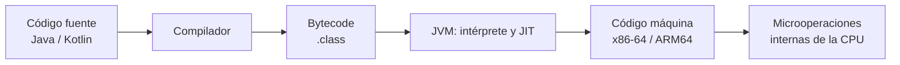
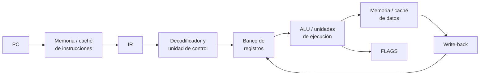
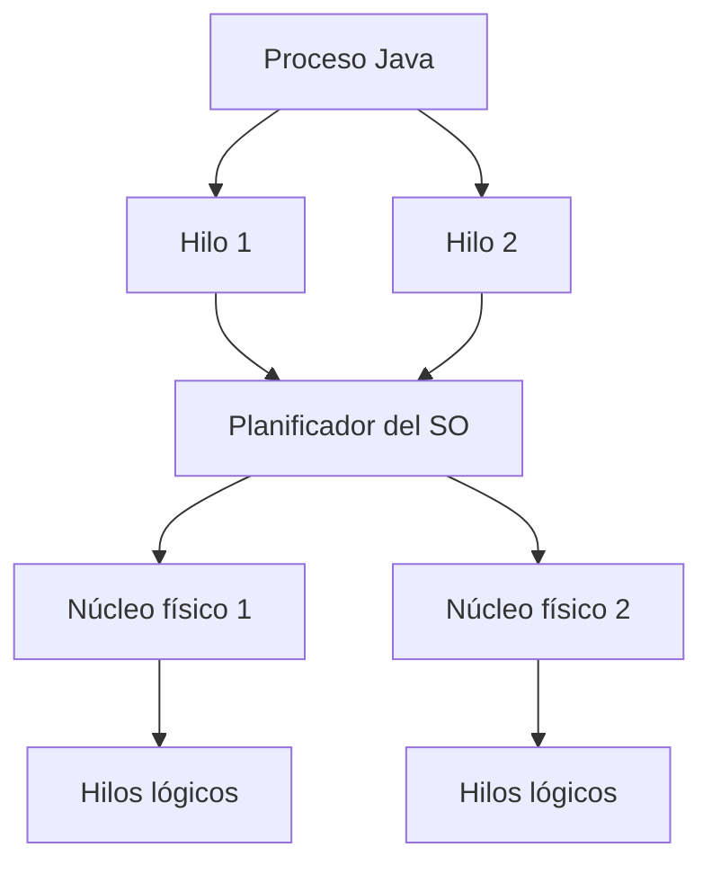
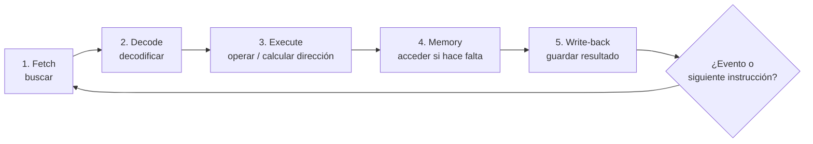
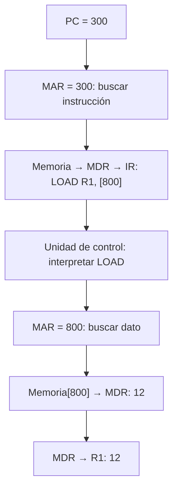
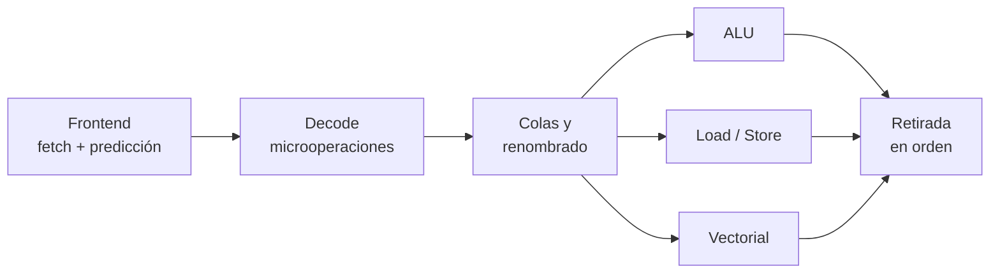

# 1.1 · Las instrucciones de la CPU

<div class="lesson-banner" markdown>
<div class="lesson-number">1.1</div>
<div markdown>
**Del programa escrito al movimiento de bits**

Seguiremos una instrucción desde el código de una aplicación hasta los registros
y unidades de ejecución. Después veremos cómo una CPU moderna consigue mantener
muchas instrucciones en vuelo sin alterar el resultado del programa.
</div>
</div>

<div class="pdf-resource" markdown>

## PDF de ampliación · Instrucciones de la CPU

[:material-file-pdf-box: **Abrir Cómo ejecuta instrucciones la CPU**](recursos-pdf/UD1-1-Instrucciones-de-la-CPU.pdf){ .md-button .md-button--primary target="_blank" }

Material visual complementario sobre *fetch*, *decode*, *execute*, PC, MAR,
MDR, IR, unidad de control, *opcode* y tipos de instrucciones. La web contiene
la explicación actualizada y el PDF sirve como refuerzo gráfico.

</div>

## Qué aprenderás

Al terminar podrás:

- diferenciar programa, instrucción, ISA y microarquitectura;
- explicar la función de PC, IR, registros generales, MAR, MDR y FLAGS;
- reconstruir las fases de búsqueda, decodificación y ejecución;
- distinguir instrucción, microoperación, etapa y ciclo de reloj;
- interpretar una segmentación sencilla y sus riesgos;
- relacionar caché, interrupciones y llamadas al sistema con una aplicación DAM.

## 1. Del código fuente al procesador

La CPU no ejecuta directamente una línea Java como `total += precio`. Antes debe
convertirse en representaciones que cada capa pueda entender.


```mermaid
flowchart LR
  F["Código fuente<br>Java / Kotlin"] --> C[Compilador]
  C --> B["Bytecode<br>.class"]
  B --> J["JVM: intérprete y JIT"]
  J --> M["Código máquina<br>x86-64 / ARM64"]
  M --> U["Microoperaciones<br>internas de la CPU"]
```

En Java, `javac` produce bytecode para la JVM. Durante la ejecución, la JVM
puede interpretar ese bytecode o compilar con JIT las zonas más utilizadas a
código máquina nativo. Por eso el mismo `.class` puede ejecutarse en equipos con
CPU diferentes, siempre que exista una JVM adecuada.

!!! note "Tres niveles que no deben confundirse"
    **Lenguaje fuente** expresa el algoritmo; **bytecode** expresa operaciones
    de una máquina virtual; **código máquina** contiene instrucciones binarias
    de una arquitectura real.

## 2. ISA y microarquitectura

La **arquitectura del conjunto de instrucciones** o ISA es el contrato visible
para compiladores y sistemas operativos. Define instrucciones, registros,
formatos, tipos de datos, modos de direccionamiento y comportamiento de las
excepciones. x86-64, ARM64 y RISC-V son ISA diferentes.

La **microarquitectura** es la forma concreta de implementar una ISA: tamaño de
cachés, número de etapas, predictores, unidades de ejecución o capacidad para
reordenar operaciones. Dos procesadores pueden ejecutar el mismo programa
x86-64 y tener diseños internos y rendimientos muy distintos.

| Concepto | Pregunta que responde | Ejemplo |
|---|---|---|
| ISA | ¿Qué instrucciones entiende? | x86-64, ARM64, RISC-V |
| Microarquitectura | ¿Cómo las ejecuta internamente? | pipeline, cachés, unidades |
| Código máquina | ¿Qué bits ejecutará esta CPU? | bytes de una instrucción |
| Ensamblador | ¿Cómo escribimos esos bits de forma legible? | `ADD R1, R2, R3` |

## 3. Anatomía de una instrucción

Una instrucción suele combinar:

- **opcode:** operación que debe realizarse;
- **registros origen:** dónde están los operandos;
- **registro destino:** dónde se guardará el resultado;
- **inmediato:** constante incluida en la instrucción;
- **modo de direccionamiento:** cómo obtener una dirección de memoria.

Consideremos una notación didáctica que mantendremos en el ejemplo guiado:

```asm
LOAD  R1, [800]     ; R1 recibe el contenido de memoria[800]
ADD   R1, R2        ; R1 recibe R1 + R2
STORE [804], R1     ; memoria[804] recibe R1
JZ    400          ; salta a 400 si la bandera Z vale 1
```

`ADD R1, R2` no suma los nombres. El decodificador selecciona los valores de
ambos registros, ordena una suma a la ALU y guarda el resultado en R1.
Aquí el primer operando es también el destino. En otros ejemplos puedes ver
la forma de tres operandos `ADD R3, R1, R2`: significa `R3 ← R1 + R2`.

**Dirección y contenido son cosas distintas.** Imagina la memoria como casillas
numeradas: 800 es el número de una casilla; `[800]` es lo que hay dentro.
Si esa casilla contiene 12, `LOAD R1, [800]` carga **12**, no 800.
La flecha `←` significa «recibe el valor de».

!!! example "Un mismo objetivo, instrucciones distintas"
    Una ISA puede ofrecer una instrucción compleja para una operación; otra
    puede necesitar varias instrucciones simples. Importa el resultado definido
    por la ISA, no que el ensamblador sea idéntico.

## 4. Bloques que participan


```mermaid
flowchart LR
  PC[PC] --> IM["Memoria / caché<br>de instrucciones"]
  IM --> IR[IR]
  IR --> DEC["Decodificador y<br>unidad de control"]
  DEC --> RF["Banco de<br>registros"]
  RF --> ALU["ALU / unidades<br>de ejecución"]
  ALU --> DM["Memoria / caché<br>de datos"]
  DM --> WB[Write-back]
  WB --> RF
  ALU --> FL[FLAGS]
```

### 4.1 Registros del modelo didáctico

| Registro | Función | Pregunta útil |
|---|---|---|
| PC | Dirección de la próxima instrucción | ¿Qué se busca ahora? |
| IR | Instrucción que se está decodificando | ¿Qué orden ha llegado? |
| MAR | Dirección usada en un acceso a memoria | ¿En qué posición? |
| MDR | Dato transferido desde o hacia memoria | ¿Qué valor viaja? |
| Registros generales | Operandos, direcciones y resultados | ¿Con qué trabajamos? |
| SP | Posición superior de la pila | ¿Dónde está el marco actual? |
| FLAGS | Cero, signo, acarreo, desbordamiento... | ¿Qué ocurrió? |

MAR y MDR ayudan a visualizar los accesos, aunque en una CPU moderna no siempre
existan como dos registros físicos únicos con esos nombres.

Por ejemplo, para leer el dato 12 situado en la dirección 800, MAR recibe 800
y MDR recibe 12. Si estamos buscando una instrucción, MDR transporta su
codificación y después IR la conserva para interpretarla. **El PC contiene
una dirección; el IR contiene una instrucción.**

La bandera **Z** es un bit: en el modelo que usaremos, vale 1 si la última
suma produjo cero y 0 si produjo otro resultado. No es un registro donde se
guarde la suma completa.

### 4.2 ALU, unidad de control y reloj

La **ALU** realiza operaciones aritméticas, lógicas, desplazamientos y
comparaciones. Otras unidades se especializan en coma flotante, vectores,
cargas/almacenamientos o saltos. La **unidad de control** interpreta la
instrucción y genera señales para mover datos y activar recursos.

El reloj coordina cambios de estado. Una frecuencia de 4 GHz representa cuatro
mil millones de ciclos por segundo, pero no implica cuatro mil millones de
instrucciones terminadas: cada instrucción atraviesa etapas distintas y pueden
completarse varias o ninguna en un ciclo concreto.

### 4.3 La CPU física: del silicio al socket

Lo que llamamos «procesador» reúne varias capas:

| Capa | Qué es | Por qué importa |
|---|---|---|
| *Die* | Fragmento de silicio con transistores | Integra núcleos, caché y controladores |
| *Chiplet* | Die especializado dentro de un mismo producto | Permite combinar cálculo, E/S y gráficos |
| Encapsulado | Soporte que protege y conecta los dies | Determina contactos y dimensiones |
| IHS | Cubierta metálica que reparte calor | Contacta con pasta térmica y disipador |
| Socket | Conector y retención de la placa | Debe coincidir mecánica y eléctricamente |

Una CPU moderna puede integrar CPU, GPU, NPU, controlador de memoria y líneas
PCIe. Eso no significa que todas las CPU incorporen los mismos bloques ni que
una salida de vídeo de la placa funcione sin gráficos integrados.

### 4.4 Núcleos, hilos y procesadores híbridos

Un **núcleo** mantiene su propio estado de ejecución. SMT —Hyper-Threading es
una implementación comercial— permite que un núcleo exponga más de un hilo
lógico y aproveche recursos que quedarían libres. Dos hilos lógicos no equivalen
a dos núcleos completos.

En diseños híbridos pueden convivir núcleos de prestaciones y características
distintas. El planificador del sistema operativo decide dónde ejecutar cada hilo.
Para una carga DAM importa el comportamiento completo: compilación, máquinas
virtuales, base de datos, contenedores, consumo y respuesta interactiva.


```mermaid
flowchart TB
  P[Proceso Java] --> T1[Hilo 1]
  P --> T2[Hilo 2]
  T1 --> SCH[Planificador del SO]
  T2 --> SCH
  SCH --> C1[Núcleo físico 1]
  SCH --> C2[Núcleo físico 2]
  C1 --> L1[Hilos lógicos]
  C2 --> L2[Hilos lógicos]
```

#### Cómo reconocer estos datos en Linux

Ejecuta `lscpu` en un terminal y relaciona la salida con los conceptos anteriores.
Este ejemplo es ficticio y describe una topología uniforme:

| Campo | Ejemplo | Cómo interpretarlo |
|---|---|---|
| Arquitectura | x86_64 | ISA que utiliza el entorno |
| Nombre del modelo | Modelo indicado por el sistema | Identificación del procesador |
| Sockets | 1 | Un paquete de CPU reconocido |
| Núcleos por socket | 4 | Cuatro núcleos físicos en ese paquete |
| Hilos por núcleo | 2 | Dos contextos lógicos por núcleo |
| CPU lógicas | 8 | El SO puede planificar sobre ocho CPU lógicas |
| Cachés | Valores de L1, L2 y L3 | Comprueba si los tamaños son agregados |
| Virtualización | VT-x o AMD-V, si aparece | Extensión de virtualización expuesta |

En este caso, `1 × 4 × 2 = 8` CPU lógicas. Cada pareja de hilos comparte
recursos de un núcleo: ocho CPU lógicas no equivalen a ocho núcleos físicos.
El socket físico es el conector de la placa; el campo de `lscpu` informa de
los paquetes que el sistema reconoce.

En una máquina virtual o WSL, la salida puede describir lo que el entorno
expone al invitado. Indica siempre dónde ejecutaste el comando. Si un campo no
aparece, escribe «no mostrado»; no inventes su valor. La fórmula anterior no
debe aplicarse sin comprobarla en topologías híbridas o con CPU desactivadas.

### 4.5 Potencia, temperatura y frecuencia dinámica

La frecuencia anunciada no permanece fija. El procesador ajusta tensión y
frecuencia según carga, temperatura, límites eléctricos y política energética.
Puede alcanzar un turbo alto durante poco tiempo y reducirlo después para no
superar sus límites. El **throttling** es una reducción protectora; no se arregla
comparando únicamente el TDP impreso en dos cajas.

!!! warning "TDP no es consumo máximo universal"
    TDP es un parámetro de diseño térmico definido por cada fabricante. Para
    dimensionar placa, refrigeración o fuente se consultan también los límites
    de potencia y la ficha técnica del modelo concreto.

### 4.6 Cómo comparar rendimiento con criterio

El tiempo de un programa puede aproximarse conceptualmente como:

`tiempo = instrucciones × ciclos por instrucción × tiempo de ciclo`

El compilador cambia el número de instrucciones; la microarquitectura y la
memoria cambian los ciclos necesarios; la frecuencia cambia el tiempo de ciclo.
Por eso no existe una única cifra que describa todas las cargas.

- Usa pruebas que representen la tarea real y especifica versión y configuración.
- Separa rendimiento de un hilo y de varios hilos.
- Observa consumo, temperatura y rendimiento sostenido, no solo el pico.
- Comprueba RAM, almacenamiento y refrigeración para no medir otro cuello de botella.
- Distingue latencia —tiempo de una tarea— de throughput —trabajo por unidad de tiempo—.

**Ejemplo numérico:** 3 GHz significa 3 000 millones de ciclos por segundo.
Si un núcleo completa de media 0,5 instrucciones por ciclo (IPC), termina unos
1 500 millones de instrucciones por segundo. Si completa 2 por ciclo, termina
unos 6 000 millones. Son situaciones hipotéticas a la misma frecuencia:

```text
Instrucciones por segundo ≈ frecuencia en Hz × IPC medio
```

Las esperas de memoria y las dependencias pueden reducir el IPC; disponer de
varias unidades de ejecución permite completar varias instrucciones por ciclo
cuando el programa lo permite. Por eso los GHz, por sí solos, no bastan.

## 5. Ciclo de una instrucción, paso a paso

El esquema escolar se resume como **fetch - decode - execute**. Para explicar
mejor el camino de datos utilizaremos cinco fases lógicas:


```mermaid
flowchart LR
  F["1. Fetch<br>buscar"] --> D["2. Decode<br>decodificar"]
  D --> E["3. Execute<br>operar / calcular dirección"]
  E --> M["4. Memory<br>acceder si hace falta"]
  M --> W["5. Write-back<br>guardar resultado"]
  W --> Q{"¿Evento o<br>siguiente instrucción?"}
  Q --> F
```

No todas las instrucciones usan las cinco fases del mismo modo. Una suma entre
registros no necesita leer datos de RAM; un `STORE` escribe memoria y no suele
escribir un registro destino; un salto puede sustituir el siguiente valor del
PC.

### 5.1 Nuestro programa de ejemplo

Vamos a leer un número, sumarle otro, guardar el resultado y decidir si hay
que saltar. Usaremos estos mismos datos en los apartados 5, 6 y 7:

```text
Dirección   Instrucción
300         LOAD  R1, [800]
304         ADD   R1, R2
308         STORE [804], R1
312         JZ    400
```

Estado inicial: **PC = 300, memoria[800] = 12, R2 = −5 y Z = 0**.
No conocemos todavía R1 ni el contenido de 804.

Estas son las reglas del ejemplo, una CPU didáctica y no una ISA comercial:

- La memoria se direcciona por bytes y cada instrucción ocupa cuatro bytes.
  Por eso la dirección secuencial siguiente se obtiene sumando 4.
- `ADD R1, R2` guarda la suma en R1 y actualiza Z.
- `LOAD`, `STORE` y `JZ` no modifican Z. No estudiaremos otras banderas.
- Primero seguiremos una instrucción completa detrás de otra. El solapamiento
  del pipeline se estudiará después, con el mismo resultado final.

### 5.2 Primera instrucción: `LOAD R1, [800]`

Significa: **«Lee el contenido de la dirección 800 y cópialo en R1»**.

1. **Búsqueda:** PC vale 300. Se coloca esa dirección en MAR, se lee la
   instrucción a través de MDR y se copia en IR. El PC secuencial pasa a 304.
2. **Decodificación:** la unidad de control reconoce una carga de memoria,
   con destino R1 y dirección de origen 800.
3. **Ejecución:** se obtiene la dirección efectiva del dato, 800.
4. **Memoria:** `MAR ← 800`; `MDR ← memoria[800]`. MDR recibe 12.
5. **Escritura del resultado:** `R1 ← MDR`. R1 recibe 12.

```text
Al terminar LOAD: R1 = 12, PC = 304, Z = 0.
Memoria[800] sigue valiendo 12: leer no borra el dato.
```

Hay **dos lecturas diferentes**: la instrucción está en 300 y el dato está en
800. MAR y MDR se utilizan en ambos momentos. El PC no pasa a 800, porque esa
es la dirección de un dato, no la de la siguiente instrucción.


```mermaid
flowchart TD
  PC["PC = 300"] --> A["MAR = 300: buscar instrucción"]
  A --> B["Memoria → MDR → IR: LOAD R1, [800]"]
  B --> C["Unidad de control: interpretar LOAD"]
  C --> D["MAR = 800: buscar dato"]
  D --> E["Memoria[800] → MDR: 12"]
  E --> F["MDR → R1: 12"]
```

Las apariciones de MAR y MDR son usos sucesivos de los mismos registros del
modelo, no registros nuevos.

### 5.3 Segunda instrucción: `ADD R1, R2`

Significa: **«Suma los valores de R1 y R2 y guarda el resultado en R1»**.

1. Se busca la instrucción en 304 y el PC secuencial pasa a 308.
2. La unidad de control reconoce la suma y selecciona R1 y R2.
3. La ALU calcula `12 + (−5) = 7`.
4. No hace falta acceder a memoria de datos: los operandos están en registros.
5. Se guarda 7 en R1. Como el resultado no es cero, Z queda en 0.

```text
Al terminar ADD: R1 = 7, R2 = −5, Z = 0, PC = 308.
```

R2 conserva su valor: el destino es R1. MAR y MDR se han usado para buscar
la instrucción, pero no para obtener los operandos de esta suma.

### 5.4 Tercera instrucción: `STORE [804], R1`

Significa: **«Copia el contenido de R1 en la dirección de memoria 804»**.

1. Se busca la instrucción en 308 y el PC secuencial pasa a 312.
2. La unidad de control identifica R1 como origen del dato y 804 como destino.
3. Se obtiene la dirección efectiva 804.
4. `MAR ← 804`; `MDR ← R1`; `memoria[MAR] ← MDR`. Se escribe el valor 7.
5. No hay resultado que escribir en un registro destino.

```text
Al terminar STORE: memoria[804] = 7, R1 = 7, Z = 0, PC = 312.
```

**804 es la dirección; 7 es el valor guardado.** Copiar R1 a memoria no borra
R1 ni modifica Z. La escritura ocurre en la fase M; la fase W no escribe
ningún registro para esta instrucción.

```text
LOAD:  memoria → registro
STORE: registro → memoria
```

### 5.5 Instrucción, etapa, microoperación y ciclo

| Concepto | Qué significa | Ejemplo |
|---|---|---|
| Instrucción | Orden completa del programa | `LOAD R1, [800]` |
| Etapa | Parte del procesamiento de una instrucción | Buscarla o decodificarla |
| Microoperación didáctica | Acción elemental con datos o registros | `MAR ← PC` |
| Ciclo de reloj | Intervalo de sincronización del procesador | Un pulso de avance del modelo |

Una instrucción atraviesa varias etapas. En el pipeline sencillo supondremos
una etapa por ciclo; en una CPU real, los tiempos y la organización dependen
del diseño. Las flechas de una traza explican transferencias: no debes contar
cada flecha automáticamente como un ciclo.

## 6. Saltos: cuando PC no avanza en línea recta

Un programa necesita decisiones y bucles. Una comparación actualiza condiciones
y un salto condicional decide entre continuar secuencialmente o cargar otra
dirección en PC.

### 6.1 Cuarta instrucción del ejemplo: `JZ 400`

Significa: **«Salta a 400 si la bandera Z vale 1»**.

1. La CPU busca la instrucción en 312; la dirección secuencial siguiente es 316.
2. La unidad de control identifica el salto condicional y su destino, 400.
3. Se consulta Z, que vale 0 porque la suma produjo 7.
4. No se toma el salto. La siguiente instrucción se buscará en **316**.

`JZ` consulta la bandera; no vuelve a sumar ni lee R1 para comprobar su valor.
Tampoco lee un dato de la dirección 400. Si toma el salto, esa dirección se
utilizará en la próxima búsqueda de instrucciones.

| Después de ejecutar | R1 | R2 | Memoria[800] | Memoria[804] | Z | PC |
|---|---:|---:|---:|---|---:|---:|
| Estado inicial | Sin especificar | −5 | 12 | Sin especificar | 0 | 300 |
| LOAD | 12 | −5 | 12 | Sin especificar | 0 | 304 |
| ADD | 7 | −5 | 12 | Sin especificar | 0 | 308 |
| STORE | 7 | −5 | 12 | 7 | 0 | 312 |
| JZ | 7 | −5 | 12 | 7 | 0 | 316 |

Esta tabla muestra el estado tras completar cada instrucción en secuencia,
no el PC de búsqueda adelantada de un pipeline. El programa mostrado no nos
dice qué instrucción hay en 316.

### 6.2 Variante: ¿qué cambiaría si R2 empezase en −12?

Reiniciamos el programa desde 300 con los mismos datos, excepto **R2 = −12**:

- `LOAD` vuelve a cargar 12 en R1.
- `ADD` calcula `12 + (−12) = 0`, guarda 0 en R1 y pone Z en 1.
- `STORE` escribe 0 en 804 y conserva Z en 1.
- `JZ` encuentra Z = 1 y establece **PC = 400**.

| Caso | Resultado de la suma | Z | ¿Salta? | PC tras JZ |
|---|---:|---:|---|---:|
| Principal: R2 = −5 | 7 | 0 | No | 316 |
| Variante: R2 = −12 | 0 | 1 | Sí | 400 |

El recorrido es el mismo hasta la decisión; lo que cambia es el resultado
de la suma y, por tanto, la bandera que consulta el salto.

### 6.3 Otro uso de los saltos: repetir un bucle

El siguiente ejemplo es independiente y utiliza instrucciones de tres operandos:

```asm
loop:
    LOAD R1, [R4]       ; leer elemento
    ADD  R2, R2, R1     ; acumular
    ADD  R4, R4, 4      ; siguiente posición
    SUB  R5, R5, 1      ; queda un elemento menos
    JNZ  loop           ; repetir mientras R5 no sea cero
```

El bucle de alto nivel y su traducción conceptual se relacionan así:

```java
int total = 0;
for (int valor : datos) {
    total += valor;
}
```

El compilador decide instrucciones concretas, asigna registros y optimiza. La
traducción anterior sirve para razonar, pero no pretende reproducir literalmente
el código que generará una JVM real.

## 7. Segmentación: una cadena de montaje

Sin segmentación, una instrucción podría atravesar todas las fases antes de que
comenzase la siguiente. Con **pipeline**, cada etapa trabaja simultáneamente con
una instrucción diferente.

| Ciclo | Fetch | Decode | Execute | Memory | Write-back |
|---:|---|---|---|---|---|
| 1 | I1 |  |  |  |  |
| 2 | I2 | I1 |  |  |  |
| 3 | I3 | I2 | I1 |  |  |
| 4 | I4 | I3 | I2 | I1 |  |
| 5 | I5 | I4 | I3 | I2 | I1 |
| 6 | I6 | I5 | I4 | I3 | I2 |

La latencia de una instrucción no desaparece, pero aumenta el **throughput**:
una vez llena la tubería, idealmente puede finalizar una instrucción por ciclo.

### 7.1 Riesgos del pipeline

| Riesgo | Qué ocurre | Respuesta habitual |
|---|---|---|
| Estructural | Dos instrucciones necesitan el mismo recurso | Duplicar o esperar |
| De datos | Una instrucción necesita un resultado aún no disponible | Forwarding o burbuja |
| De control | Todavía no se conoce el resultado de un salto | Predecir y, si falla, vaciar |

Ejemplo de dependencia verdadera:

```asm
ADD R1, R2, R3
SUB R4, R1, R5     ; necesita el R1 producido por ADD
```

El **forwarding** puede enviar el resultado directamente a la siguiente unidad
sin esperar a que se escriba y vuelva a leerse del banco de registros. Si no
llega a tiempo, la CPU introduce una espera o *stall*.

### 7.2 El pipeline de nuestro programa, paso a paso

Volvemos al programa de 300–312. Para poder dibujar sus tiempos fijamos estas
reglas: cinco etapas de un ciclo, ejecución en orden, accesos independientes
a instrucciones y datos, y memoria que responde sin esperas adicionales.
La carga entrega su dato al final de M. Hay forwarding hacia la ALU y hacia
el dato de escritura de STORE; Z está disponible cuando JZ llega a E.

**El problema está entre LOAD y ADD:** ADD necesita el valor que LOAD todavía
está buscando. Si LOAD empieza en el ciclo 1, llega a M en el ciclo 4 y obtiene
12 al final de ese ciclo. ADD no puede usar ese 12 al comienzo del mismo ciclo.

La solución de este modelo es esperar un ciclo y enviar el dato mediante
forwarding a la ALU en el ciclo 5:

| Instrucción / ciclo | 1 | 2 | 3 | 4 | 5 | 6 | 7 | 8 | 9 |
|---|---|---|---|---|---|---|---|---|---|
| LOAD | F | D | E | M | W | | | | |
| ADD | | F | D | Espera | E | M | W | | |
| STORE | | | F | Espera | D | E | M | W | |
| JZ | | | | | F | D | E | M | W |

En el ciclo 4, ADD permanece retenida antes de E y STORE también espera;
queda una **burbuja**, una posición sin instrucción útil en E. En el ciclo 5,
ADD recibe 12 y calcula 7. El forwarding evita esperar a leer otra vez R1
después de la escritura de LOAD, pero **no elimina esta espera de un ciclo**.

También hay dependencias entre ADD y STORE, por R1, y entre ADD y JZ, por Z.
Con las reglas indicadas, el resultado llega a STORE para su escritura en M
del ciclo 7, y Z está disponible para JZ en E del ciclo 7. No hacen falta
esperas adicionales. Otros diseños pueden necesitar una planificación distinta.

Las casillas M y W de ADD, STORE y JZ no implican que todas esas instrucciones
lean memoria o escriban registros. ADD no accede a datos en M; STORE no escribe
registros en W; JZ resuelve el salto en E y no hace trabajo útil en M ni W.

### 7.3 Predicción: ¿y si la CPU se adelanta por el camino incorrecto?

Supongamos que JZ se resuelve al final de E y se predice «no tomado».
La CPU empieza a buscar las instrucciones de 316 y 320 mientras decide.

En el **caso principal**, Z vale 0: la predicción acierta y puede continuar.
En la **variante con R2 = −12**, Z vale 1: el destino correcto es 400.
En ese caso, al resolver el salto en el ciclo 7:

1. Se anulan las instrucciones del camino equivocado que están en D y F
   (las buscadas en 316 y 320 en este modelo).
2. La búsqueda se redirige a 400 en el ciclo siguiente.
3. Se conservan los resultados de LOAD, ADD y STORE, que son anteriores al salto.

Estas instrucciones posteriores no estaban incluidas en la tabla porque no
conocemos sus operaciones. Su trabajo se descarta antes de modificar el estado
arquitectónico. El tiempo invertido explica la penalización de una predicción
incorrecta.

## 8. Qué añade una CPU moderna

El modelo anterior sigue siendo válido para comprender el resultado, pero una
CPU actual incorpora técnicas adicionales:

- **superescalaridad:** inicia varias operaciones por ciclo;
- **renombrado de registros:** elimina dependencias falsas;
- **ejecución fuera de orden:** adelanta operaciones cuyos datos están listos;
- **predicción de saltos:** intenta mantener alimentado el pipeline;
- **ejecución especulativa:** trabaja sobre el camino previsto;
- **retirada en orden:** confirma resultados respetando el comportamiento de la ISA;
- **SIMD/vectorización:** una instrucción opera sobre varios datos.


```mermaid
flowchart LR
  FE["Frontend<br>fetch + predicción"] --> DE["Decode<br>microoperaciones"]
  DE --> Q["Colas y<br>renombrado"]
  Q --> U1[ALU]
  Q --> U2[Load / Store]
  Q --> U3[Vectorial]
  U1 --> R["Retirada<br>en orden"]
  U2 --> R
  U3 --> R
```

!!! warning "Fuera de orden no significa resultado desordenado"
    El procesador puede ejecutar antes una operación independiente, pero solo
    hace visibles los resultados de una forma compatible con el programa. Si
    falla una predicción o aparece una excepción, descarta trabajo especulativo.

## 9. La jerarquía de memoria también decide el tiempo

La CPU puede ejecutar operaciones internas mucho más rápido que acceder a RAM.
Las cachés guardan temporalmente bloques usados recientemente.


```mermaid
flowchart LR
  R[Registros] --> L1[Caché L1]
  L1 --> L2[Caché L2]
  L2 --> L3[Caché L3]
  L3 --> RAM[Memoria RAM]
  RAM --> SSD[SSD]
```

Un **hit** encuentra el dato en el nivel consultado; un **miss** obliga a buscar
en otro más lento. La localidad temporal favorece datos reutilizados y la
localidad espacial favorece posiciones cercanas. Por eso recorrer un array de
forma ordenada suele aprovechar mejor la caché que acceder a posiciones al azar.

La memoria virtual añade traducción de direcciones. La **MMU** convierte
direcciones virtuales en físicas y el **TLB** conserva traducciones recientes.
Un fallo de página es muy distinto de un fallo de caché: puede requerir la
intervención del sistema operativo y resultar muchísimo más costoso.

## 10. Interrupciones, excepciones y llamadas al sistema

| Mecanismo | Origen | Ejemplo |
|---|---|---|
| Interrupción | Evento externo o asíncrono | red, teclado, temporizador |
| Excepción | La instrucción en ejecución | división por cero, fallo de página |
| Llamada al sistema | Petición deliberada del programa | abrir archivo, crear proceso |

De forma simplificada, la CPU termina o detiene de manera controlada el flujo,
guarda el contexto necesario, cambia a una rutina del sistema operativo y luego
reanuda el programa cuando procede. Esto permite que una aplicación DAM use
archivos, red o pantalla sin controlar directamente cada dispositivo.

### De una operación Java a la CPU

Considera dos acciones de una aplicación:

```java
int saldo = entrada + ajuste;
String texto = java.nio.file.Files.readString(ruta);
```

En la primera, el programa calcula una suma. `javac` genera bytecode y la JVM
puede interpretarlo o compilarlo mediante JIT. El código máquina resultante
utiliza los registros y las unidades de la CPU. No hay una equivalencia fija
entre una línea Java y una instrucción: el compilador puede transformar e
incluso eliminar operaciones cuyo resultado ya conoce o no se utiliza.

En la segunda, las bibliotecas y la JVM recurren a servicios del sistema
operativo para abrir y leer el archivo. Las llamadas al sistema necesarias
transfieren el control a código del núcleo y después lo devuelven al programa.
El sistema puede satisfacer lecturas desde caché, por lo que leer un archivo
no implica siempre una lectura física del dispositivo.

**Sumar datos en registros no requiere por sí mismo una llamada al sistema.**
Pedir acceso a un recurso administrado por el sistema operativo, como un
archivo, sí requiere sus servicios. En ambos casos, la CPU termina ejecutando
instrucciones máquina; lo que cambia es el código y el nivel de privilegio.

## 11. Caso guiado para explicar en clase

Este segundo programa es independiente: aumenta en uno un contador. Ahora
usamos la forma de tres operandos de ADD; el último operando es el inmediato 1.

```asm
LOAD R3, [900]
ADD  R3, R3, 1
STORE [900], R3
```

Estado inicial: `PC = 600`, `R3 = 0`, `M[900] = 20`; cada instrucción ocupa
4 bytes.

| Tras la instrucción | PC | R3 | M[900] | Explicación |
|---|---:|---:|---:|---|
| Inicial | 600 | 0 | 20 | Todavía no se ejecutó nada |
| `LOAD` | 604 | 20 | 20 | Se copió el contador a R3 |
| `ADD` | 608 | 21 | 20 | Se sumó 1 en la ALU; la memoria aún conserva 20 |
| `STORE` | 612 | 21 | 21 | Se guardó el contador actualizado |

Tras ADD, R3 ya contiene 21 pero la memoria todavía contiene 20. Solo STORE
actualiza la casilla 900. Así se distingue **calcular un resultado** de
**guardarlo en memoria**.

Preguntas para conducir la explicación:

1. ¿En qué instrucción se modifica realmente la memoria 900?
2. ¿Por qué `ADD` no necesita acceder a RAM para sus operandos?
3. ¿Qué valor tendría PC si la segunda instrucción fuese un salto incondicional a 700?
4. ¿Qué dependencia aparecería entre `LOAD` y `ADD` en un pipeline?
5. ¿Qué ocurriría si la página que contiene la dirección 900 no estuviera en RAM?

## 12. Errores frecuentes

- **“Una instrucción tarda un ciclo”.** Depende de la instrucción y del diseño.
- **“4 GHz son 4 000 millones de instrucciones/s”.** Frecuencia y rendimiento
  no son equivalentes.
- **“El PC contiene la instrucción”.** Contiene normalmente su dirección.
- **“LOAD copia una dirección”.** Puede cargar un dato desde la dirección; hay
  que leer el modo de direccionamiento.
- **“Caché y RAM son lo mismo”.** Ambas son memoria, pero difieren en función,
  tamaño, tecnología, latencia y gestión.
- **“x86-64 identifica un procesador concreto”.** Identifica una ISA compatible
  con muchas microarquitecturas.

## Vídeo para reforzar la explicación

<div class="video-card" markdown>

### La unidad central de proceso, paso a paso

Crash Course Computer Science construye una CPU didáctica y sigue sus señales y
ciclos. Está en inglés, con subtítulos, y funciona especialmente bien después de
explicar los apartados 4 y 5.

<div class="video-frame">
<iframe src="https://www.youtube-nocookie.com/embed/FZGugFqdr60"
title="The Central Processing Unit - Crash Course Computer Science 7"
loading="lazy" allowfullscreen></iframe>
</div>

[Abrir el vídeo en YouTube](https://www.youtube.com/watch?v=FZGugFqdr60)

</div>

## Comprueba que lo entiendes

1. Diferencia ISA y microarquitectura mediante un ejemplo.
2. Explica por qué MAR y MDR aparecen dos veces en un `LOAD`.
3. Distingue instrucción, etapa del pipeline y ciclo de reloj.
4. Identifica la dependencia entre `LOAD R1, [800]` y `ADD R1, R2`.
5. Explica qué ocurre cuando falla una predicción de salto.
6. Relaciona una llamada Java para leer un archivo con una llamada al sistema.

<div class="activity-card" markdown>

## :material-chip: Tarea 1.1.1 · Viaje de una instrucción

<div class="activity-meta" markdown>
<span>110 min</span><span>Individual</span><span>Entrega en Aules</span>
</div>

Trazarás un programa corto, justificarás cada cambio de registro y distinguirás
accesos a memoria, instrucciones, etapas del pipeline y ciclos de reloj.

[Abrir la Tarea 1.1.1](actividades/A11-ciclo-instruccion.md){ .md-button .md-button--primary }

</div>

## Fuentes para ampliar

- [Intel: manuales de arquitectura y programación](https://www.intel.com/content/www/us/en/developer/articles/technical/intel-sdm.html)
- [Arm: guía introductoria a la arquitectura](https://developer.arm.com/documentation/102404/latest/)
- [RISC-V: especificaciones públicas de la ISA](https://riscv.org/technical/specifications/)
- [Crash Course: Central Processing Unit](https://thecrashcourse.com/courses/the-central-processing-unit-cpu-crash-course-computer-science-7/)
