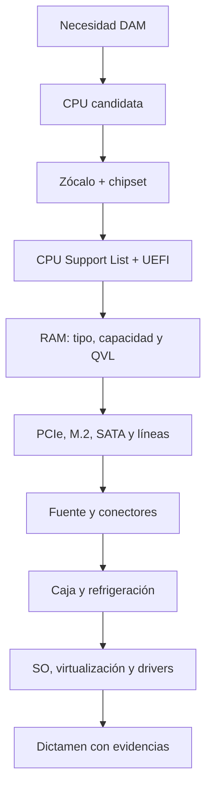

# 1.2 · Compatibilidad de CPU, placa base y RAM

1.2

**De “encaja” a “está verificado”**

Una configuración profesional se justifica con listas de soporte, manuales y
medidas, no con intuiciones ni con una única coincidencia.

## 1. Las cuatro capas de compatibilidad

**Física**  
Zócalo, formato, altura, longitud y anclajes.

**Eléctrica**  
Potencia, conectores, regulación y límites.

**Lógica**  
Chipset, buses, protocolos y recursos compartidos.

**Firmware y software**  
UEFI/BIOS, controladores y sistema operativo.

## 2. Ruta de comprobación

## 3. CPU y placa base

El zócalo coincidente es necesario, pero no suficiente. El chipset debe admitir
la familia y la **CPU Support List** del modelo exacto debe incluir el procesador.
La lista suele indicar una versión mínima de UEFI/BIOS. Si la placa llega con
una versión anterior, hay que saber si admite actualización sin CPU compatible.

!!! example "Caso"
    La CPU aparece en la lista desde UEFI `2.10`, pero la placa tiene `1.40`.
    Físicamente encaja y aun así puede no arrancar. Primero se planifica la
    actualización indicada por el fabricante.

## 4. Memoria RAM

Hay que comprobar generación DDR, capacidad total y por módulo, número de
canales, velocidad oficial, perfiles y QVL. DDR4 y DDR5 no son intercambiables.
XMP o EXPO configura parámetros de rendimiento, pero no garantiza estabilidad
en cualquier combinación; poblar todos los bancos puede reducir la velocidad.

## 5. Almacenamiento y expansión

M.2 describe un **formato**, mientras NVMe describe un protocolo sobre PCIe.
Una ranura M.2 puede admitir distintas interfaces. El manual revela si una
ranura comparte líneas con SATA o PCIe y si desactiva otros puertos.

## 6. Alimentación, refrigeración y caja

Se verifican potencia continua, conectores ATX/EPS/GPU, protecciones, formato de
placa, altura del disipador, longitud y grosor de GPU, radiadores y flujo de aire.
Una fuente sobredimensionada no corrige un conector inexistente.

## 7. Evidencias de calidad

Una auditoría debe registrar fabricante, modelo, revisión, URL y fecha. Las
fuentes prioritarias son manual, lista de CPU, QVL, ficha de procesador y
documentación del sistema operativo. Una tienda o comparador ayuda a localizar,
pero no sustituye la fuente técnica.

## Comprueba que lo entiendes

1. Enumera las cuatro capas de compatibilidad.
2. Diferencia M.2 y NVMe.
3. ¿Por qué se guarda la versión de UEFI?
4. ¿Qué información aporta una QVL y qué no garantiza?

## :material-clipboard-search-outline: Actividad 1.2 · Auditoría de compatibilidad

110 minParejasEntrega en Aules

Diseñarás un equipo para desarrollo multiplataforma y demostrarás cada decisión
con documentación oficial y una matriz visual de compatibilidad.

[Abrir la actividad 1.2](actividades/A12-compatibilidad.md){ .md-button .md-button--primary }

## Fuentes de consulta

- [Intel: localizar chipsets compatibles](https://www.intel.com/content/www/us/en/support/articles/000092715/processors.html)
- [Intel: zócalos y soporte de BIOS](https://www.intel.com/content/www/us/en/support/articles/000005670/processors.html)
- Manual, CPU Support List y QVL de la placa concreta.
