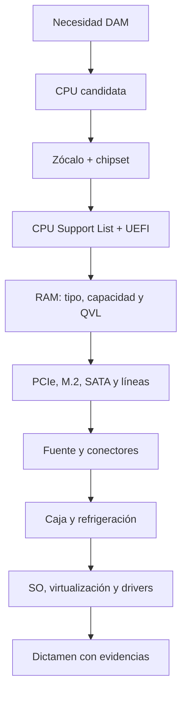
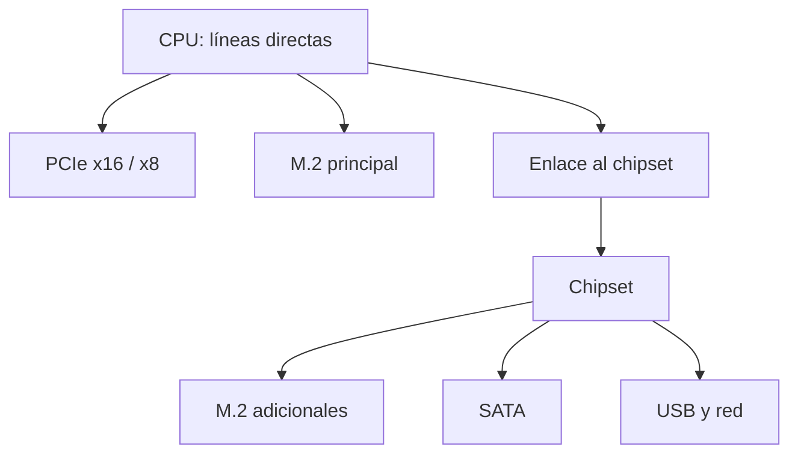
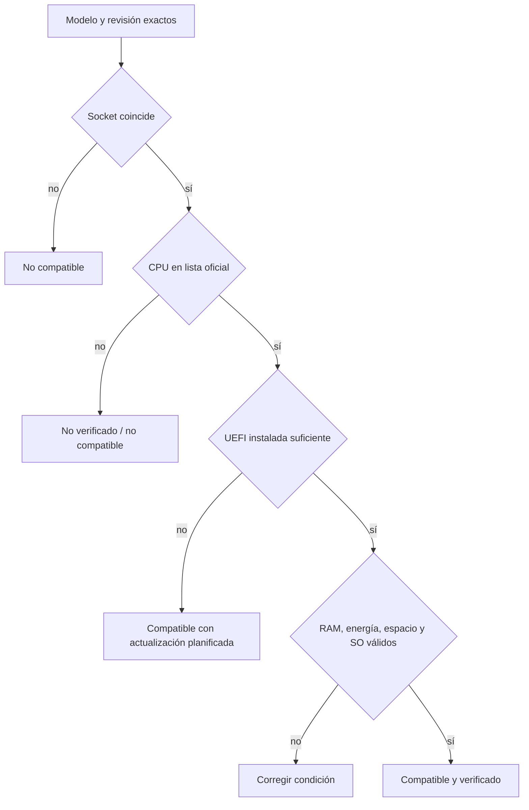

# 1.2 · Compatibilidad de CPU, placa base y RAM

<div class="lesson-banner" markdown>
<div class="lesson-number">1.2</div>
<div markdown>
**De “encaja” a “está verificado”**

Una configuración profesional se justifica con listas de soporte, manuales y
medidas, no con intuiciones ni con una única coincidencia.
</div>
</div>

<div class="pdf-resource" markdown>

## PDF de ampliación · Compatibilidad

[:material-file-pdf-box: **Abrir Compatibilidad de CPU, placa y RAM**](recursos-pdf/UD1-2-Compatibilidad-CPU-Placa-RAM.pdf){ .md-button .md-button--primary target="_blank" }

Guía complementaria para seguir el proceso de verificación de socket,
chipset, UEFI, memoria, QVL, refrigeración y factor de forma. Contrasta los
modelos concretos con las fuentes oficiales enlazadas en esta página.

</div>

## 1. Las cuatro capas de compatibilidad

<div class="component-grid" markdown>
<div markdown>**Física**  
Zócalo, formato, altura, longitud y anclajes.</div>
<div markdown>**Eléctrica**  
Potencia, conectores, regulación y límites.</div>
<div markdown>**Lógica**  
Chipset, buses, protocolos y recursos compartidos.</div>
<div markdown>**Firmware y software**  
UEFI/BIOS, controladores y sistema operativo.</div>
</div>

## 2. Ruta de comprobación



## 3. CPU y placa base

El zócalo coincidente es necesario, pero no suficiente. El chipset debe admitir
la familia y la **CPU Support List** del modelo exacto debe incluir el procesador.
La lista suele indicar una versión mínima de UEFI/BIOS. Si la placa llega con
una versión anterior, hay que saber si admite actualización sin CPU compatible.

!!! example "Caso"
    La CPU aparece en la lista desde UEFI `2.10`, pero la placa tiene `1.40`.
    Físicamente encaja y aun así puede no arrancar. Primero se planifica la
actualización indicada por el fabricante.

Además de zócalo y chipset se revisan límites de potencia, refrigeración, versión
de firmware y prestaciones que dependen de la CPU instalada. Una placa puede
ofrecer físicamente una ranura o salida y no habilitarla con todas las CPU.

### 3.1 Socket no significa compatibilidad completa

El socket define contactos, dimensiones y retención. Hay tres tecnologías que
conviene distinguir:

| Tipo | Contactos | Ejemplo de uso | Riesgo al manipular |
|---|---|---|---|
| LGA | Pines elásticos en la placa | AMD AM5, Intel LGA1851 | Dañar el socket de la placa |
| PGA | Pines en la CPU | AMD AM4 y plataformas anteriores | Doblar pines del procesador |
| BGA | Soldado a la placa | Portátiles y sistemas integrados | No es sustituible de forma ordinaria |

ZIF describe el mecanismo de inserción con poca fuerza, no una familia de
procesadores. Tampoco se deben deducir compatibilidades porque dos sockets midan
lo mismo: Intel documenta que LGA1851 y LGA1700 no son intercambiables.

### 3.2 Ejemplos de plataforma vigentes en 2026

| Plataforma | CPU de referencia | Memoria | Comprobación imprescindible |
|---|---|---|---|
| AMD AM5 | Ryzen 7000/8000/9000 y familias admitidas | DDR5 | CPU Support List y versión de UEFI |
| Intel LGA1851 | Core Ultra de sobremesa Serie 2 | DDR5 | Chipset serie 800 y lista del fabricante |
| AMD AM4 | Ryzen de generaciones compatibles | DDR4 | El mismo socket abarca combinaciones no válidas sin firmware adecuado |
| Intel LGA1700 | Core de 12.ª a 14.ª generación según placa | DDR4 o DDR5 según placa | Chipset, revisión, tipo de RAM y BIOS |

La tabla es una fotografía docente, no una autorización de compra. AMD indica
que una placa AM5 de la serie 600 puede requerir actualización de firmware para
CPU posteriores. La página de soporte del **modelo y revisión exactos** decide.

### 3.3 Chipset y VRM

El chipset amplía las líneas de entrada/salida y habilita funciones, pero no es
«el cerebro» que controla toda la RAM: en equipos actuales el controlador de
memoria suele estar en la CPU. El VRM transforma la alimentación para el
procesador; su capacidad y refrigeración influyen en el rendimiento sostenido.

Dos placas con el mismo chipset pueden diferir en:

- calidad y límites del VRM;
- número de ranuras y reparto de líneas PCIe;
- red, audio, USB y controladores adicionales;
- posibilidad de actualizar UEFI sin una CPU compatible;
- tamaño de la memoria de firmware y soporte real de generaciones.

## 4. Memoria RAM

Hay que comprobar generación DDR, capacidad total y por módulo, número de
canales, velocidad oficial, perfiles y QVL. DDR4 y DDR5 no son intercambiables.
XMP o EXPO configura parámetros de rendimiento, pero no garantiza estabilidad
en cualquier combinación; poblar todos los bancos puede reducir la velocidad.
La velocidad anunciada en un kit puede corresponder a un perfil de overclock y
no a la velocidad estándar admitida oficialmente por el controlador de memoria.

### 4.1 Frecuencia, transferencias y canales

En DDR se anuncian normalmente **MT/s**, no MHz de reloj. Un módulo DDR5-6000
transfiere 6 000 millones de operaciones por segundo por pin, pero su reloj de
E/S no se expresa simplemente como «6 000 MHz». Para estimar ancho de banda de
un canal de 64 bits:

`6 000 MT/s × 8 bytes = 48 000 MB/s` teóricos.

Dos canales poblados correctamente pueden duplicar el ancho de banda teórico,
pero no duplican el rendimiento de todas las aplicaciones.

### 4.2 QVL, perfiles y estabilidad

Una QVL demuestra que el fabricante probó una referencia concreta, capacidad,
número de módulos y configuración. Que un módulo no figure no demuestra que sea
incompatible; sí obliga a justificarlo con más cuidado. Que figure tampoco
garantiza la misma velocidad al usar cuatro módulos o una revisión distinta.

XMP y EXPO almacenan perfiles de temporización y tensión. Activarlos puede
considerarse overclock del subsistema de memoria. Antes de entregar un equipo se
realiza una prueba de memoria y se documenta la configuración estable.

## 5. Almacenamiento y expansión

M.2 describe un **formato**, mientras NVMe describe un protocolo sobre PCIe.
Una ranura M.2 puede admitir distintas interfaces. El manual revela si una
ranura comparte líneas con SATA o PCIe y si desactiva otros puertos.

PCIe mantiene compatibilidad entre generaciones en muchos casos, pero el enlace
negocia la combinación posible y queda limitado por el extremo más lento. La
forma `x16` de una ranura tampoco asegura que tenga dieciséis líneas eléctricas.

### 5.1 Leer el reparto de líneas



Si varios dispositivos atraviesan el enlace del chipset, comparten su ancho de
banda. El manual puede indicar expresiones como «M2_2 comparte ancho de banda
con SATA_3» o «PCIEX16_2 funciona a x4». Esa nota es tan importante como el
dibujo de la ranura.

## 6. Alimentación, refrigeración y caja

Se verifican potencia continua, conectores ATX/EPS/GPU, protecciones, formato de
placa, altura del disipador, longitud y grosor de GPU, radiadores y flujo de aire.
Una fuente sobredimensionada no corrige un conector inexistente.

## 7. Compatibilidad para virtualización y DAM

Para el aula no basta con que el equipo arranque. Conviene comprobar:

- virtualización por hardware habilitable en UEFI;
- RAM suficiente para anfitrión, IDE, navegador y máquinas virtuales;
- SSD con espacio para discos virtuales e instantáneas;
- controladores compatibles con el sistema anfitrión;
- firmware actualizado y posibilidad de recuperación;
- conectividad de red adecuada para descargar imágenes y dependencias.

Una configuración con 8 GB puede ejecutar herramientas por separado, pero queda
muy limitada al combinar IDE, navegador y una VM. La necesidad real se justifica
por la carga de trabajo y no solo por el requisito mínimo de cada producto.

### 7.1 Inventario desde Linux

En los equipos del aula se puede obtener un primer inventario sin instalar CPU-Z:

```bash
lscpu
sudo dmidecode -t baseboard -t bios -t memory
lsblk -o NAME,MODEL,SIZE,TRAN
lspci -nn
sudo fwupdmgr get-devices
```

Estos comandos identifican lo instalado, pero no sustituyen las listas de
soporte. `dmidecode` muestra lo que declara el firmware y puede contener campos
vacíos o imprecisos. Antes de usar `sudo`, se explica qué lee el comando y se
respeta la política del aula.

### 7.2 Dictamen técnico

Una conclusión profesional no dice solo «compatible». Usa uno de estos estados:

- **compatible y verificado**;
- **compatible con condición** —por ejemplo, actualizar UEFI antes—;
- **no compatible**, indicando la causa exacta;
- **no verificable con la evidencia disponible**, indicando qué falta.



## 8. Evidencias de calidad

Una auditoría debe registrar fabricante, modelo, revisión, URL y fecha. Las
fuentes prioritarias son manual, lista de CPU, QVL, ficha de procesador y
documentación del sistema operativo. Una tienda o comparador ayuda a localizar,
pero no sustituye la fuente técnica.

<div class="video-card" markdown>

### Vídeo · Reconocer los elementos antes de comprobarlos

Este repaso visual de 2026 identifica VRM, zócalo, DIMM, chipset, PCIe, M.2 y
alimentación. Úsalo para localizar componentes; las decisiones de compatibilidad
deben verificarse después en documentación oficial.

<div class="video-frame">
<iframe src="https://www.youtube-nocookie.com/embed/jfKOl1W8Ml4"
title="Every Motherboard Component Explained" loading="lazy"
allowfullscreen></iframe>
</div>

[Abrir el vídeo en YouTube](https://www.youtube.com/watch?v=jfKOl1W8Ml4)

</div>

## Comprueba que lo entiendes

1. Enumera las cuatro capas de compatibilidad.
2. Diferencia M.2 y NVMe.
3. ¿Por qué se guarda la versión de UEFI?
4. ¿Qué información aporta una QVL y qué no garantiza?

<div class="activity-card" markdown>

## :material-clipboard-search-outline: Tarea 1.2.1 · Auditoría de compatibilidad

<div class="activity-meta" markdown>
<span>110 min</span><span>Individual</span><span>Entrega en Aules</span>
</div>

Diseñarás un equipo para desarrollo multiplataforma y demostrarás cada decisión
con documentación oficial y una matriz visual de compatibilidad.

[Abrir la Tarea 1.2.1](actividades/A12-compatibilidad.md){ .md-button .md-button--primary }

</div>

## Fuentes de consulta

- [Intel: localizar chipsets compatibles](https://www.intel.com/content/www/us/en/support/articles/000092715/processors.html)
- [Intel: zócalos y soporte de BIOS](https://www.intel.com/content/www/us/en/support/articles/000005670/processors.html)
- Manual, CPU Support List y QVL de la placa concreta.
- [PCI-SIG: información oficial de PCI Express](https://pcisig.com/pci-express)
- [AMD: plataformas y chipsets AM5](https://www.amd.com/en/products/processors/chipsets/am5.html)
- [Intel: incompatibilidad entre LGA1851 y LGA1700](https://www.intel.com/content/www/us/en/support/articles/000099723/processors.html)
- [AMD: cuándo es necesaria una actualización de BIOS](https://www.amd.com/en/resources/support-articles/faqs/cpu-99.html)
