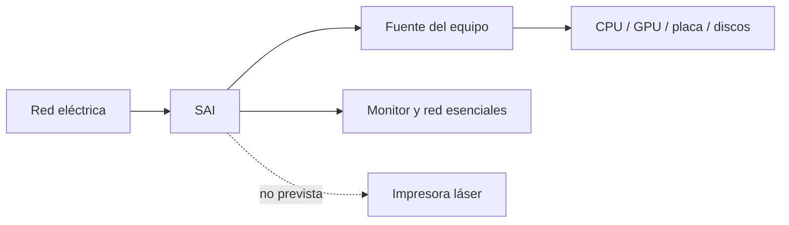
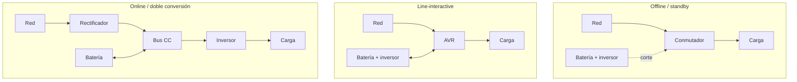
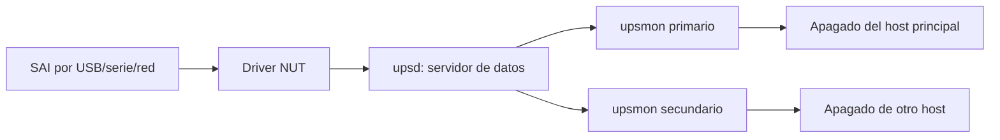

# 1.3 · Alimentación y sistemas SAI

1.3

**Mantener, proteger y apagar con seguridad**

Aprenderemos a elegir un SAI por carga y autonomía, no solo por el número de VA
de la caja.

!!! info "PDF de ampliación · Sistemas SAI"
    [:material-file-pdf-box: **Abrir Guía técnica de sistemas SAI**](recursos-pdf/UD1-3-Sistemas-SAI.pdf){ .md-button .md-button--primary target="_blank" }

    Documento complementario con perturbaciones eléctricas, topologías,
    dimensionado, autonomía, instalación y buenas prácticas. Para elegir un
    equipo real prevalecen la ficha y la curva de autonomía del fabricante.

## 1. Cadena de alimentación

La fuente transforma corriente alterna en tensiones continuas y aplica
protecciones. Un SAI mantiene las cargas críticas durante un corte y, según su
topología, acondiciona la señal. No sustituye toma de tierra, instalación segura
ni copias de respaldo.

### 1.1 Potencia activa, aparente y factor de potencia

- **W (vatios):** potencia activa que realiza trabajo y se transforma en calor,
  movimiento o cálculo.
- **VA (voltamperios):** potencia aparente, producto de tensión eficaz por
  corriente eficaz.
- **Factor de potencia (PF):** relación aproximada `W / VA` en una carga dada.

Un SAI puede anunciar, por ejemplo, `1 000 VA / 600 W`. Una carga de 650 W lo
sobrecarga aunque su potencia aparente parezca inferior a 1 000 VA. Siempre se
comprueban ambos límites y la ficha del fabricante.

### 1.2 Fuente, PFC y forma de onda

Muchas fuentes de PC actuales incorporan **PFC activo**. Para cargas sensibles o
fuentes exigentes se prefiere una salida senoidal adecuada; expresiones como
«senoidal simulada» describen una señal escalonada y no equivalen a una senoide
pura. La compatibilidad se verifica en la documentación del SAI y del equipo.

## 2. Problemas de la red

| Fenómeno | Descripción | Riesgo |
|---|---|---|
| Corte | Ausencia de tensión | Apagado y pérdida de trabajo |
| Microcorte | Interrupción breve | Reinicio intermitente |
| Subtensión | Tensión baja sostenida | Inestabilidad |
| Sobretensión | Tensión alta | Estrés o daño |
| Transitorio | Pico muy rápido | Daño electrónico |
| Distorsión/ruido | Señal degradada | Fallos en cargas sensibles |

## 3. Topologías

| Criterio | Offline | Line-interactive | Online |
|---|---|---|---|
| Regulación | Básica | AVR | Doble conversión |
| Transferencia | Breve | Breve | Nula para la carga |
| Coste | Bajo | Medio | Alto |
| Uso típico | Puesto | Aula/red/servidor pequeño | Servicio crítico |

La regulación AVR corrige ciertas variaciones sin gastar batería. La doble
conversión aísla mejor, pero aumenta coste, calor y consumo propio.

### 3.1 Bypass y disponibilidad

Un SAI online puede disponer de **bypass** para alimentar la carga desde la red
cuando existe sobrecarga, fallo interno o mantenimiento. Bypass no significa que
la batería siga protegiendo frente a un corte. En servicios importantes se
documenta qué activa el bypass y qué alarma recibe el administrador.

## 4. Dimensionado

Un SAI posee límites en **W** (potencia activa) y **VA** (potencia aparente); no
se debe superar ninguno. La autonomía depende de la batería y de la carga, por
lo que se consulta en la curva o calculadora del modelo.

1. Selecciona las cargas imprescindibles.
2. Mide o documenta su consumo simultáneo.
3. Suma W y añade margen; 20–25 % sirve como orientación inicial.
4. Verifica límites W y VA.
5. Consulta autonomía a la carga prevista.
6. Revisa topología, forma de onda, comunicación y baterías.

### Ejemplo

Equipo `260 W` + monitor `35 W` + red `20 W` = `315 W`. Con 25 % de margen:
`315 × 1,25 = 393,75 W`. El modelo debe admitir más de `394 W`, cumplir también
el límite VA y ofrecer la autonomía necesaria a unos `315 W` reales.

!!! caution "No uses una equivalencia fija"
    `VA = W / 0,6` fue una aproximación frecuente, no una ley. Los equipos
    actuales publican ambos límites; se comprueban directamente.

### 4.1 La autonomía no es proporcional de forma perfecta

Duplicar la carga suele reducir la autonomía en más de la mitad porque batería,
inversor, temperatura y tasa de descarga introducen pérdidas. Por eso la
estimación energética sirve para detectar órdenes de magnitud, pero la selección
final usa la **curva de autonomía del modelo**.

| Dato | Fuente válida | Evidencia que se guarda |
|---|---|---|
| Potencia de la carga | Medidor o ficha del equipo | W simultáneos y escenario |
| Límites del SAI | Ficha técnica oficial | W y VA máximos |
| Autonomía | Curva/calculadora oficial | Minutos a la carga prevista |
| Batería | Manual y referencia | Tecnología, cantidad y sustitución |
| Comunicación | Manual/software | USB, red, protocolo y SO compatible |

### 4.2 Baterías y envejecimiento

Las baterías pierden capacidad con los ciclos, la edad y, especialmente, la
temperatura elevada. Los modelos pueden usar baterías de plomo selladas o
litio, con comportamientos, costes y procedimientos distintos. No se fija una
fecha universal de sustitución: se sigue el diagnóstico, las pruebas y el manual
del fabricante.

!!! danger "Seguridad eléctrica"
    Un banco de baterías puede entregar corrientes muy elevadas y conservar
    energía con el equipo desconectado. El alumnado no abrirá el SAI ni sustituirá
    baterías. Las prácticas se limitan a inspección externa, software y pruebas
    controladas autorizadas.

## 5. Instalación y seguridad

- Sitúa el SAI seco, estable y ventilado.
- Conecta únicamente cargas previstas.
- Configura apagado automático por USB o red.
- Registra modelo, serie, carga y fecha.
- Prueba según el manual y revisa alarmas periódicamente.
- No abras el equipo: puede conservar tensión desenchufado.
- Gestiona baterías mediante un punto autorizado.

Motores, calefactores e impresoras láser pueden tener picos elevados; solo se
conectan cuando el fabricante lo permite y el cálculo los contempla.

## 6. Monitorización y apagado coordinado en Linux

Un cable USB por sí solo no protege los datos. Debe existir un servicio que lea
el SAI, registre eventos y ordene apagar antes de alcanzar una batería crítica.
**Network UPS Tools (NUT)** separa normalmente tres funciones:

- El **driver** habla con el modelo concreto.
- `upsd` publica estado de manera controlada.
- `upsmon` vigila alimentación y batería y ejecuta el apagado configurado.
- En un SAI compartido, los secundarios deben apagarse antes de que el primario
  ordene cortar la salida.

Una configuración real contiene credenciales y órdenes con privilegios. No se
copia desde Internet sin revisar permisos. La prueba inicial se hace con cargas
no críticas, tiempo suficiente y un plan de recuperación.

### 6.1 Secuencia de una prueba segura

1. Confirmar carga, batería cargada, registro y autorización.
2. Verificar que el software recibe estado, tensión y autonomía.
3. Guardar trabajo y detener servicios de prueba.
4. Simular el evento según el manual; no improvisar conexiones.
5. Comprobar notificación y apagado antes del nivel crítico.
6. Restaurar red, validar arranque y revisar los registros.

## 7. Mantenimiento y ciclo de vida

El plan debe registrar fecha, carga, autonomía observada, temperatura, alarmas,
versión de software y estado de batería. También contempla ventilación, limpieza
externa, prueba periódica, sustitución autorizada y reciclaje. Una prueba que
vacía completamente la batería puede reducir la disponibilidad; se diseña con
un objetivo y siguiendo el fabricante.

### Vídeo · Comparación real de topologías SAI

Demostración práctica de cómo responden un SAI line-interactive y uno online a
variaciones de tensión. Los principios eléctricos no han cambiado; contrasta
siempre potencias y autonomías con la ficha actual del modelo que vayas a usar.

<iframe src="https://www.youtube-nocookie.com/embed/ijdB8szpmdA"
title="UPS topologies - standby, line interactive and online"
loading="lazy" allowfullscreen></iframe>

[Abrir el vídeo en YouTube](https://www.youtube.com/watch?v=ijdB8szpmdA)

## Comprueba que lo entiendes

1. Diferencia corte, subtensión y transitorio.
2. ¿Qué aporta AVR?
3. Calcula el mínimo orientativo para una carga de 420 W y margen del 25 %.
4. ¿Por qué dos SAI de iguales VA pueden ofrecer autonomías distintas?

## :material-battery-charging: Tarea 1.3.1 · Protege el aula

110 minIndividualEntrega en Aules

Calcularás la carga, compararás dos modelos mediante sus curvas de autonomía y
diseñarás el apagado seguro de un pequeño servicio del aula.

[Abrir la Tarea 1.3.1](actividades/A13-sai.md){ .md-button .md-button--primary }

## Fuente de consulta

- [APC: W, VA, factor de potencia y selección](https://www.apc.com/us/en/support/product-support/ups-buying-guide-for-selecting-a-battery-backup-system.jsp)
- [Eaton: elección de la topología adecuada](https://www.eaton.com/us/en-us/products/backup-power-ups-surge-it-power-distribution/backup-power-ups/choosing-the-optimal-ups-topology-.html)
- [Network UPS Tools: manual de usuario](https://networkupstools.org/docs/user-manual.pdf)
- [NUT `upsmon`: monitorización y apagado](https://networkupstools.org/docs/man/upsmon.html)
- Manual y curva de autonomía del modelo analizado.
