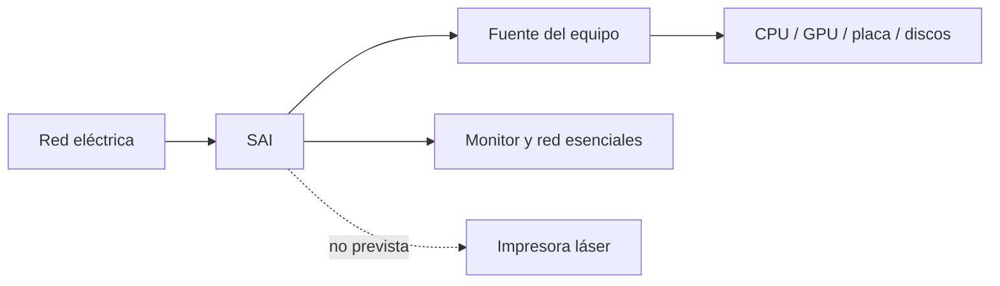
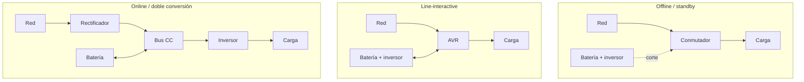

# 1.3 · Alimentación y sistemas SAI

1.3

**Mantener, proteger y apagar con seguridad**

Aprenderemos a elegir un SAI por carga y autonomía, no solo por el número de VA
de la caja.

## 1. Cadena de alimentación

La fuente transforma corriente alterna en tensiones continuas y aplica
protecciones. Un SAI mantiene las cargas críticas durante un corte y, según su
topología, acondiciona la señal. No sustituye toma de tierra, instalación segura
ni copias de respaldo.

## 2. Problemas de la red

| Fenómeno | Descripción | Riesgo |
|---|---|---|
| Corte | Ausencia de tensión | Apagado y pérdida de trabajo |
| Microcorte | Interrupción breve | Reinicio intermitente |
| Subtensión | Tensión baja sostenida | Inestabilidad |
| Sobretensión | Tensión alta | Estrés o daño |
| Transitorio | Pico muy rápido | Daño electrónico |
| Distorsión/ruido | Señal degradada | Fallos en cargas sensibles |

## 3. Topologías

| Criterio | Offline | Line-interactive | Online |
|---|---|---|---|
| Regulación | Básica | AVR | Doble conversión |
| Transferencia | Breve | Breve | Nula para la carga |
| Coste | Bajo | Medio | Alto |
| Uso típico | Puesto | Aula/red/servidor pequeño | Servicio crítico |

La regulación AVR corrige ciertas variaciones sin gastar batería. La doble
conversión aísla mejor, pero aumenta coste, calor y consumo propio.

## 4. Dimensionado

Un SAI posee límites en **W** (potencia activa) y **VA** (potencia aparente); no
se debe superar ninguno. La autonomía depende de la batería y de la carga, por
lo que se consulta en la curva o calculadora del modelo.

1. Selecciona las cargas imprescindibles.
2. Mide o documenta su consumo simultáneo.
3. Suma W y añade margen; 20–25 % sirve como orientación inicial.
4. Verifica límites W y VA.
5. Consulta autonomía a la carga prevista.
6. Revisa topología, forma de onda, comunicación y baterías.

### Ejemplo

Equipo `260 W` + monitor `35 W` + red `20 W` = `315 W`. Con 25 % de margen:
`315 × 1,25 = 393,75 W`. El modelo debe admitir más de `394 W`, cumplir también
el límite VA y ofrecer la autonomía necesaria a unos `315 W` reales.

!!! caution "No uses una equivalencia fija"
    `VA = W / 0,6` fue una aproximación frecuente, no una ley. Los equipos
    actuales publican ambos límites; se comprueban directamente.

## 5. Instalación y seguridad

- Sitúa el SAI seco, estable y ventilado.
- Conecta únicamente cargas previstas.
- Configura apagado automático por USB o red.
- Registra modelo, serie, carga y fecha.
- Prueba según el manual y revisa alarmas periódicamente.
- No abras el equipo: puede conservar tensión desenchufado.
- Gestiona baterías mediante un punto autorizado.

Motores, calefactores e impresoras láser pueden tener picos elevados; solo se
conectan cuando el fabricante lo permite y el cálculo los contempla.

### Vídeo · Comparación real de topologías SAI

Demostración práctica de cómo responden un SAI line-interactive y uno online a
variaciones de tensión. Los principios eléctricos no han cambiado; contrasta
siempre potencias y autonomías con la ficha actual del modelo que vayas a usar.

<iframe src="https://www.youtube-nocookie.com/embed/ijdB8szpmdA"
title="UPS topologies - standby, line interactive and online"
loading="lazy" allowfullscreen></iframe>

[Abrir el vídeo en YouTube](https://www.youtube.com/watch?v=ijdB8szpmdA)

## Comprueba que lo entiendes

1. Diferencia corte, subtensión y transitorio.
2. ¿Qué aporta AVR?
3. Calcula el mínimo orientativo para una carga de 420 W y margen del 25 %.
4. ¿Por qué dos SAI de iguales VA pueden ofrecer autonomías distintas?

## :material-battery-charging: Tarea 1.3.1 · Protege el aula

110 minIndividualEntrega en Aules

Calcularás la carga, compararás dos modelos mediante sus curvas de autonomía y
diseñarás el apagado seguro de un pequeño servicio del aula.

[Abrir la Tarea 1.3.1](actividades/A13-sai.md){ .md-button .md-button--primary }

## Fuente de consulta

- [APC: W, VA, factor de potencia y selección](https://www.apc.com/us/en/support/product-support/ups-buying-guide-for-selecting-a-battery-backup-system.jsp)
- [Eaton: elección de la topología adecuada](https://www.eaton.com/us/en-us/products/backup-power-ups-surge-it-power-distribution/backup-power-ups/choosing-the-optimal-ups-topology-.html)
- Manual y curva de autonomía del modelo analizado.
