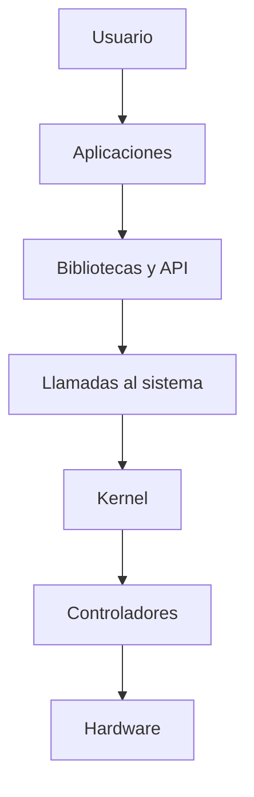
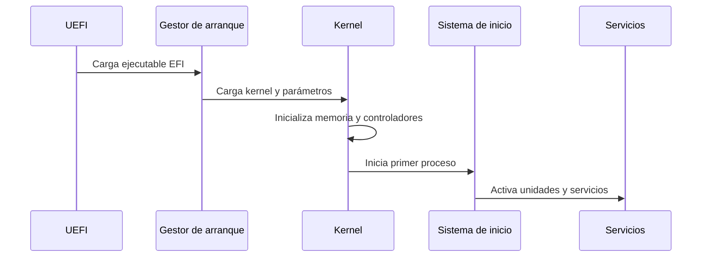

# 1. Arquitectura y funciones del sistema operativo

## 1.1 El problema que resuelve

Distintos programas quieren usar simultáneamente CPU, memoria, disco, pantalla y red. Si cada aplicación controlara directamente el hardware, habría conflictos, dependencia total de cada modelo y ausencia de protección. El sistema operativo crea abstracciones estables y arbitra el acceso.

Una aplicación solicita “abrir un archivo”; no necesita conocer sectores físicos ni protocolo del SSD. El sistema valida permisos, localiza metadatos, usa el controlador y devuelve un descriptor.

## 1.2 Modo usuario y modo kernel

La CPU ofrece niveles de privilegio. Las aplicaciones trabajan en modo usuario y no pueden ejecutar determinadas instrucciones ni acceder libremente a memoria o dispositivos. Para solicitar una operación protegida realizan una llamada al sistema, que transfiere control al kernel.

Esta separación contiene errores: una aplicación defectuosa debería terminar sin corromper todo el sistema. Un fallo del kernel o de un controlador tiene mayor impacto porque se ejecuta con privilegios elevados.

### Ejemplo explicado

Al guardar un documento:

1. La aplicación prepara los bytes.
2. Invoca una función de biblioteca.
3. La biblioteca realiza una llamada al sistema.
4. El kernel comprueba descriptor y permisos.
5. El sistema de archivos decide bloques y actualiza metadatos.
6. El controlador envía órdenes al dispositivo.
7. El kernel devuelve éxito o un código de error.

## 1.3 Componentes

- **Kernel:** planificación, memoria, protección y E/S.
- **Controladores:** adaptadores para dispositivos concretos.
- **Sistema de archivos:** nombres, directorios, metadatos y persistencia.
- **Servicios:** red, impresión, registro, actualización y otras funciones de fondo.
- **Shell:** intérprete de órdenes.
- **Interfaz gráfica:** ventanas, composición y aplicaciones de configuración.
- **Utilidades:** diagnóstico, mantenimiento y administración.

El shell no es el kernel. Bash, PowerShell y una interfaz gráfica son formas distintas de solicitar servicios al mismo sistema subyacente.

## 1.4 Diseños de kernel

Un kernel monolítico integra muchos subsistemas en espacio privilegiado y puede cargar módulos. Un micronúcleo conserva un conjunto mínimo y mueve servicios a procesos separados. Los diseños híbridos combinan ideas.

| Diseño | Ventaja típica | Coste o reto |
| --- | --- | --- |
| Monolítico modular | Rendimiento e integración | Mayor impacto de fallos privilegiados |
| Micronúcleo | Aislamiento y modularidad | Comunicación adicional entre componentes |
| Híbrido | Equilibrio práctico | Arquitectura compleja |

La clasificación no permite afirmar automáticamente que un sistema sea más seguro o rápido; importa la implementación completa.

## 1.5 Arranque

En Linux, `systemd` suele actuar como sistema de inicio. En Windows intervienen el Windows Boot Manager, el cargador y los componentes del sistema. Comprender etapas permite interpretar un fallo en lugar de reinstalar sin diagnóstico.

## 1.6 Interfaces CLI y GUI

La GUI facilita descubrimiento y visualización. La CLI ofrece precisión, automatización, repetibilidad y administración remota. Un profesional usa ambas y documenta comandos cuando necesita que el procedimiento sea reproducible.

### Comprobación

Explica por qué una aplicación no debe escribir directamente en un SSD y describe qué capas intervienen al guardar un archivo.
