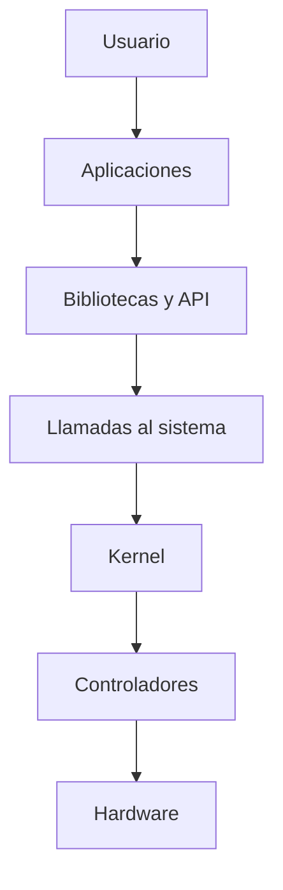
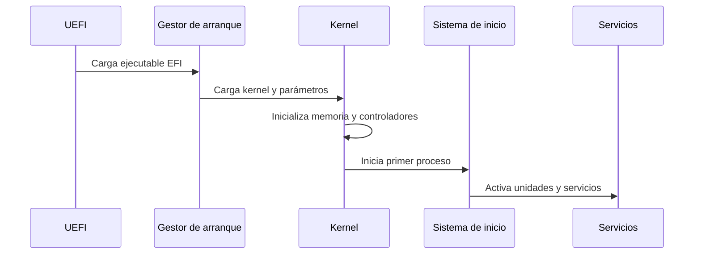

# 1. Arquitectura y funciones del sistema operativo

## 1.1 El problema que resuelve

Distintos programas quieren usar simultáneamente CPU, memoria, disco, pantalla y red. Si cada aplicación controlara directamente el hardware, habría conflictos, dependencia total de cada modelo y ausencia de protección. El sistema operativo crea abstracciones estables y arbitra el acceso.

```mermaid
flowchart TB
    USER["Usuario"] --> APPS["Aplicaciones"]
    APPS --> API["Bibliotecas y API"]
    API --> SYSCALL["Llamadas al sistema"]
    SYSCALL --> KERNEL["Kernel"]
    KERNEL --> DRIVER["Controladores"]
    DRIVER --> HW["Hardware"]
```

Una aplicación solicita “abrir un archivo”; no necesita conocer sectores físicos ni protocolo del SSD. El sistema valida permisos, localiza metadatos, usa el controlador y devuelve un descriptor.

### Vídeo · Qué hace realmente un sistema operativo

Crash Course presenta el sistema operativo como la capa privilegiada que reparte
CPU, memoria, dispositivos y archivos entre programas. Está en inglés, pero el
ritmo visual ayuda a situar kernel, aplicaciones, abstracciones y protección.

<iframe src="https://www.youtube-nocookie.com/embed/26QPDBe-NB8"
title="Operating Systems: Crash Course Computer Science" loading="lazy"
allowfullscreen></iframe>

[Abrir el vídeo en YouTube](https://www.youtube.com/watch?v=26QPDBe-NB8)

## 1.2 Modo usuario y modo kernel

La CPU ofrece niveles de privilegio. Las aplicaciones trabajan en modo usuario y no pueden ejecutar determinadas instrucciones ni acceder libremente a memoria o dispositivos. Para solicitar una operación protegida realizan una llamada al sistema, que transfiere control al kernel.

Esta separación contiene errores: una aplicación defectuosa debería terminar sin corromper todo el sistema. Un fallo del kernel o de un controlador tiene mayor impacto porque se ejecuta con privilegios elevados.

### Ejemplo explicado

Al guardar un documento:

1. La aplicación prepara los bytes.
2. Invoca una función de biblioteca.
3. La biblioteca realiza una llamada al sistema.
4. El kernel comprueba descriptor y permisos.
5. El sistema de archivos decide bloques y actualiza metadatos.
6. El controlador envía órdenes al dispositivo.
7. El kernel devuelve éxito o un código de error.

## 1.3 Componentes

- **Kernel:** planificación, memoria, protección y E/S.
- **Controladores:** adaptadores para dispositivos concretos.
- **Sistema de archivos:** nombres, directorios, metadatos y persistencia.
- **Servicios:** red, impresión, registro, actualización y otras funciones de fondo.
- **Shell:** intérprete de órdenes.
- **Interfaz gráfica:** ventanas, composición y aplicaciones de configuración.
- **Utilidades:** diagnóstico, mantenimiento y administración.

El shell no es el kernel. Bash, PowerShell y una interfaz gráfica son formas distintas de solicitar servicios al mismo sistema subyacente.

## :material-layers-triple-outline: Tarea 2.1 · Mapa de capas del sistema operativo

55 minIndividualEntrega en Aules

Seguirás una operación cotidiana desde la aplicación hasta el hardware y
explicarás qué aporta cada capa.

[Abrir la actividad de capas del SO](actividades/A1-mapa-capas-so.md){ .md-button .md-button--primary }

## 1.4 Diseños de kernel

Un kernel monolítico integra muchos subsistemas en espacio privilegiado y puede cargar módulos. Un micronúcleo conserva un conjunto mínimo y mueve servicios a procesos separados. Los diseños híbridos combinan ideas.

| Diseño | Ventaja típica | Coste o reto |
| --- | --- | --- |
| Monolítico modular | Rendimiento e integración | Mayor impacto de fallos privilegiados |
| Micronúcleo | Aislamiento y modularidad | Comunicación adicional entre componentes |
| Híbrido | Equilibrio práctico | Arquitectura compleja |

La clasificación no permite afirmar automáticamente que un sistema sea más seguro o rápido; importa la implementación completa.

## 1.5 Arranque

```mermaid
sequenceDiagram
    participant F as UEFI
    participant B as Gestor de arranque
    participant K as Kernel
    participant I as Sistema de inicio
    participant S as Servicios
    F->>B: Carga ejecutable EFI
    B->>K: Carga kernel y parámetros
    K->>K: Inicializa memoria y controladores
    K->>I: Inicia primer proceso
    I->>S: Activa unidades y servicios
```

En Linux, `systemd` suele actuar como sistema de inicio. En Windows intervienen el Windows Boot Manager, el cargador y los componentes del sistema. Comprender etapas permite interpretar un fallo en lugar de reinstalar sin diagnóstico.

## 1.6 Interfaces CLI y GUI

La GUI facilita descubrimiento y visualización. La CLI ofrece precisión, automatización, repetibilidad y administración remota. Un profesional usa ambas y documenta comandos cuando necesita que el procedimiento sea reproducible.

## 1.7 Servicios, permisos y seguridad básica

Un sistema operativo moderno no solo ejecuta programas: mantiene servicios de
red, indexación, impresión, registro, actualización, antivirus, sincronización o
telemetría. Algunos se ejecutan aunque no haya una ventana visible. Por eso un
equipo puede consumir CPU, memoria o red sin que el usuario haya abierto una
aplicación de forma consciente.

La seguridad se apoya en cuatro ideas:

- **identificación:** quién dice ser el usuario o proceso;
- **autenticación:** cómo demuestra esa identidad;
- **autorización:** qué permisos tiene sobre recursos concretos;
- **auditoría:** qué acciones quedan registradas.

En sistemas multiusuario, dos cuentas no deberían poder modificar libremente los
archivos de la otra. En sistemas empresariales, además, se aplican políticas,
cifrado, arranque seguro, gestión remota y actualizaciones centralizadas.

### Comprobación

Explica por qué una aplicación no debe escribir directamente en un SSD y describe qué capas intervienen al guardar un archivo.

## Fuentes para ampliar y comprobar datos

- [Microsoft Learn · Requisitos de Windows 11](https://learn.microsoft.com/es-es/windows/whats-new/windows-11-requirements):
  requisitos mínimos, firmware UEFI, Secure Boot, TPM y soporte en máquinas
  virtuales.
- [GNU · ¿Qué es el software libre?](https://www.gnu.org/philosophy/free-sw.es.html):
  libertades de uso, estudio, redistribución y modificación.
