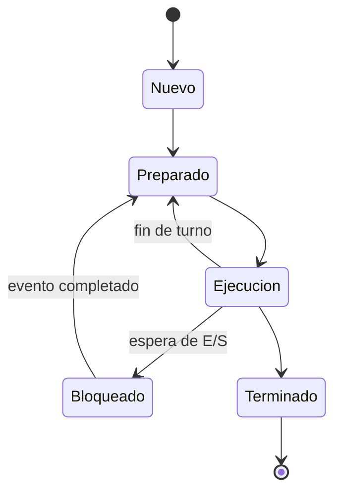
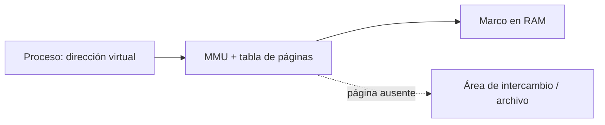
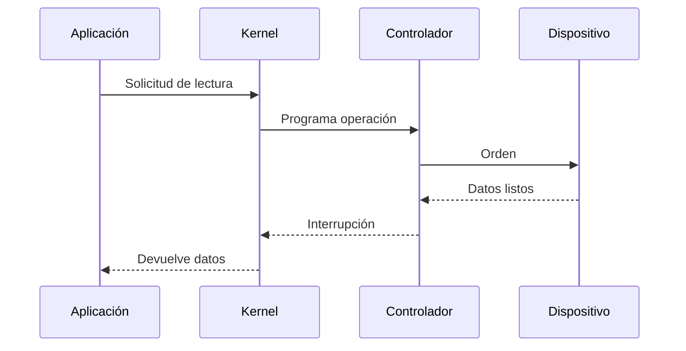

# 2. Procesos, memoria y entrada/salida

## 2.1 Programa, proceso e hilo

Un programa es un archivo con instrucciones. Un proceso es su ejecución con espacio de memoria, recursos, credenciales y estado. Un hilo es una línea de ejecución dentro del proceso; los hilos comparten memoria y recursos del proceso.



El planificador selecciona procesos preparados. Una conmutación de contexto guarda el estado de uno y restaura el de otro. Es necesaria para multitarea, pero tiene coste.

## 2.2 Concurrencia y paralelismo

Concurrencia significa que varias tareas progresan durante el mismo intervalo. Paralelismo significa que se ejecutan literalmente al mismo tiempo en distintos núcleos.

Dos hilos que modifican un dato compartido pueden sufrir una condición de carrera. Los mecanismos de sincronización —mutex, semáforos y operaciones atómicas— coordinan el acceso, pero un mal diseño puede producir interbloqueo.

### Ejemplo de carrera

Dos hilos leen un contador con valor 10, ambos suman uno y ambos escriben 11. Se esperaban dos incrementos, pero se obtiene uno. La operación “leer-modificar-escribir” debe protegerse como una unidad.

## 2.3 Memoria virtual

Cada proceso ve un espacio de direcciones propio. La unidad de gestión de memoria traduce direcciones virtuales a marcos físicos mediante tablas de páginas.



Ventajas:

- aislamiento entre procesos;
- uso de direcciones continuas aunque la RAM esté fragmentada;
- compartición controlada;
- carga bajo demanda;
- posibilidad de apoyar RAM con almacenamiento.

Si el sistema intercambia páginas constantemente aparece *thrashing*: dedica más tiempo a mover datos que a ejecutar trabajo útil.

## 2.4 Asignación y protección

El sistema marca páginas con permisos de lectura, escritura y ejecución. La protección NX impide ejecutar regiones destinadas a datos. La aleatorización del espacio de direcciones dificulta determinados ataques, aunque no corrige vulnerabilidades.

La memoria usada no equivale siempre a memoria perdida. Los sistemas aprovechan RAM libre como caché y pueden liberarla si una aplicación la necesita.

## 2.5 Entrada/salida

Los dispositivos son mucho más lentos que la CPU. El sistema usa interrupciones, búferes, cachés, colas y acceso directo a memoria.



Una operación síncrona puede bloquear al hilo hasta finalizar. En modelos asíncronos, el proceso continúa y recibe una notificación posterior.

## 2.6 Observación práctica

En Linux:

```bash
ps -eo pid,ppid,stat,ni,%cpu,%mem,comm
free -h
vmstat 1
```

En PowerShell:

```powershell
Get-Process | Sort-Object CPU -Descending | Select-Object -First 10
Get-CimInstance Win32_OperatingSystem |
  Select-Object TotalVisibleMemorySize,FreePhysicalMemory
```

Los datos deben interpretarse durante un periodo y bajo una carga conocida. Un pico breve no implica un problema.

## Caso razonado

Un equipo tiene CPU al 15 %, RAM al 95 % y disco al 100 % mientras cambia lentamente entre aplicaciones. La hipótesis principal es presión de memoria con paginación. Antes de ampliar RAM se identifica qué procesos crecen, si existe fuga, qué carga es normal y cuánto intercambio se produce.

## Comprobación

1. Diferencia programa, proceso e hilo.
2. Explica por qué la memoria virtual mejora aislamiento.
3. ¿Qué indica un equipo con baja CPU pero disco saturado durante paginación?
