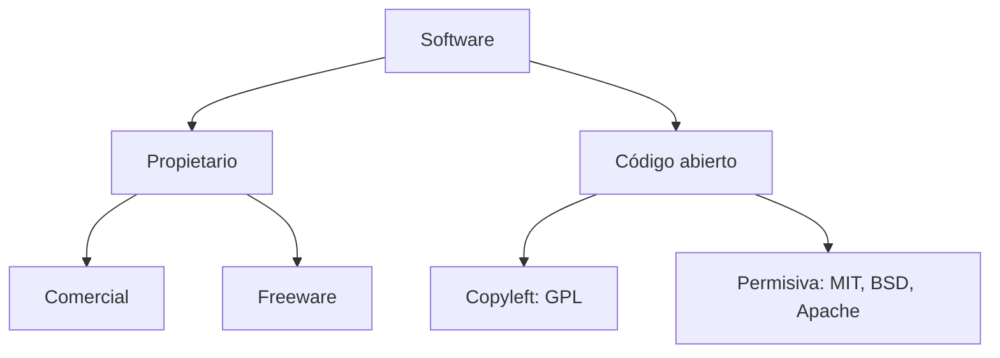
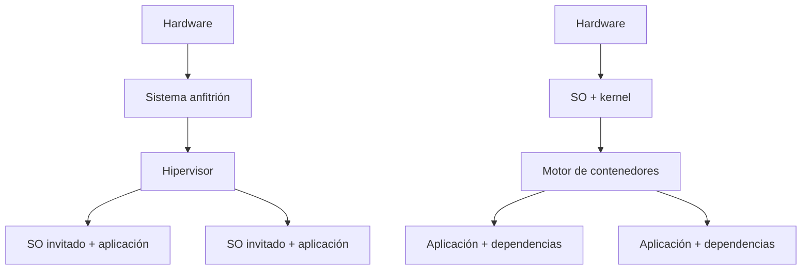

# 3. Familias, licencias y criterios de elección

## 3.1 Evolución y tipos

La evolución pasó de operación manual a lotes, multiprogramación, tiempo compartido, ordenadores personales, redes, móviles, sistemas empotrados y nube. Cada etapa respondió a una limitación: aprovechar CPU, compartir recursos, mejorar interacción o escalar servicios.

Los sistemas actuales pueden ser multiusuario, multitarea, multiprocesador, distribuidos o de tiempo real. Un sistema de tiempo real no significa simplemente “rápido”: debe responder dentro de límites temporales conocidos.

## 3.2 Familias actuales

### Windows

Amplia compatibilidad comercial, integración empresarial, administración gráfica y PowerShell. NTFS aporta ACL, journaling y otras funciones. Deben considerarse edición, licencia, requisitos y ciclo de soporte.

### GNU/Linux

El kernel Linux se combina con herramientas y paquetes de una distribución. Debian, Ubuntu, Fedora y otras difieren en ciclo, gestor de paquetes y políticas. Destaca en servidores, nube, desarrollo y sistemas empotrados.

### macOS

Integra hardware y software controlados por Apple, usa una base Unix y APFS. La compatibilidad está vinculada a equipos admitidos y al ecosistema.

### Móviles y empotrados

Android usa kernel Linux y una plataforma propia. iOS integra estrechamente hardware, seguridad y distribución. Los sistemas empotrados priorizan consumo, fiabilidad o restricciones temporales.

## 3.3 Licencias

“Gratis” y “libre” no son sinónimos. Una licencia define derechos y condiciones.

Una licencia permisiva suele permitir redistribución con pocas condiciones, como conservar avisos. Copyleft exige que determinadas obras derivadas mantengan libertades y se distribuyan bajo condiciones compatibles.

No debe decidirse compatibilidad jurídica solo por el nombre; se revisa texto, versión, forma de distribución y relación entre componentes.

## 3.4 Coste total

El coste total de propiedad incluye:

- licencias y suscripciones;
- hardware compatible;
- migración y formación;
- soporte y administración;
- disponibilidad de aplicaciones;
- seguridad y recuperación;
- consumo energético;
- dependencia de proveedor;
- fin de soporte.

Una opción sin coste de licencia puede requerir más adaptación; una opción comercial puede reducir tiempo de soporte. La decisión depende del contexto.

## 3.5 Matriz de decisión

Caso: servidor web para un equipo de desarrollo.

| Criterio | Peso | GNU/Linux | Windows Server |
| --- | ---: | ---: | ---: |
| Compatibilidad con la aplicación | 5 | 5 | 4 |
| Experiencia del equipo | 4 | 4 | 3 |
| Automatización | 4 | 5 | 4 |
| Coste de licencia | 3 | 5 | 2 |
| Integración corporativa | 3 | 3 | 5 |

Se multiplica puntuación por peso, pero la matriz no sustituye una prueba. Después se construye un prototipo, se mide y se documentan riesgos.

## 3.6 Máquina virtual o contenedor

Una VM ofrece kernel independiente y permite sistemas invitados distintos. Un contenedor comparte kernel y resulta ligero. La elección considera aislamiento, compatibilidad, arranque, densidad, persistencia y operación.

## Caso de aula

Una aplicación requiere un servicio Linux, pero el alumnado usa Windows. Para aprender instalación completa se emplea una VM Ubuntu. Para distribuir después la aplicación con dependencias reproducibles se crea un contenedor. Las dos tecnologías se complementan.

## Comprobación

Justifica un sistema operativo para: un aula, un servidor web, un puesto de diseño y un dispositivo IoT. Incluye requisitos, aplicaciones, soporte, seguridad, licencia y recuperación.
