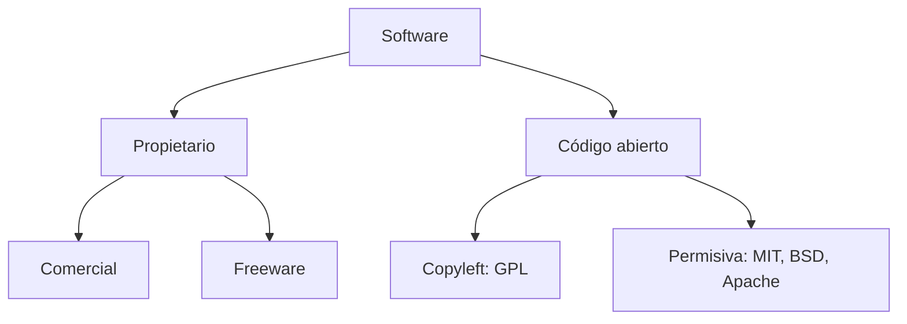
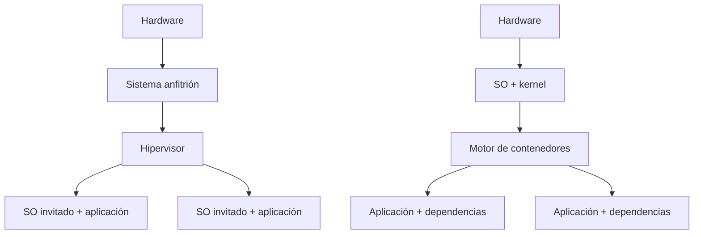

# 3. Familias, licencias y criterios de elección

2.2

**Elegir no es opinar: es justificar con requisitos**

Compararemos familias de sistemas, licencias, soporte y coste total para tomar
decisiones técnicas defendibles en un aula, un equipo personal o un servidor.

## 3.1 Evolución y tipos

La evolución pasó de operación manual a lotes, multiprogramación, tiempo compartido, ordenadores personales, redes, móviles, sistemas empotrados y nube. Cada etapa respondió a una limitación: aprovechar CPU, compartir recursos, mejorar interacción o escalar servicios.

Los sistemas actuales pueden ser multiusuario, multitarea, multiprocesador, distribuidos o de tiempo real. Un sistema de tiempo real no significa simplemente “rápido”: debe responder dentro de límites temporales conocidos.

## 3.2 Familias actuales

### Windows

Amplia compatibilidad comercial, integración empresarial, administración gráfica y PowerShell. NTFS aporta ACL, journaling y otras funciones. Deben considerarse edición, licencia, requisitos y ciclo de soporte.

En equipos actuales hay que comprobar requisitos como CPU compatible, RAM,
almacenamiento, UEFI, Secure Boot y TPM 2.0. No basta con que “arranque”: un
equipo fuera de soporte puede quedar sin actualizaciones de seguridad.

### GNU/Linux

El kernel Linux se combina con herramientas y paquetes de una distribución. Debian, Ubuntu, Fedora y otras difieren en ciclo, gestor de paquetes y políticas. Destaca en servidores, nube, desarrollo y sistemas empotrados.

Una distribución no se elige solo por estética. Importan su ciclo de publicación,
duración del soporte, repositorios, comunidad, documentación, compatibilidad de
hardware y facilidad para automatizar instalaciones.

### macOS

Integra hardware y software controlados por Apple, usa una base Unix y APFS. La compatibilidad está vinculada a equipos admitidos y al ecosistema.

### Móviles y empotrados

Android usa kernel Linux y una plataforma propia. iOS integra estrechamente hardware, seguridad y distribución. Los sistemas empotrados priorizan consumo, fiabilidad o restricciones temporales.

## 3.3 Licencias

“Gratis” y “libre” no son sinónimos. Una licencia define derechos y condiciones.

```mermaid
flowchart TD
    SW["Software"] --> PROP["Propietario"]
    SW --> OPEN["Código abierto"]
    PROP --> COMM["Comercial"]
    PROP --> FREEWARE["Freeware"]
    OPEN --> COPYLEFT["Copyleft: GPL"]
    OPEN --> PERM["Permisiva: MIT, BSD, Apache"]
```

Una licencia permisiva suele permitir redistribución con pocas condiciones, como conservar avisos. Copyleft exige que determinadas obras derivadas mantengan libertades y se distribuyan bajo condiciones compatibles.

No debe decidirse compatibilidad jurídica solo por el nombre; se revisa texto, versión, forma de distribución y relación entre componentes.

| Licencia | Tipo orientativo | Idea práctica |
|---|---|---|
| GPL | Copyleft fuerte | Al distribuir derivados, exige conservar libertades compatibles |
| LGPL | Copyleft débil | Pensada para bibliotecas con condiciones menos expansivas |
| MIT/BSD | Permisiva | Permite mucho uso si se conservan avisos |
| Apache 2.0 | Permisiva | Añade condiciones explícitas sobre patentes |
| Propietaria | Restrictiva | Uso, copia o modificación dependen del contrato |
| Freeware | Gratuita de uso | Gratis no implica código ni permiso de modificación |

## 3.4 Coste total

El coste total de propiedad incluye:

- licencias y suscripciones;
- hardware compatible;
- migración y formación;
- soporte y administración;
- disponibilidad de aplicaciones;
- seguridad y recuperación;
- consumo energético;
- dependencia de proveedor;
- fin de soporte.

Una opción sin coste de licencia puede requerir más adaptación; una opción comercial puede reducir tiempo de soporte. La decisión depende del contexto.

## 3.5 Matriz de decisión

Caso: servidor web para un equipo de desarrollo.

| Criterio | Peso | GNU/Linux | Windows Server |
| --- | ---: | ---: | ---: |
| Compatibilidad con la aplicación | 5 | 5 | 4 |
| Experiencia del equipo | 4 | 4 | 3 |
| Automatización | 4 | 5 | 4 |
| Coste de licencia | 3 | 5 | 2 |
| Integración corporativa | 3 | 3 | 5 |

Se multiplica puntuación por peso, pero la matriz no sustituye una prueba. Después se construye un prototipo, se mide y se documentan riesgos.

## :material-scale-balance: Tarea 2.3 · Elección justificada de sistema operativo

60 minIndividualEntrega en Aules

Compararás sistemas para un caso real usando requisitos, licencias, soporte y
una matriz ponderada.

[Abrir la actividad de elección](actividades/A3-eleccion-so.md){ .md-button .md-button--primary }

## 3.6 Del sistema elegido al entorno de pruebas

```mermaid
flowchart TB
    HW1["Hardware"] --> HOST1["Sistema anfitrión"]
    HOST1 --> HYP["Hipervisor"]
    HYP --> VM1["SO invitado + aplicación"]
    HYP --> VM2["SO invitado + aplicación"]

    HW2["Hardware"] --> HOST2["SO + kernel"]
    HOST2 --> ENG["Motor de contenedores"]
    ENG --> C1["Aplicación + dependencias"]
    ENG --> C2["Aplicación + dependencias"]
```

Una VM ofrece kernel independiente y permite sistemas invitados distintos. Un contenedor comparte kernel y resulta ligero. La elección considera aislamiento, compatibilidad, arranque, densidad, persistencia y operación.

## Caso de aula

Una aplicación requiere un servicio Linux, pero el alumnado usa Windows. Para aprender instalación completa se emplea una VM Ubuntu. Para distribuir después la aplicación con dependencias reproducibles se crea un contenedor. Las dos tecnologías se complementan.

La elección del sistema operativo no termina en una tabla: debe probarse. La
subunidad siguiente desarrolla cómo documentar una máquina virtual reproducible,
qué red conviene usar y por qué una instantánea no sustituye a una copia.

## Comprobación

Justifica un sistema operativo para: un aula, un servidor web, un puesto de diseño y un dispositivo IoT. Incluye requisitos, aplicaciones, soporte, seguridad, licencia y recuperación.

## Fuentes para ampliar y comprobar datos

- [Microsoft Support · Requisitos del sistema de Windows 11](https://support.microsoft.com/es-es/windows/experience/compatibility/windows-11-system-requirements):
  requisitos mínimos y condiciones de conectividad/cuenta.
- [Ubuntu · Ciclo de versiones](https://ubuntu.com/about/release-cycle):
  calendario, LTS, soporte estándar y mantenimiento extendido.
- [Open Source Initiative · Licencias aprobadas](https://opensource.org/licenses):
  listado de licencias revisadas por OSI.
- [GNU · ¿Qué es el software libre?](https://www.gnu.org/philosophy/free-sw.es.html):
  distinción entre libertad y precio.
- [Apache Software Foundation · Licencias](https://www.apache.org/licenses/):
  texto y contexto de las licencias Apache.
