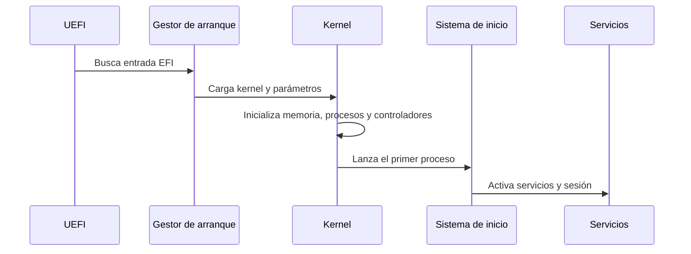

# 2.3. Virtualización, arranque y preparación de entornos

## 2.3.1 Por qué virtualizamos

Virtualizar consiste en ejecutar un entorno lógico sobre recursos físicos
compartidos. En DAM interesa por tres motivos: practicar sin romper el equipo
principal, repetir instalaciones con las mismas condiciones y probar servicios
aislados antes de desplegarlos.

Una **máquina virtual** incluye un sistema operativo invitado completo. Un
**contenedor** comparte el kernel del anfitrión y empaqueta procesos con sus
dependencias. No compiten por ser “mejores”: resuelven problemas distintos.

| Criterio | Máquina virtual | Contenedor |
|---|---|---|
| Kernel | Propio del invitado | Compartido con el anfitrión |
| Aislamiento | Mayor separación | Ligero, pero dependiente del kernel |
| Arranque | Más lento | Muy rápido |
| Uso típico | Instalar SO, pruebas completas | Desplegar servicios reproducibles |
| Ejemplo DAM | Ubuntu en VirtualBox | API con Docker |

## 2.3.2 Hipervisores

Un hipervisor de tipo 1 se ejecuta directamente sobre el hardware y es habitual
en servidores. Un hipervisor de tipo 2 se ejecuta sobre un sistema anfitrión,
como VirtualBox, VMware Workstation o soluciones equivalentes de escritorio.

Para una práctica de clase conviene documentar:

- versión del hipervisor;
- sistema anfitrión;
- ISO utilizada y suma de verificación si se proporciona;
- CPU virtual, RAM, disco y red;
- instantáneas creadas;
- usuario inicial y cambios de configuración.

## 2.3.3 Recursos de una VM

Asignar muchos recursos no siempre mejora el resultado. Si una VM recibe demasiada
RAM o CPU, el anfitrión puede quedarse sin margen y todo el equipo se ralentiza.

Recomendaciones iniciales para laboratorio:

| Uso | CPU virtual | RAM | Disco |
|---|---:|---:|---:|
| GNU/Linux ligero | 2 | 2-4 GB | 25 GB |
| Escritorio completo | 2-4 | 4-8 GB | 40 GB |
| Servidor de pruebas | 1-2 | 1-4 GB | 20-40 GB |
| Windows 11 invitado | 2+ | 4 GB mínimo | 64 GB mínimo |

Windows 11 exige UEFI, arranque seguro disponible, TPM 2.0 y procesador compatible.
En una VM se suelen usar firmware UEFI, TPM virtual y dos o más procesadores
virtuales. Estos requisitos deben comprobarse en la documentación oficial antes
de planificar una práctica.

## 2.3.4 Red en máquinas virtuales

| Modo | Qué consigue | Uso habitual |
|---|---|---|
| NAT | La VM sale a Internet usando el anfitrión | Navegar y actualizar sin exponer servicios |
| Adaptador puente | La VM aparece como otro equipo de la red | Probar servicios accesibles desde otros equipos |
| Red interna | Solo comunica VMs entre sí | Laboratorios cerrados |
| Solo anfitrión | Comunica VM y anfitrión | Desarrollo local controlado |

Elegir red forma parte de la seguridad. No se usa puente por comodidad si el
servicio no debe verse desde la red del aula.

## 2.3.5 Instantáneas y copias

Una instantánea guarda el estado de una VM para volver atrás tras una prueba. Es
muy útil antes de instalar paquetes, tocar particiones o cambiar servicios.

Pero una instantánea no sustituye a una copia de seguridad:

- depende del disco y del hipervisor donde vive la VM;
- puede ocupar mucho espacio;
- puede quedar inconsistente si se abusa de cadenas largas;
- no protege frente a pérdida del equipo anfitrión.

## 2.3.6 Arranque del sistema operativo

El arranque moderno suele seguir esta secuencia:

En un fallo de arranque conviene localizar la etapa: firmware, gestor de
arranque, kernel, sistema de archivos, servicio o sesión de usuario. Reinstalar
sin diagnóstico puede borrar evidencias y no resolver la causa.

## :material-monitor-screenshot: Tarea 2.3.1 · Ficha de una máquina virtual reproducible

60 minIndividualEntrega en Aules

Diseñarás una VM de laboratorio, justificarás sus recursos y documentarás cómo
repetirla de forma segura.

[Abrir la actividad de máquina virtual](actividades/A23-maquina-virtual.md){ .md-button .md-button--primary }

## Fuentes para ampliar y comprobar datos

- [Microsoft Learn · Requisitos de Windows 11](https://learn.microsoft.com/es-es/windows/whats-new/windows-11-requirements):
  requisitos de CPU, RAM, almacenamiento, UEFI, Secure Boot, TPM y VM.
- [Ubuntu · Ciclo de versiones](https://ubuntu.com/about/release-cycle):
  versiones LTS, soporte estándar y soporte extendido.
- [VirtualBox · Manual de usuario](https://www.virtualbox.org/manual/):
  configuración de máquinas virtuales, red, almacenamiento e instantáneas.

## Comprueba que estás preparado

1. Diferencia anfitrión, invitado e hipervisor.
2. Explica cuándo elegirías NAT y cuándo adaptador puente.
3. Justifica por qué una instantánea no sustituye a una copia de seguridad.
4. Relaciona UEFI, gestor de arranque, kernel y servicios.
