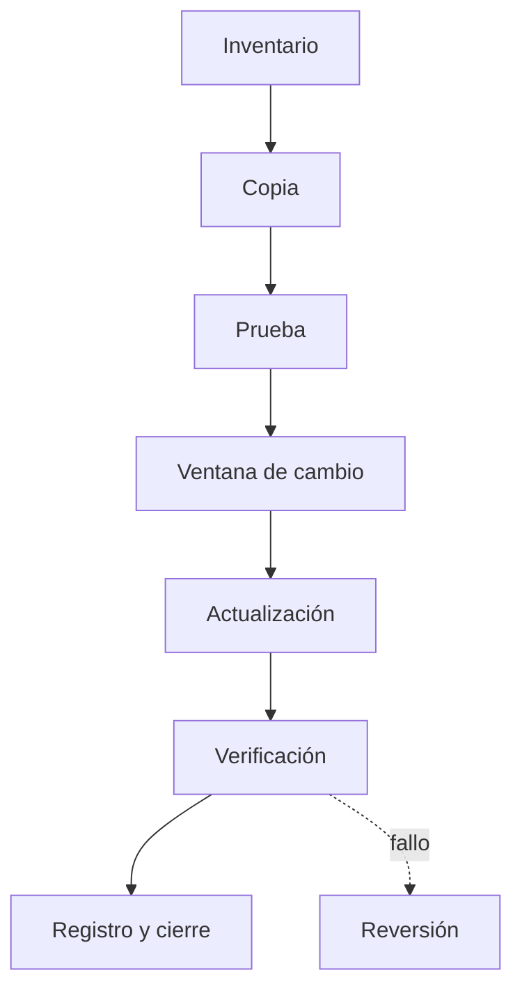

# 2. Instalación, actualización y recuperación

## 2.1 Fases comunes

Aunque las pantallas cambien, las instalaciones comparten fases: idioma, licencia, destino, identidad, red, privacidad, copia de archivos, configuración del arranque y primer inicio.

Después del primer inicio comienza la **postinstalación**:

1. Actualizar sistema.
2. Instalar controladores desde fuentes confiables.
3. Confirmar activación o licencia.
4. Configurar cuentas sin privilegios administrativos ordinarios.
5. Ajustar red, hora, energía y privacidad.
6. Instalar software necesario.
7. Activar protección, copia y recuperación.
8. Ejecutar pruebas y crear inventario.

## 2.2 Paquetes Linux

Un paquete contiene archivos, metadatos y scripts. Un repositorio publica paquetes y firmas. APT consulta índices y resuelve dependencias.

```bash
sudo apt update
apt list --upgradable
sudo apt full-upgrade
sudo apt install nginx
apt show nginx
dpkg -L nginx
```

`apt update` no actualiza programas: actualiza la información disponible. `apt upgrade` aplica versiones compatibles. Antes de añadir repositorios externos se revisan propietario, firma, mantenimiento y necesidad.

## 2.3 Software en Windows

MSI usa Windows Installer y facilita administración declarativa. EXE puede implementar cualquier instalador. `winget` permite buscar, instalar y actualizar paquetes desde fuentes configuradas.

```powershell
winget search --name "Visual Studio Code"
winget install --id Microsoft.VisualStudioCode --exact
winget list
winget upgrade --all
```

Se revisan editor, identificador, versión y opciones. Descargar “drivers” desde portales genéricos es una mala práctica.

## 2.4 Versionado y actualizaciones

El versionado semántico usa `MAYOR.MENOR.PARCHE` como convención, aunque cada fabricante define su política. Una actualización puede corregir seguridad, errores o compatibilidad y también introducir cambios.



## 2.5 Recuperación Linux

Si un sistema no arranca se identifica la etapa. Herramientas posibles:

- modo de recuperación;
- consola desde medio en vivo;
- comprobación del sistema de archivos desmontado;
- montaje y `chroot` para reparar paquetes o cargador;
- consulta del diario del arranque anterior;
- restauración desde copia.

```bash
journalctl -b -1 -p warning
systemctl --failed
```

No se ejecuta una reparación destructiva sin copia ni entender el mensaje.

## 2.6 Recuperación Windows

El entorno de recuperación permite reparación de inicio, modo seguro, desinstalación de actualizaciones, restauración, consola y restablecimiento. Un punto de restauración protege configuración del sistema, no sustituye una copia de documentos.

```powershell
Get-WinEvent -LogName System -MaxEvents 30
sfc /scannow
DISM /Online /Cleanup-Image /RestoreHealth
```

Estas órdenes tienen finalidades distintas. Se consultan resultados y registros antes de repetirlas.

## Caso resuelto

Tras una actualización, un servicio no inicia. Se consulta su estado y registro, se identifica una configuración obsoleta, se valida sintaxis, se corrige una única directiva y se reinicia. Restaurar todo el sistema habría sido desproporcionado.

## Evidencias de aceptación

- Reinicio correcto.
- Dispositivos reconocidos.
- Sin actualizaciones críticas pendientes.
- Red, DNS y hora operativos.
- Cuenta estándar funcional.
- Aplicaciones requeridas probadas.
- Recuperación accesible.
- Memoria técnica reproducible.
