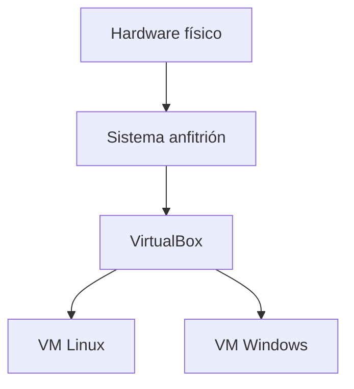
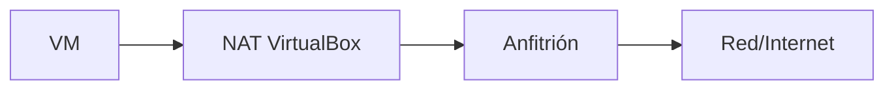

# 3. VirtualBox, redes e instantáneas

## 3.1 Anfitrión, hipervisor e invitado

VirtualBox es un hipervisor de tipo 2. El anfitrión conserva el control del hardware y el invitado ve dispositivos virtuales.

Las extensiones de CPU permiten virtualización eficiente. Deben estar habilitadas en UEFI y no bloqueadas por otra plataforma incompatible.

## 3.2 Dimensionamiento

Una VM de aula no debe absorber todos los recursos. Se deja margen para el anfitrión y otras aplicaciones.

Ejemplo con 16 GiB y 8 hilos:

- anfitrión: reservar al menos 6–8 GiB;
- VM Ubuntu escritorio: 4 GiB y 2–4 vCPU;
- disco dinámico: 40 GiB máximos;
- vídeo: según entorno gráfico, sin exceder recomendaciones.

Más vCPU no siempre mejora; puede aumentar espera de planificación.

## 3.3 Discos virtuales

Un disco dinámico crece según datos escritos hasta un máximo. Uno fijo reserva capacidad desde el principio. Borrar archivos dentro del invitado no siempre reduce automáticamente el archivo físico.

Los discos diferenciales de instantáneas dependen de una cadena. Mover o borrar manualmente una pieza puede inutilizar la VM.

## 3.4 Modos de red

| Modo | Salida | Acceso desde LAN | Uso |
| --- | --- | --- | --- |
| NAT | Sí | No por defecto | Navegación y actualizaciones |
| Puente | Sí | Sí | VM como equipo de la LAN |
| Solo anfitrión | No directa | Solo anfitrión/VM | Laboratorio aislado |
| Red interna | No | Solo VM de la red | Topologías privadas |

Para exponer un servicio con NAT se configura reenvío de puertos, por ejemplo anfitrión `8080` hacia invitado `80`.

## 3.5 Guest Additions

Aportan controlador gráfico, portapapeles, carpetas compartidas y sincronización del puntero. Se instalan dentro del invitado y deben ser compatibles con la versión del hipervisor.

Las carpetas compartidas cruzan el aislamiento. No se comparten directorios sensibles y se revisan permisos.

## 3.6 Instantánea, clon y exportación

- **Instantánea:** punto de retorno de estado de VM y discos.
- **Clon:** nueva VM basada en otra; puede ser completo o enlazado.
- **OVA/OVF:** formato de intercambio de una máquina y su descripción.
- **Copia de seguridad:** copia independiente y recuperable de los archivos necesarios.

Una instantánea no es una copia: comparte almacenamiento y puede crecer. Se usa antes de un cambio de laboratorio, se valida y se consolida cuando deja de ser necesaria.

## Laboratorio guiado

1. Crear VM sin instalación desatendida.
2. Asignar recursos justificados.
3. Adjuntar ISO verificada.
4. Instalar sistema y Guest Additions.
5. Configurar NAT y comprobar Internet.
6. Crear instantánea “sistema-base”.
7. Instalar un servicio y probarlo.
8. Provocar un cambio controlado y restaurar.
9. Exportar sin credenciales personales.

## Diagnóstico

- Sin opción de 64 bits: revisar virtualización UEFI y plataforma del anfitrión.
- VM lenta: comprobar presión de RAM, exceso de vCPU, disco y antivirus.
- Sin red: revisar modo, IP, ruta, DNS y firewall del invitado.
- Sin portapapeles: instalar Guest Additions y activar modo apropiado.
