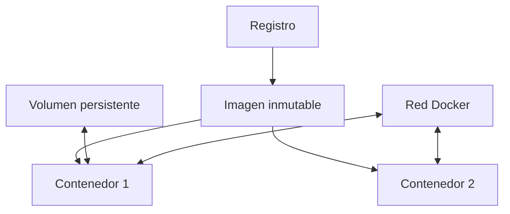

# 4. Docker, imágenes y Compose

## 4.1 Contenedores

Un contenedor es un proceso aislado con su propio espacio de nombres, límites y sistema de archivos por capas. Comparte kernel con el anfitrión.



Imagen no es contenedor. El Dockerfile es la receta; la imagen es el resultado; el contenedor es una ejecución.

## 4.2 Ciclo básico

```bash
docker pull nginx:alpine
docker run --name web -d -p 8080:80 nginx:alpine
docker ps
docker logs web
docker exec -it web sh
docker stop web
docker rm web
```

`-p 8080:80` publica el puerto 80 del contenedor en el 8080 del anfitrión. Publicar en todas las interfaces puede exponerlo a la red; se revisa firewall y dirección de enlace.

## 4.3 Capas y Dockerfile

```dockerfile
FROM python:3.13-slim
WORKDIR /app
COPY requirements.txt .
RUN pip install --no-cache-dir -r requirements.txt
COPY . .
USER 1000
CMD ["python", "app.py"]
```

Las instrucciones generan capas reutilizables. Copiar primero dependencias permite conservar caché cuando solo cambia código. Se usa una imagen base mantenida, se minimizan paquetes y se evita ejecutar como root.

Construcción:

```bash
docker build -t ejemplo/app:1.0 .
docker image inspect ejemplo/app:1.0
```

## 4.4 Persistencia

La capa escribible desaparece al eliminar el contenedor. Un volumen conserva datos y es administrado por Docker. Un *bind mount* enlaza una ruta del anfitrión.

```bash
docker volume create datos
docker run --rm -v datos:/var/lib/app ejemplo/app:1.0
```

No se almacenan bases de datos importantes sin copia, permisos y prueba de restauración.

## 4.5 Redes

En una red de usuario, los servicios se resuelven por nombre. No se fijan IP internas salvo necesidad justificada.

```bash
docker network create laboratorio
docker run -d --name web --network laboratorio nginx:alpine
```

## 4.6 Compose

```yaml
services:
  web:
    image: nginx:alpine
    ports:
      - "8080:80"
    volumes:
      - contenido:/usr/share/nginx/html:ro

volumes:
  contenido:
```

```bash
docker compose up -d
docker compose ps
docker compose logs
docker compose down
```

Compose describe el estado deseado. Los secretos no se escriben en el YAML versionado; se emplean mecanismos de secretos o variables protegidas.

## 4.7 Seguridad y reproducibilidad

- Fijar etiquetas o digest cuando la repetibilidad lo requiera.
- Analizar vulnerabilidades y actualizar bases.
- Ejecutar sin privilegios y con capacidades mínimas.
- No montar el socket Docker dentro de contenedores ordinarios.
- Limitar CPU y memoria.
- Mantener configuración fuera de la imagen.
- Registrar cómo construir, ejecutar, verificar y eliminar.

## Caso resuelto

Una web y su base de datos se definen como servicios separados. La web publica puerto; la base solo está en la red interna. Los datos van a un volumen. Se añade comprobación de salud y copia. El despliegue se reproduce con el mismo archivo Compose sin configurar manualmente cada contenedor.
