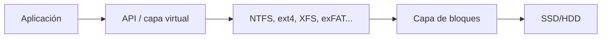
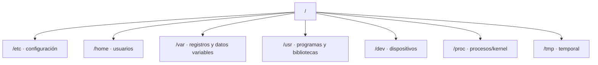

# 1. Archivos, directorios y sistemas de archivos

## 1.1 De bloques a nombres

El dispositivo almacena bloques; el sistema de archivos convierte ese espacio en archivos, directorios y metadatos. Mantiene qué bloques pertenecen a cada archivo, cuáles están libres y qué permisos se aplican.



Un nombre no contiene los datos. En sistemas tipo Unix, una entrada de directorio relaciona nombre e inodo; el inodo guarda metadatos y referencias a bloques.

## 1.2 Metadatos

Incluyen tamaño, propietario, grupo, permisos, fechas, atributos y referencias. “Fecha de creación” no existe o no significa lo mismo en todos los sistemas. Al copiar entre sistemas pueden perderse ACL, enlaces, atributos o precisión temporal.

## 1.3 Rutas

Una ruta absoluta identifica desde la raíz; una relativa depende del directorio actual.

```text
/home/alumna/proyecto/informe.md
C:\Users\alumna\proyecto\informe.md
```

`..` representa el directorio superior y `.` el actual. Normalizar una ruta es importante para seguridad: una aplicación no debe permitir que una entrada como `../../secreto` escape de la carpeta prevista.

## 1.4 Jerarquía Linux



No todo ocupa espacio del disco raíz. `/proc` y `/sys` exponen información generada por el kernel; puntos como `/mnt` o `/media` pueden contener otros sistemas montados.

## 1.5 Jerarquía Windows

Windows presenta volúmenes mediante letras o puntos de montaje. Directorios importantes:

- `%SystemRoot%`, normalmente `C:\Windows`;
- `%ProgramFiles%` y `%ProgramFiles(x86)%`;
- `%USERPROFILE%` para el perfil;
- `%ProgramData%` para datos compartidos de aplicaciones;
- `%TEMP%` para temporales.

Usar variables evita codificar rutas que cambien entre equipos o idiomas.

## 1.6 Comparación de sistemas

| Característica | NTFS | ext4 | exFAT | FAT32 |
| --- | --- | --- | --- | --- |
| Uso | Windows | Linux | Extraíbles | Compatibilidad antigua |
| Journaling | Sí | Sí | No | No |
| ACL | Sí | POSIX/ACL | Limitadas | Limitadas |
| Archivo >4 GiB | Sí | Sí | Sí | No |
| Sensibilidad a mayúsculas | Normalmente no | Sí | Normalmente no | Normalmente no |

La elección considera interoperabilidad, tamaño, número de archivos, fiabilidad, permisos, cifrado, instantáneas y herramientas de recuperación.

## 1.7 Journaling y consistencia

El journal registra intención o metadatos antes de confirmar cambios. Tras un apagado, el sistema reproduce o descarta operaciones incompletas. Esto reduce tiempo de comprobación, pero no recupera automáticamente un archivo borrado ni reemplaza copias.

## Ejemplo razonado

Para un USB que intercambia vídeos grandes entre Windows, macOS y Linux, exFAT puede ser apropiado. Para una raíz Linux, ext4 aporta permisos y journal. Para un volumen Windows con ACL, NTFS. No existe un formato universalmente mejor.
