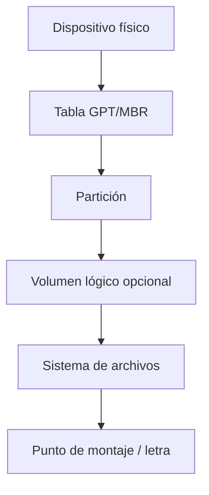
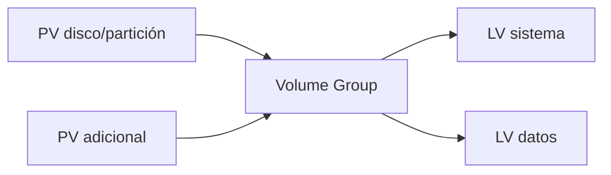

# 2. Particiones, volúmenes y montaje

## 2.1 Capas



Particionar no formatea. Formatear crea estructuras de un sistema de archivos. Montar conecta ese sistema a una ruta. Confundir capas puede provocar pérdida de datos.

## 2.2 Identificar antes de actuar

```bash
lsblk -o NAME,SIZE,TYPE,FSTYPE,MOUNTPOINTS,UUID
sudo fdisk -l
findmnt
```

```powershell
Get-Disk
Get-Partition
Get-Volume
```

Se identifica por tamaño, modelo, número de serie y topología; nunca únicamente por `/dev/sdb` o “Disco 1”, porque pueden cambiar.

## 2.3 GPT

GPT incluye cabecera primaria, entradas, copia de respaldo y CRC. Cada partición tiene GUID de tipo e identificador único. UEFI usa normalmente una partición EFI FAT32.

## 2.4 LVM

LVM agrupa almacenamiento:



Permite ampliar volúmenes y distribuirlos entre dispositivos. No sustituye RAID ni copia. Para ampliar correctamente suele crecer primero el LV y luego el sistema de archivos; para reducir se procede en orden inverso y solo si el sistema lo admite.

## 2.5 Montaje Linux

```bash
sudo mkdir -p /srv/datos
sudo mount /dev/disk/by-uuid/UUID /srv/datos
findmnt /srv/datos
```

Para persistencia se configura `/etc/fstab` preferentemente con UUID. Un error puede afectar el arranque; se prueba con `mount -a` y se conserva acceso de recuperación.

## 2.6 Administración Windows

Administración de discos y PowerShell permiten inicializar, particionar, formatear y asignar letras.

```powershell
Get-Disk -Number 2
Initialize-Disk -Number 2 -PartitionStyle GPT
New-Partition -DiskNumber 2 -UseMaximumSize -AssignDriveLetter |
  Format-Volume -FileSystem NTFS -NewFileSystemLabel "DATOS"
```

Este ejemplo destruye la interpretación previa del disco seleccionado. En clase se ejecuta solo sobre un disco virtual desechable, después de verificar su número.

## Caso: volumen lleno

Antes de ampliar:

1. Confirmar qué ocupa espacio.
2. Revisar archivos abiertos y crecimiento anormal.
3. Comprobar copia y espacio disponible en la capa inferior.
4. Ampliar partición o LV.
5. Ampliar sistema de archivos.
6. Verificar capacidad, montaje y aplicación.

Añadir espacio sin investigar puede ocultar un registro descontrolado o una fuga de datos.
