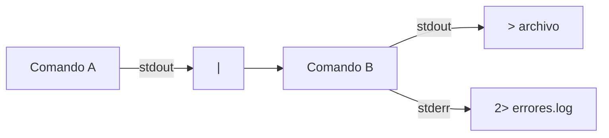

# 3. Terminal, búsqueda y automatización

## 3.1 Trabajar con seguridad

Antes de una orden que mueve o elimina:

- mostrar directorio con `pwd`;
- listar objetivo;
- usar rutas entre comillas;
- probar con una copia;
- evitar comodines amplios;
- no elevar privilegios sin necesidad.

## 3.2 Operaciones básicas

```bash
pwd
ls -lah
mkdir -p proyecto/{docs,src,backup}
cp -a docs/. proyecto/docs/
mv informe.txt proyecto/docs/
ln -s proyecto/docs acceso-docs
file descarga
du -sh proyecto
df -hT
```

Un enlace duro referencia el mismo inodo y normalmente no cruza sistemas. Un enlace simbólico guarda una ruta y puede quedar roto.

## 3.3 Globbing frente a expresiones regulares

El shell expande comodines antes de ejecutar la orden:

```bash
ls *.md
ls informe-?.pdf
```

`grep` interpreta expresiones regulares dentro del contenido:

```bash
grep -RniE "error|warning" ./logs
```

Son mecanismos diferentes. Citar un patrón puede impedir que el shell lo expanda antes de llegar al programa.

## 3.4 Tuberías y redirecciones



```bash
journalctl -p warning | grep -i network | tail -n 20
find . -type f -name "*.log" -print0 | xargs -0 grep -l "ERROR"
```

`-print0` y `-0` preservan nombres con espacios o saltos. No se procesa la salida de `ls` en scripts robustos.

## 3.5 Compresión y archivo

`tar` agrupa; gzip comprime:

```bash
tar -czf proyecto-$(date +%F).tar.gz proyecto/
tar -tzf proyecto-2026-08-07.tar.gz
tar -xzf proyecto-2026-08-07.tar.gz -C restauracion/
```

Listar antes de extraer evita rutas inesperadas. Un archivo comprimido no es copia si permanece en el mismo dispositivo y no se verifica.

## 3.6 Automatización

Un script debe usar variables con nombres claros, validar precondiciones, registrar acciones y devolver error.

```bash
#!/usr/bin/env bash
set -euo pipefail
source_dir="/srv/datos"
dest_dir="/srv/copias"
stamp="$(date +%F-%H%M)"
test -d "$source_dir"
mkdir -p "$dest_dir"
tar -czf "$dest_dir/datos-$stamp.tar.gz" -C "$source_dir" .
sha256sum "$dest_dir/datos-$stamp.tar.gz" > "$dest_dir/datos-$stamp.sha256"
```

La automatización se prueba manualmente, con errores simulados y bajo la misma cuenta que la ejecutará programada.
