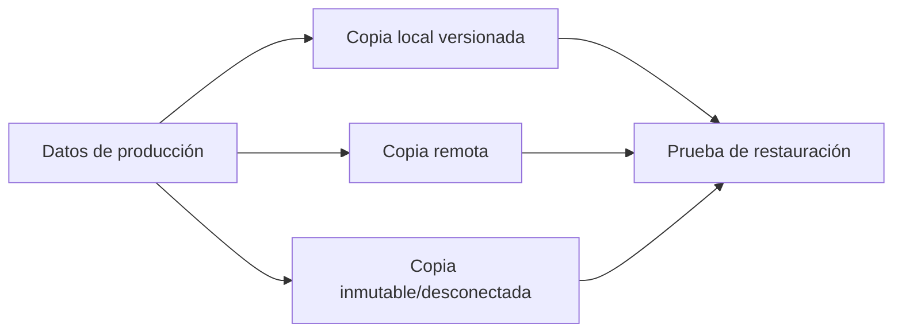

# 4. Copias, integridad y recuperación

## 4.1 Amenazas

Borrado accidental, fallo físico, corrupción, ransomware, robo, incendio y error de configuración requieren controles diferentes. RAID mejora disponibilidad frente a ciertos fallos de disco, pero no conserva históricos ni protege de borrados.

## 4.2 Estrategia 3-2-1-1-0

- 3 copias de los datos;
- 2 soportes o tecnologías;
- 1 copia fuera de la ubicación;
- 1 copia inmutable, desconectada o aislada;
- 0 errores tras verificación.



## 4.3 Tipos

Una completa simplifica restauración y consume más. Una incremental reduce ventana y espacio, pero necesita cadena. Una diferencial crece desde la última completa y requiere dos conjuntos para restaurar.

Ejemplo semanal:

- domingo: completa;
- lunes–sábado: incrementales;
- retención: cuatro semanales y doce mensuales.

La política se ajusta a RPO, RTO, capacidad y regulación.

## 4.4 Integridad y autenticidad

Una suma detecta cambios. Para demostrar origen se usa firma o MAC con claves controladas. El cifrado protege confidencialidad, pero perder la clave hace inútil la copia.

Se registran tamaño, suma, fecha, herramienta, versión, origen y destino.

## 4.5 Restauración

Plan:

1. Definir escenario y punto de recuperación.
2. Preparar destino aislado.
3. Recuperar copia completa y dependencias.
4. Aplicar incrementales o diferencial.
5. Verificar sumas, permisos y propietarios.
6. Arrancar aplicación o abrir datos.
7. Medir tiempo y documentar incidencias.

Una prueba que solo comprueba que el archivo de copia existe no valida recuperación.

## 4.6 Robocopy

```powershell
robocopy C:\Datos D:\Backup\Datos /MIR /COPY:DAT /DCOPY:T /R:2 /W:5 /LOG:D:\Backup\backup.log
```

`/MIR` replica borrados. Se usa con destino dedicado y se revisa con `/L` para simular:

```powershell
robocopy C:\Datos D:\Backup\Datos /MIR /L
```

## Caso de incidente

Un usuario cifra accidentalmente archivos sincronizados. El espejo también replica cambios. Se aísla el origen, se determina el último punto sano, se restaura una versión inmutable a una ubicación alternativa, se valida con usuarios y solo entonces se sustituye producción.

## Criterios de aceptación

- RPO y RTO definidos.
- Copia fuera del dominio de credenciales ordinario.
- Cifrado y claves gestionados.
- Alertas ante fallo.
- Restauración parcial y completa ensayadas.
- Evidencia de la última prueba.
