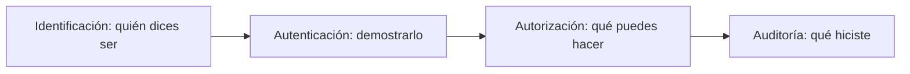

# 1. Usuarios, grupos, permisos y ACL

## 1.1 Identidad y control de acceso



Una cuenta personal permite trazabilidad. Las cuentas de servicio no deben usarse para sesiones interactivas. Los grupos representan funciones: alumnado, desarrollo, copias o administración.

## 1.2 Linux

`/etc/passwd` relaciona nombre y UID; `/etc/shadow` almacena información de contraseña con acceso restringido; `/etc/group` define grupos.

```bash
sudo useradd -m -s /bin/bash ana
sudo passwd ana
sudo groupadd desarrollo
sudo usermod -aG desarrollo ana
id ana
getent passwd ana
```

Olvidar `-a` al modificar grupos suplementarios puede reemplazar membresías existentes.

## 1.3 Permisos POSIX

```text
-rwxr-x--- 1 ana desarrollo 1200 informe.sh
```

- `-`: archivo ordinario;
- `rwx`: propietaria puede leer, escribir y ejecutar;
- `r-x`: grupo puede leer y ejecutar;
- `---`: otros no acceden.

En directorios, `r` lista nombres, `w` modifica entradas y `x` permite atravesar. Para leer un archivo se necesitan permisos sobre él y ejecución en todos los directorios de la ruta.

```bash
chmod 750 proyecto
chmod u=rw,g=r,o= informe.txt
chown -R ana:desarrollo proyecto
```

## 1.4 Bits especiales

- setgid en un directorio hace que nuevos elementos hereden el grupo;
- sticky bit limita borrado en directorios compartidos;
- setuid ejecuta un binario con identidad propietaria y exige especial revisión.

```bash
sudo chmod 2770 /srv/proyecto
```

## 1.5 ACL

Las ACL conceden permisos a identidades adicionales:

```bash
setfacl -m u:revisor:r-x /srv/proyecto
setfacl -m d:g:desarrollo:rwx /srv/proyecto
getfacl /srv/proyecto
```

La máscara limita permisos efectivos de entradas nombradas. Una ACL aparentemente `rwx` puede resultar `r-x` por la máscara.

## 1.6 Windows

NTFS usa descriptores y entradas ACE en una DACL. La herencia propaga permisos desde carpetas superiores. Es preferible asignar permisos a grupos y gestionar membresías.

```powershell
New-LocalGroup -Name "Desarrollo"
Add-LocalGroupMember -Group "Desarrollo" -Member "ana"
Get-Acl C:\Proyectos | Format-List
```

Permisos de compartición y NTFS se combinan; el resultado es el más restrictivo aplicable. Las denegaciones explícitas complican el análisis y se reservan para casos justificados.

## 1.7 Diseño por roles

Caso: `/srv/web` debe permitir que desarrollo modifique, revisión lea y el servicio web solo lea.

1. Crear grupos funcionales.
2. Asignar propiedad y setgid.
3. Conceder `rwx` a desarrollo.
4. ACL `r-x` a revisión y cuenta del servicio.
5. Retirar acceso a otros.
6. Probar con cada identidad.
7. Documentar permisos efectivos.

## Principio de mínimo privilegio

Una persona administra con cuenta ordinaria y eleva solo la operación necesaria. Dar administración permanente “por comodidad” aumenta superficie de error y ataque.
