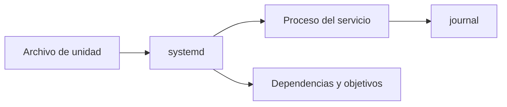

# 2. Procesos, servicios y arranque

## 2.1 Árbol de procesos

Cada proceso tiene PID y normalmente PPID. Hereda entorno y descriptores según cómo se cree.

```bash
ps -ef --forest
pstree -p
pgrep -a nginx
```

En Windows:

```powershell
Get-Process | Select-Object Id,ProcessName,CPU,WorkingSet
Get-CimInstance Win32_Process | Select-Object ProcessId,ParentProcessId,Name
```

## 2.2 Señales y finalización

`SIGTERM` solicita finalización ordenada; `SIGKILL` no puede capturarse y evita limpieza. Se usa primero TERM, se espera y solo se fuerza si es imprescindible.

```bash
kill -TERM 1234
sleep 3
ps -p 1234
```

En Windows, `Stop-Process` puede forzar la terminación; antes se buscan mecanismos propios del servicio o aplicación.

## 2.3 Prioridad

La prioridad influye, no reserva CPU. En Linux un valor nice mayor implica menor prioridad ordinaria.

```bash
nice -n 10 tarea-larga
renice 15 -p 1234
```

Prioridad excesiva puede perjudicar interactividad y no soluciona cuellos de botella de disco o red.

## 2.4 Servicios systemd

Una unidad describe dependencias, usuario, orden de inicio, reinicio y límites.

```bash
systemctl status nginx
sudo systemctl enable --now nginx
systemctl is-enabled nginx
journalctl -u nginx --since today
```



`enable` configura arranque; `start` inicia ahora. Son operaciones diferentes.

## 2.5 Servicios Windows

```powershell
Get-Service -Name sshd
Start-Service sshd
Set-Service sshd -StartupType Automatic
Get-WinEvent -LogName System -MaxEvents 50
```

Las cuentas de servicio deben tener derechos mínimos. La recuperación puede reiniciar tras fallo, pero un bucle de reinicios sin investigar oculta el problema.

## 2.6 Diagnóstico de servicio

```mermaid
flowchart TD
    RUN{"¿Proceso activo?"} -- No --> LOG["Revisar estado y registro"]
    RUN -- Sí --> LISTEN{"¿Escucha puerto correcto?"}
    LISTEN -- No --> CONF["Configuración y dependencias"]
    LISTEN -- Sí --> LOCAL{"¿Funciona localmente?"]
    LOCAL -- No --> APP["Aplicación, permisos, datos"]
    LOCAL -- Sí --> REMOTE["Firewall, ruta, DNS y cliente"]
```

Caso: nginx está activo pero no responde desde otra máquina. `ss -lntp` muestra escucha solo en `127.0.0.1`; se corrige dirección tras confirmar intención y se prueba de nuevo. Reiniciar repetidamente no habría resuelto la configuración.
