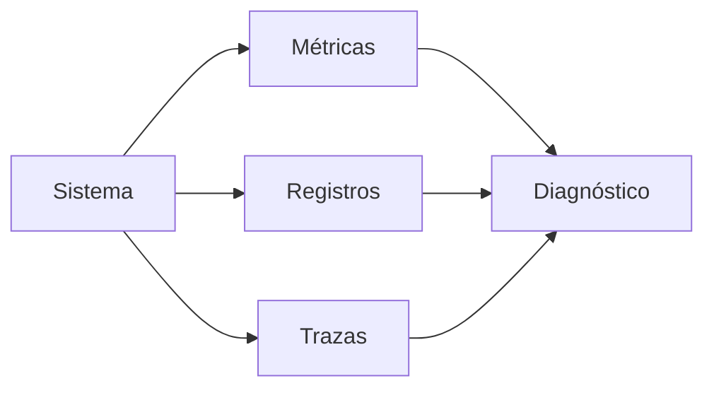

# 3. Monitorización, registros y diagnóstico

## 3.1 Observabilidad

Métricas muestran cantidades; registros describen eventos; trazas siguen una petición. Un sistema pequeño puede empezar con métricas y logs, pero necesita hora sincronizada y contexto.



## 3.2 Método USE

Para cada recurso se observa:

- **utilización:** porcentaje de tiempo ocupado;
- **saturación:** trabajo esperando;
- **errores:** fallos registrados.

CPU al 100 % puede ser normal si no hay latencia problemática. Disco con cola alta y baja transferencia puede indicar muchas operaciones pequeñas. Memoria “usada” incluye caché útil.

## 3.3 Herramientas Linux

```bash
uptime
top
free -h
vmstat 1
iostat -xz 1
df -hT
ss -s
journalctl -p warning --since today
```

`load average` cuenta tareas ejecutables o en espera no interrumpible; se compara con núcleos y contexto.

## 3.4 Herramientas Windows

Administrador de tareas muestra vista rápida; Monitor de recursos relaciona procesos y E/S; Monitor de rendimiento registra contadores; Visor de eventos conserva logs.

```powershell
Get-Counter '\Processor(_Total)\% Processor Time'
Get-Counter '\Memory\Available MBytes'
Get-WinEvent -FilterHashtable @{LogName='System';Level=2} -MaxEvents 20
```

## 3.5 Línea temporal

Ante un fallo:

1. ¿Cuándo empezó y quién lo observó?
2. ¿Qué cambió antes: actualización, despliegue, configuración, carga?
3. ¿Afecta a todos o a una ruta concreta?
4. ¿Qué muestran métricas antes, durante y después?
5. ¿Qué hipótesis explica todos los datos?

Correlación no implica causalidad. Un evento próximo puede ser consecuencia, no causa.

## Caso: aplicación lenta

Se mide: CPU baja, RAM suficiente, disco normal, pero conexiones a base de datos esperan. El puerto responde y la latencia de consultas creció tras un cambio de índice. La causa está en la capa de datos, no en el sistema operativo. La monitorización evita “optimizar” CPU sin fundamento.

## Alertas

Una alerta debe ser accionable, tener umbral con duración, severidad, contexto y procedimiento. Alertar por cada pico produce fatiga. Se prefieren síntomas de usuario o saturación sostenida.
