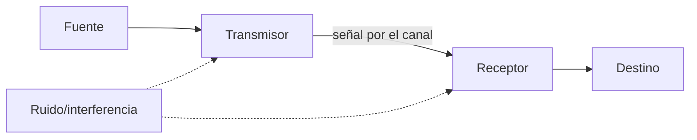
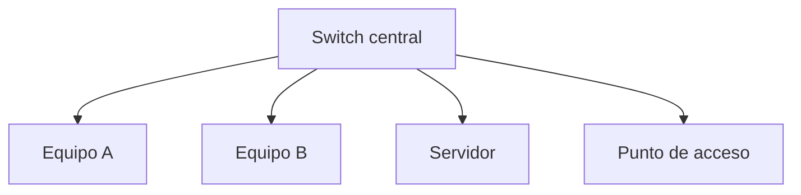

# 1. Fundamentos, medios y dispositivos

## 1.1 Elementos de comunicación

El mensaje debe codificarse en señales adecuadas al canal. En cobre son variaciones eléctricas; en fibra, luz; en Wi-Fi, ondas electromagnéticas. El receptor reconstruye bits, pero debe compartir protocolos y código.

## 1.2 Magnitudes

- **Ancho de banda:** capacidad nominal en bit/s.
- **Throughput:** datos útiles logrados.
- **Latencia:** tiempo de extremo a extremo.
- **Jitter:** variación de latencia.
- **Pérdida:** unidades que no llegan.

Copiar 1 GiB por un enlace de 100 Mbit/s no tarda 10 segundos. `1 GiB = 8.589.934.592 bits`; el mínimo teórico ronda 85,9 s y la sobrecarga aumenta el tiempo.

## 1.3 Medios guiados

El par trenzado reduce interferencia mediante torsión y transmisión diferencial. Categoría, longitud, conectores y calidad del montaje determinan prestaciones. Ethernet de cobre suele limitar el tramo horizontal a 100 m en condiciones estándar.

La fibra transmite luz, ofrece gran capacidad, distancia e inmunidad electromagnética. Monomodo y multimodo usan ópticas y alcances distintos; conectores y limpieza son críticos.

## 1.4 Wi-Fi

Wi-Fi comparte medio: los clientes compiten por tiempo de aire. La velocidad anunciada es física y agregada; distancia, obstáculos, interferencias, canal, ancho y número de clientes reducen rendimiento.

Bandas de 2,4 GHz ofrecen alcance y congestión; 5/6 GHz aportan más canales y capacidad con menor penetración. La planificación usa mediciones, no solo intensidad de señal.

## 1.5 Topologías

La estrella facilita aislamiento de fallos de cable. Topología física describe conexiones; lógica, cómo circula información.

## 1.6 Dispositivos

- Un **repetidor** regenera señal.
- Un **switch** aprende MAC y conmuta tramas.
- Un **router** decide siguiente salto entre redes IP.
- Un **punto de acceso** puentea clientes inalámbricos.
- Un **firewall** aplica política.
- Una **ONT/módem** adapta el acceso del proveedor.

### Ejemplo

Un PC de una LAN quiere acceder a Internet. Envía la trama al MAC de la puerta de enlace, no al MAC del servidor remoto. El router elimina la trama local, examina IP y crea una nueva trama para el siguiente enlace.

## 1.7 Dúplex y conmutación

En full dúplex ambos extremos transmiten simultáneamente. En redes Ethernet con switches modernos no deberían existir colisiones en el enlace. Una discrepancia de velocidad o dúplex puede causar errores y rendimiento anómalo.
