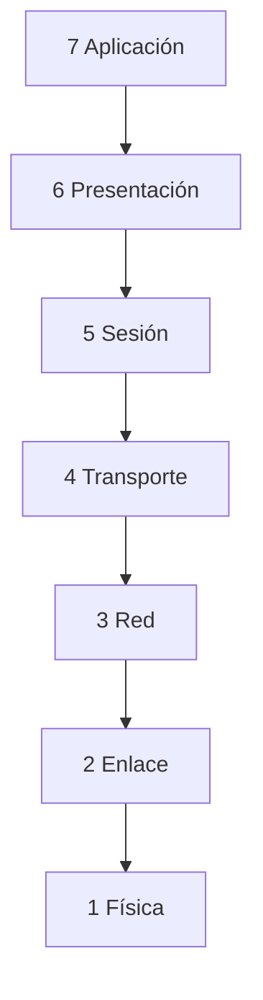
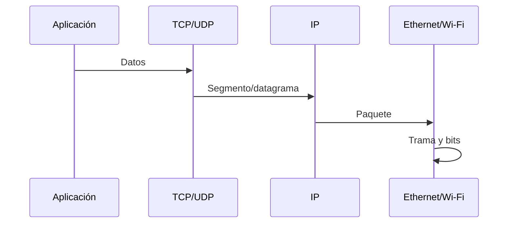
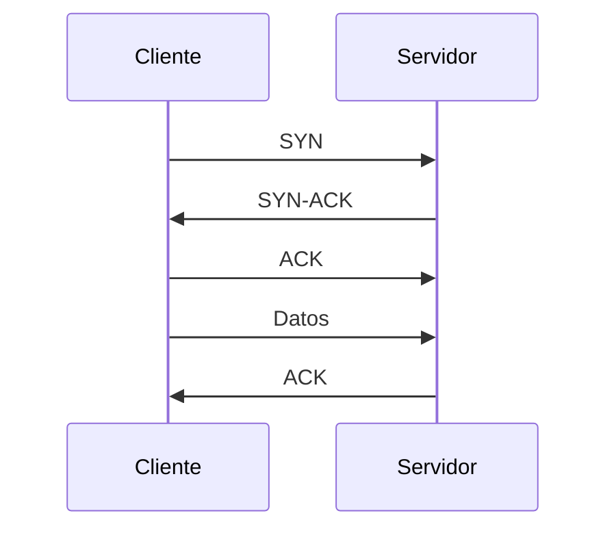
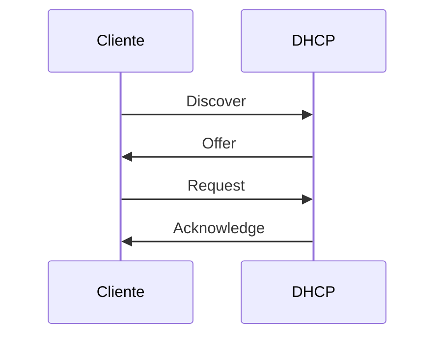

# 2. Modelos, Ethernet y protocolos

## 2.1 Capas

El modelo OSI organiza funciones; TCP/IP refleja la pila utilizada en Internet. Las capas ayudan a explicar y diagnosticar, pero implementaciones reales pueden cruzar límites.

## 2.2 Encapsulación

Cada capa añade cabecera. En el destino se verifica y elimina en orden inverso.

## 2.3 Ethernet y MAC

Una dirección MAC identifica una interfaz en el dominio de enlace. El switch aprende la MAC de origen asociada al puerto. Si desconoce destino, inunda dentro de la VLAN; cuando aprende, reenvía solo por el puerto adecuado.

ARP resuelve qué MAC corresponde a una IPv4 local. La consulta ARP es broadcast; la respuesta permite enviar la trama.

## 2.4 IP e ICMP

IP ofrece entrega de paquetes sin conexión y mejor esfuerzo. Cada router reduce TTL; si llega a cero, envía ICMP de tiempo excedido. Esto permite a `traceroute` descubrir saltos.

ICMP informa errores y diagnóstico. Bloquearlo completamente puede romper mecanismos útiles, incluida detección de MTU.

## 2.5 TCP

TCP establece conexión mediante intercambio inicial, numera bytes, confirma recepción, retransmite pérdidas y regula flujo y congestión.

Un puerto identifica una aplicación dentro del host. La conexión se distingue por IP y puerto de ambos extremos más protocolo.

## 2.6 UDP

UDP envía datagramas sin establecimiento, confirmación ni orden. Es útil cuando la aplicación tolera pérdida, implementa su propio control o prioriza latencia. DNS, voz o juegos pueden usarlo, aunque protocolos modernos añaden mecanismos sobre UDP.

## 2.7 DNS y DHCP

DNS es jerárquico y traduce nombres. Una consulta puede pasar por caché, resolutor y servidores autoritativos.

DHCP suele seguir DORA:

La concesión incluye dirección, máscara, puerta, DNS y duración.

## Caso de diagnóstico

`ping 1.1.1.1` funciona, pero `ping example.com` no. Enlace, IP y ruta parecen operativos; se investiga DNS. Esto demuestra el valor de separar capas.
