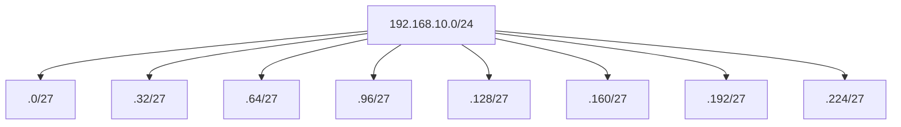

# 3. IPv4, máscaras y subnetting

## 3.1 Dirección y prefijo

IPv4 usa 32 bits. En `192.168.10.34/24`, 24 bits son red y 8 host.

```text
IP:      11000000.10101000.00001010.00100010
Máscara: 11111111.11111111.11111111.00000000
Red AND: 11000000.10101000.00001010.00000000
```

Red: `192.168.10.0`; broadcast: `192.168.10.255`; hosts ordinarios: `.1–.254`.

## 3.2 Máscaras frecuentes

| Prefijo | Máscara | Direcciones | Hosts ordinarios |
| ---: | --- | ---: | ---: |
| /24 | 255.255.255.0 | 256 | 254 |
| /25 | 255.255.255.128 | 128 | 126 |
| /26 | 255.255.255.192 | 64 | 62 |
| /27 | 255.255.255.224 | 32 | 30 |
| /28 | 255.255.255.240 | 16 | 14 |

La regla de restar dos se aplica a subredes ordinarias; `/31` se usa en enlaces punto a punto y `/32` identifica un host.

## 3.3 Método por tamaño de bloque

Para `/27`, el octeto interesante de la máscara es 224. El bloque es `256 - 224 = 32`. Redes: 0, 32, 64, 96, 128, 160, 192 y 224.

Para `192.168.5.77/27`, 77 cae en el bloque 64–95:

- red: `192.168.5.64`;
- primer host: `.65`;
- último host: `.94`;
- broadcast: `.95`.

## 3.4 Dividir una red

Se necesitan al menos seis subredes desde `/24`. Se toman tres bits porque `2³=8`. Nuevo prefijo `/27`.



## 3.5 VLSM

Para departamentos de 100, 50, 20 y 10 hosts se asigna de mayor a menor:

- 100 → `/25`, 126 hosts;
- 50 → `/26`, 62;
- 20 → `/27`, 30;
- 10 → `/28`, 14.

Sobre `10.0.0.0/24`:

| Necesidad | Subred | Rango útil |
| ---: | --- | --- |
| 100 | `10.0.0.0/25` | `.1–.126` |
| 50 | `10.0.0.128/26` | `.129–.190` |
| 20 | `10.0.0.192/27` | `.193–.222` |
| 10 | `10.0.0.224/28` | `.225–.238` |

Queda `10.0.0.240/28` para crecimiento.

## 3.6 Rangos especiales

- privados: `10/8`, `172.16/12`, `192.168/16`;
- loopback: `127/8`;
- enlace local: `169.254/16`;
- multicast: `224/4`.

NAT traduce direcciones y puertos; no es por sí mismo un firewall, aunque frecuentemente impide conexiones entrantes no solicitadas por falta de traducción.

## Práctica mental

Para cada IP, calcula red, broadcast y rango: `172.16.35.200/20`, `10.10.10.70/26` y `192.168.1.14/30`.
