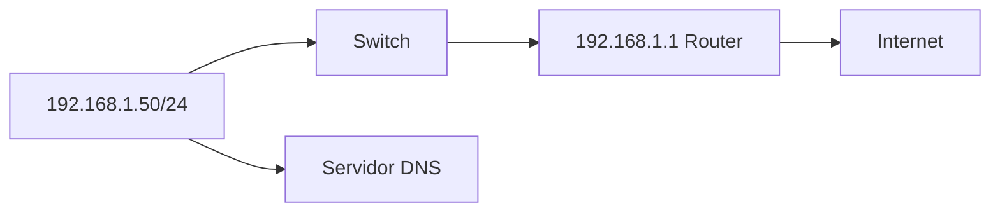
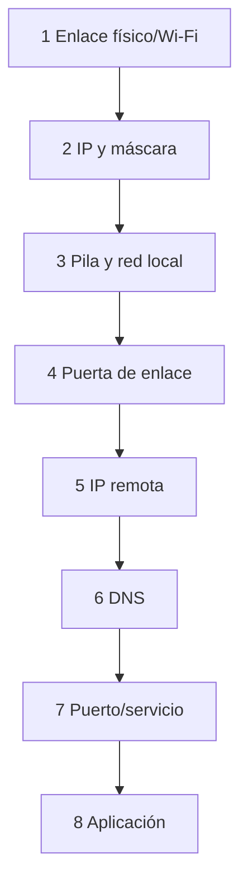

# 4. Configuración y diagnóstico

## 4.1 Parámetros

Una interfaz necesita IP/prefijo. Para salir de la subred usa puerta de enlace. Para nombres usa DNS. DHCP puede proporcionar todo.



La puerta debe pertenecer a una red directamente conectada; de lo contrario el equipo no sabe cómo alcanzarla.

## 4.2 Inspección

Linux:

```bash
ip -br address
ip route
resolvectl status
ip neigh
ss -tulpen
```

Windows:

```powershell
Get-NetIPConfiguration
Get-NetRoute -AddressFamily IPv4
Get-DnsClientServerAddress
Get-NetNeighbor
Get-NetTCPConnection -State Listen
```

## 4.3 Diagnóstico por escalones



No se empieza reinstalando. Se localiza la primera prueba que falla.

## 4.4 Herramientas

```bash
ping -c 4 127.0.0.1
ping -c 4 192.168.1.1
tracepath example.com
dig example.com
curl -v https://example.com/
nc -vz example.com 443
```

```powershell
Test-Connection 192.168.1.1 -Count 4
tracert example.com
Resolve-DnsName example.com
Test-NetConnection example.com -Port 443
```

## 4.5 Interpretación

- Sin enlace: cable, puerto, adaptador, Wi-Fi o controlador.
- `169.254.x.x`: DHCP no respondió y se usó enlace local.
- Gateway responde, IP remota no: ruta, proveedor o filtrado.
- IP remota responde, nombre no: DNS.
- Nombre resuelve y ping funciona, puerto no: servicio o firewall.
- Puerto abre, aplicación falla: protocolo, TLS, autenticación o aplicación.

## 4.6 Captura

Wireshark permite ver tramas. Se captura con autorización y filtro mínimo. Ejemplo de un acceso web:

1. ARP para localizar gateway.
2. DNS para resolver nombre.
3. SYN/SYN-ACK/ACK a 443.
4. negociación TLS.
5. intercambio HTTP cifrado.

La captura puede contener datos sensibles. Se limita, anonimiza y no se publica sin revisar.

## Caso completo

Un PC accede por IP pero no por nombre. `Get-NetIPConfiguration` muestra DNS antiguo. `Resolve-DnsName` agota tiempo. Se configura el DNS correcto mediante DHCP, se renueva concesión, se limpia caché y se verifica. Cambiar navegador no habría corregido la capa afectada.

## Documentación de incidencia

Registrar síntoma, alcance, topología, hora, comandos y salidas relevantes, hipótesis, cambio, resultado y prevención. Una captura sin explicación no es una memoria técnica.
