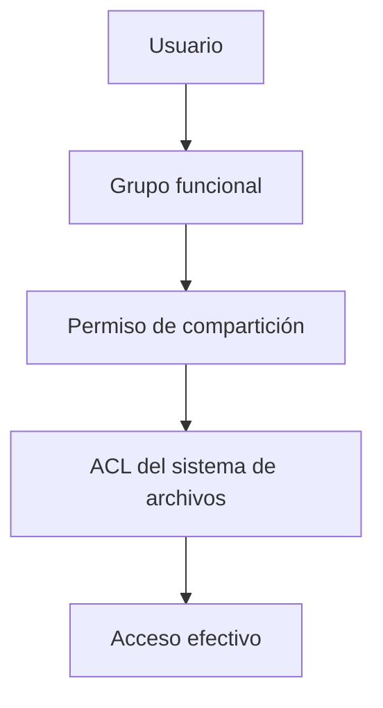

# 1. Servicios y recursos compartidos

## 1.1 De proceso a servicio accesible

Que `systemctl` indique activo solo confirma una parte. Puede escuchar en localhost, estar bloqueado o rechazar credenciales.

## 1.2 Diseño de un servicio

Se documentan:

- finalidad y responsables;
- clientes y nivel de disponibilidad;
- dirección, protocolo y puerto;
- identidad de ejecución;
- datos y permisos;
- configuración y secretos;
- dependencia de DNS, certificados o base de datos;
- registros, monitorización y copia;
- procedimiento de actualización y reversión.

## 1.3 Compartición SMB

SMB permite archivos e impresoras en redes Windows y mixtas. El acceso efectivo combina permisos del recurso y del sistema de archivos.

Diseño recomendado:

- `Proyecto-Lectura` y `Proyecto-Edicion`;
- recurso accesible solo desde redes internas;
- ACL asignadas a grupos, no personas;
- auditoría de cambios sensibles;
- copias versionadas;
- sin acceso de invitado.

## 1.4 NFS

NFS es habitual en Unix/Linux. La exportación define clientes y opciones; los permisos siguen dependiendo de UID/GID y sistema de archivos.

Una exportación no debe confiar en redes amplias sin controles. Se revisan mapeo de identidades, `root_squash`, firewall y versiones del protocolo.

## 1.5 Web y transferencia

HTTP publica recursos y API; HTTPS añade TLS. SFTP opera sobre SSH y cifra autenticación y datos. FTP sin TLS expone credenciales y no es apropiado para redes no confiables.

Los certificados vinculan una clave pública con una identidad. El cliente verifica cadena, nombre, periodo y revocación según su política.

## 1.6 Disponibilidad

Un servicio puede depender de red, DNS, almacenamiento y autenticación. Se identifican puntos únicos de fallo y se monitoriza desde la perspectiva del usuario.

Una comprobación de salud no debe limitarse a “puerto abierto”; idealmente valida una operación segura y representativa.

## Caso de diseño

Un departamento necesita documentos comunes. Se crea grupo de edición y lectura, recurso SMB, ACL coherentes, papelera o versiones, cuota, copia inmutable y registro. Se prueba con usuario de cada rol y desde un equipo no autorizado. La memoria incluye restauración de un archivo.
