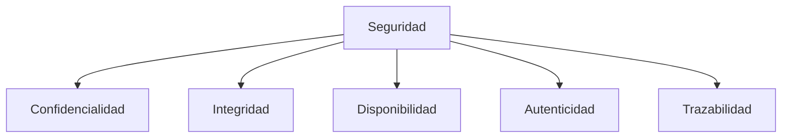
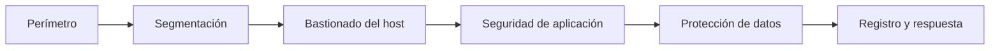

# 2. Seguridad, riesgos y bastionado

## 2.1 Objetivos

Una medida puede mejorar un objetivo y afectar otro. Cifrar sin gestionar claves puede perjudicar disponibilidad; registrar todo sin proteger logs puede perjudicar confidencialidad.

## 2.2 Riesgo

Activo es lo que se protege. Amenaza es una causa potencial. Vulnerabilidad es una debilidad. Control reduce probabilidad o impacto.

Ejemplo:

- activo: expedientes;
- amenaza: ransomware;
- vulnerabilidad: usuarios con privilegios y copias en línea con mismas credenciales;
- impacto: indisponibilidad y posible filtración;
- controles: privilegio mínimo, filtrado, formación, EDR, segmentación y copia inmutable.

## 2.3 Matriz

| Probabilidad \ Impacto | Bajo | Medio | Alto |
| --- | --- | --- | --- |
| Baja | Bajo | Bajo | Medio |
| Media | Bajo | Medio | Alto |
| Alta | Medio | Alto | Crítico |

La matriz ayuda a priorizar, no calcula una verdad exacta. Se registran supuestos y responsable de aceptar riesgo residual.

## 2.4 Defensa en profundidad

Si una credencial se filtra, MFA puede frenar acceso; si se supera, privilegio mínimo limita alcance; segmentación dificulta movimiento; logs permiten detectar; copias permiten recuperar.

## 2.5 Línea base de bastionado

1. Inventariar sistema, software, puertos y responsables.
2. Actualizar desde fuentes confiables.
3. Retirar cuentas, paquetes y servicios innecesarios.
4. Aplicar privilegio mínimo.
5. Configurar autenticación robusta y MFA.
6. Cifrar equipos portátiles y comunicaciones.
7. Restringir firewall.
8. Proteger configuración y secretos.
9. Centralizar logs y sincronizar tiempo.
10. Verificar copia y recuperación.

## 2.6 Contraseñas y secretos

Se priorizan frases largas únicas y gestores. No se reutilizan ni se almacenan en texto, scripts o Git. Una aplicación recibe secretos mediante un almacén, servicio de identidad o variables protegidas.

Los hashes de contraseña usan funciones lentas con sal; SHA-256 directo no es apropiado para guardar contraseñas.

## 2.7 Actualizaciones y vulnerabilidades

Una CVE identifica una vulnerabilidad pública, pero prioridad depende de exposición, explotabilidad y activo. Se combina inventario con avisos del proveedor y se prueba el parche.

No actualizar también es una decisión de riesgo que requiere compensaciones y fecha de revisión.

## Caso

Un servidor de laboratorio expone SSH a Internet con contraseña. Se limita por red o VPN, se habilitan claves, se desactiva root directo, se aplica MFA si procede, se actualiza, se registra y se alerta sobre intentos. Cambiar solo el puerto reduce ruido, no sustituye controles.
