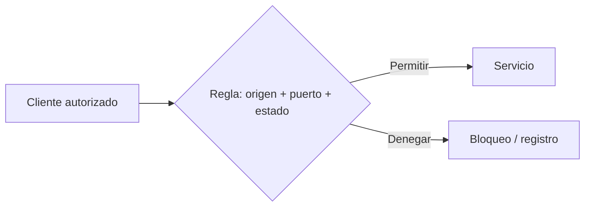
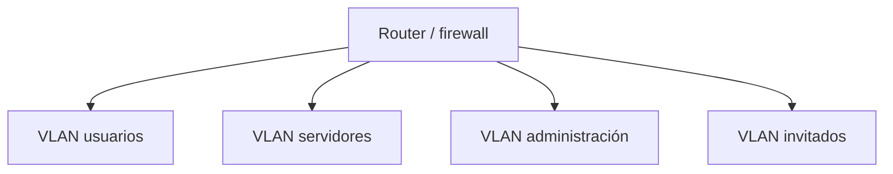

# 3. Firewall, acceso remoto y segmentación

## 3.1 Política

Un firewall evalúa dirección, interfaces, IP, protocolo, puerto, estado y, en soluciones avanzadas, aplicación. La política recomendada es denegar entrada por defecto y permitir excepciones justificadas.



Cada regla documenta propietario, motivo, alcance y fecha de revisión.

## 3.2 Estado

Un firewall con seguimiento permite respuestas a conexiones iniciadas desde dentro sin abrir conexiones nuevas desde fuera. El orden de reglas importa en muchas plataformas.

## 3.3 UFW y Windows Firewall

```bash
sudo ufw default deny incoming
sudo ufw default allow outgoing
sudo ufw allow from 192.168.50.0/24 to any port 22 proto tcp
sudo ufw enable
sudo ufw status verbose
```

Antes de habilitar remotamente se confirma una regla que mantenga administración; de lo contrario puede perderse acceso.

```powershell
New-NetFirewallRule -DisplayName 'HTTPS interno' `
  -Direction Inbound -Protocol TCP -LocalPort 443 `
  -RemoteAddress 192.168.50.0/24 -Action Allow
Get-NetFirewallRule -DisplayName 'HTTPS interno'
```

## 3.4 SSH con claves

```bash
ssh-keygen -t ed25519 -a 64
ssh-copy-id ana@servidor
ssh ana@servidor
```

La clave privada se protege con frase y permisos. Antes de desactivar contraseña se abre una segunda sesión y se comprueba acceso con clave.

Configuraciones críticas se cambian después de validar sintaxis y mantener una sesión de recuperación.

## 3.5 Segmentación



La segmentación limita broadcast y movimiento lateral. No aporta aislamiento si el router permite todo entre segmentos. Se define matriz de flujos:

| Origen | Destino | Servicio | Decisión |
| --- | --- | --- | --- |
| Usuarios | Web interno | HTTPS | Permitir |
| Usuarios | Administración | Cualquiera | Denegar |
| Admin | Servidores | SSH/RDP | Permitir |
| Invitados | Interno | Cualquiera | Denegar |

## 3.6 VPN

Una VPN crea un túnel autenticado y cifrado. No vuelve seguro automáticamente al dispositivo cliente; se aplican identidad, postura, rutas y mínimo acceso.

## Diagnóstico

Si el servicio funciona localmente y no remotamente:

1. Confirmar dirección de escucha.
2. Probar desde la misma subred.
3. Revisar ruta en ambos sentidos.
4. Consultar reglas en host y red.
5. Capturar tráfico autorizado para ver si llega y responde.
6. Revisar NAT o publicación.

Abrir temporalmente “todo” no es una prueba segura en un entorno real. Se crea una regla acotada y reversible.
