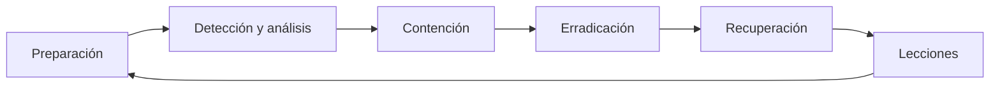
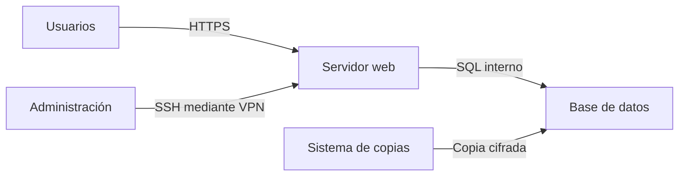

# 4. Incidentes, recuperación y documentación

## 4.1 Incidente

Un incidente es un evento que compromete o amenaza operación o seguridad. La respuesta organiza decisiones bajo presión.

## 4.2 Primeros minutos

- Registrar hora, fuente y síntoma.
- Determinar alcance y criticidad.
- Preservar logs y evidencias volátiles cuando proceda.
- Contener con la mínima alteración necesaria.
- Escalar según responsables.
- Evitar borrar, reinstalar o comunicar externamente sin coordinación.

La prioridad puede ser seguridad física y continuidad; las evidencias se gestionan según normativa y protocolo del centro.

## 4.3 Contención y recuperación

Contención corta propagación: aislar equipo, revocar credencial, bloquear indicador o retirar servicio. Erradicación elimina causa. Recuperación restaura desde estado confiable y aumenta monitorización.

Restaurar sin corregir la vía de entrada provoca recurrencia.

## 4.4 Caso ransomware

1. Se desconectan sistemas afectados de red sin apagarlos automáticamente.
2. Se identifican cuentas y recursos alcanzados.
3. Se preservan eventos, muestras y línea temporal.
4. Se revocan credenciales comprometidas.
5. Se localiza punto sano e infraestructura limpia.
6. Se reconstruye y restaura copia inmutable.
7. Se valida integridad y funciones.
8. Se monitoriza y documentan controles pendientes.

La decisión de apagar, conservar memoria o notificar depende del protocolo y personal responsable; el alumnado no improvisa investigación en sistemas reales.

## 4.5 Documentación operativa

Una documentación profesional se diseña para tareas:

- **arquitectura:** qué existe y cómo se relaciona;
- **inventario:** versiones, ubicación, responsable y soporte;
- **procedimiento:** pasos, precondiciones y resultado;
- **runbook:** respuesta a una alerta;
- **copia y recuperación:** RPO, RTO y restauración;
- **registro de cambios:** quién, qué, cuándo y reversión;
- **incidencia:** línea temporal, impacto, causa y acciones.

## 4.6 Diagrama útil

Un diagrama debe incluir nombres coherentes, redes/prefijos, flujos relevantes y leyenda. No se publican IP públicas, credenciales o detalles que aumenten exposición sin necesidad.

## 4.7 Procedimiento reproducible

Cada paso contiene:

1. objetivo;
2. precondiciones y permisos;
3. orden o acción;
4. salida esperada;
5. verificación;
6. error frecuente;
7. reversión.

Una captura no sustituye texto seleccionable. Los comandos se copian en bloques y los valores variables se marcan claramente.

## 4.8 Memoria del proyecto final

- Portada, alcance y criterios de aceptación.
- Requisitos y decisiones.
- Topología y direccionamiento.
- Instalación y configuración.
- Usuarios, permisos y firewall.
- Publicación del recurso.
- Copia y restauración demostrada.
- Pruebas con resultados.
- Incidencias y resolución.
- Riesgos, mantenimiento y conclusiones.

La prueba final consiste en que otra persona reproduzca una parte sin ayuda oral. Las dudas revelan qué documentación debe mejorarse.
